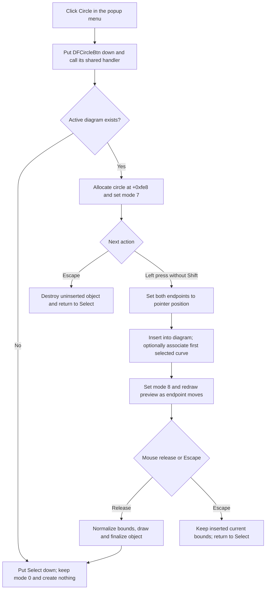

# Arm the Circle drawing tool

> Analysis status: Evidence-backed source review complete.

## Control

| Property | Recovered value |
| --- | --- |
| Form | DFWindow |
| Component path | DFWindow.DFPopupMnu.CircleMnu |
| Control class | TMenuItem |
| Caption | Circle |
| Hint | Not present in the recovered resource. |
| Text | Not present in the recovered resource. |
| Handler name | CircleMnuClick |
| Handler address | 01a7b950 |
| Graph node | `resource:dfm:DFWindow/DFWindow.DFPopupMnu.CircleMnu` |
| Handler node | `function:01a7b950` |
| Graph layer | UI |

## What happens when clicked

`FUN_01a7b950` is a popup-menu wrapper for the `DFCircleBtn` toolbar command. It puts that speed button into its down state and calls `FUN_01a7b400`, the same handler that the toolbar button uses. The menu handler does not create geometry itself.

The shared handler records command name `DFCircleBtn`. If DFWindow has no active diagram at form offset `+0x798`, it puts the Select button down and calls the Select handler. That handler leaves interaction mode `0`. No circle object is allocated, no model collection changes, and no error message appears.

With an active diagram, the shared handler constructs a circle drawing object through `FUN_010ed740`, stores it at form offset `+0xfe8`, and writes interaction mode `7` at `+0x7a8`. This only arms the tool. The click does not yet add the object to the diagram or assign its geometry.

## First point and selection behavior

The form mouse-down handler consumes mode `7` only for the normal left-button path with the recovered Shift-state bit clear. It writes the pointer position into both endpoints at circle-object offsets `+0x68` and `+0x70`. The initial bounding box therefore has zero width and height.

`FUN_01ae4b90` then inserts the object into the active diagram's `+0xe0` collection under name `Circle/Line` and writes the active diagram to object field `+0x78`. Selection is not required. If the current selection classifier returns exact category `2`, which other recovered DFWindow paths establish as curves, the helper also associates the new circle with the first selected curve at object field `+0x80` and registers the circle with that curve. Any other selection result leaves this secondary association empty and still inserts the circle.

After insertion, the mouse-down handler calls the object's preview-draw method and changes interaction mode from `7` to `8`. There is no selection warning, confirmation dialog, or rejection branch.

## Drag geometry and completion

While mode `8` is active, mouse movement selects recovered cursor value `0xb`. It calls the preview method once with the old bounds, writes the current pointer to the second endpoint at `+0x70`, and calls the preview method again. This produces the live outline while the user drags.

On mouse release, `FUN_01a77260` calls the preview method again and normalizes the two endpoints:

- `left` becomes the smaller X coordinate.
- `top` becomes the smaller Y coordinate.
- `right` becomes the larger X coordinate.
- `bottom` becomes the larger Y coordinate.

It then calls the circle's normal draw and finalization methods, clears form field `+0xfe8`, puts Select down, and resets interaction mode to `0`. The tool is single-use after a completed drag.

There is no minimum-size or aspect-ratio check. A press and release at the same coordinate commits a zero-size object. Unequal horizontal and vertical drag distances produce an axis-aligned ellipse: the recovered renderer calculates separate X and Y center/radius values and samples the outline. The UI and class name call this object a circle, but the source does not force equal radii.

## Defaults and downstream consumers

The constructor creates line and fill-style objects. It reads application settings named `Circle width`, `Circle color`, and `Circle style`, with recovered fallback values `2`, `0xff0000`, and `0`. The source does not recover a symbolic color name for the numeric color value.

The stored endpoints and styles have these proven later consumers:

- Circle render methods draw the bounded ellipse and the interactive preview.
- `FUN_010ede80` hit-tests a point against the ellipse equation, including degenerate vertical, horizontal, and point cases.
- `FUN_010ee090` moves the object by adding a delta to all four bounding coordinates.
- The shared Properties path recognizes the circle class and lets the user replace its width, color, and style.
- `FUN_010eea60` serializes the object's coordinate values, active-diagram and selected-curve references, and line style. `FUN_010ee900` restores these values and registers the loaded object as `Circle` in the active diagram.

## Cancel, no-op, and error boundaries

Escape behaves differently before and after the first point:

- In armed mode `7`, Escape destroys the uninserted object at `+0xfe8`, clears that field, puts Select down, resets mode to `0`, resets the cursor, and refreshes the active diagram. This is a complete cancel with no model change.
- In drag mode `8`, the object is already in the diagram collection. The common Escape path puts Select down, resets mode and cursor, and refreshes the diagram, but it does not remove or destroy the inserted circle. Thus, Escape after the first point stops the interaction without rolling back the live object or its current bounds.

A non-left click or a Shift-modified left click does not enter the mode-`7` circle-start branch. The tool remains armed unless another recovered interaction path changes the mode. A completed mouse release always returns to Select mode.

If the shared handler is invoked again while mode `7` is already armed, its source allocates another circle and overwrites form field `+0xfe8` without an explicit cleanup call. The recovered speed-button group behavior can affect whether the UI emits that repeated event, so the source does not prove that a normal user action reaches this condition.

The activation, insertion, drag, and completion paths have no local exception handler or rollback transaction. An allocation, collection, drawing, or virtual-method failure can propagate to higher-level Delphi handling. If a failure occurs after insertion, the diagram can retain the partly initialized object.

## Redraw, undo, and persistence

Preview and normal drawing calls update the visible canvas during placement. Escape calls the diagram interaction-refresh helper. The completion path does not call the broad diagram layout or full redraw helper; it draws and finalizes the circle through the object's virtual methods.

The object enters the live diagram model at the first point, not at mouse release. No explicit undo-record call, document-save call, or file write occurs in this interaction path. The direct handler, insertion helper, and form mouse handlers also do not explicitly set the DFWindow document's recovered modified flag. The recovered collection implementation can have an internal change notification, but this call path does not expose it, so the source does not prove whether circle insertion marks the document modified.

The circle's serializer and loader prove that a later normal diagram serialization can preserve the geometry, ownership references, and line style. This control does not invoke that serialization. Escape before the first point leaves nothing to persist; Escape after insertion leaves the live object eligible for later serialization.

## Click and drawing flow

## Handler and model evidence

- Popup-menu wrapper: [FUN_01a7b950](../../../DecompiledSources/Tina16/functions/0000000001A7B950__FUN_01a7b950.c)
- Shared toolbar activation and active-diagram guard: [FUN_01a7b400](../../../DecompiledSources/Tina16/functions/0000000001A7B400__FUN_01a7b400.c)
- Circle construction and recovered style defaults: [FUN_010ed740](../../../DecompiledSources/Tina16/functions/00000000010ED740__FUN_010ed740.c)
- First-point capture, insertion, and transition from mode `7` to `8`: [FUN_01a730e0](../../../DecompiledSources/Tina16/functions/0000000001A730E0__FUN_01a730e0.c)
- Diagram insertion and optional selected-curve association: [FUN_01ae4b90](../../../DecompiledSources/Tina16/functions/0000000001AE4B90__FUN_01ae4b90.c)
- Preview update during pointer movement: [FUN_01a74a50](../../../DecompiledSources/Tina16/functions/0000000001A74A50__FUN_01a74a50.c)
- Bounding-box normalization and completion: [FUN_01a77260](../../../DecompiledSources/Tina16/functions/0000000001A77260__FUN_01a77260.c)
- Escape handling before and after insertion: [FUN_01a7d1a0](../../../DecompiledSources/Tina16/functions/0000000001A7D1A0__FUN_01a7d1a0.c)
- Circle outline generation: [FUN_010eda50](../../../DecompiledSources/Tina16/functions/00000000010EDA50__FUN_010eda50.c)
- Ellipse hit testing and translation: [FUN_010ede80](../../../DecompiledSources/Tina16/functions/00000000010EDE80__FUN_010ede80.c) and [FUN_010ee090](../../../DecompiledSources/Tina16/functions/00000000010EE090__FUN_010ee090.c)
- Circle serialization and loading: [FUN_010eea60](../../../DecompiledSources/Tina16/functions/00000000010EEA60__FUN_010eea60.c) and [FUN_010ee900](../../../DecompiledSources/Tina16/functions/00000000010EE900__FUN_010ee900.c)
- Shared circle/line Properties path: [FUN_01ae4cc0](../../../DecompiledSources/Tina16/functions/0000000001AE4CC0__FUN_01ae4cc0.c)
- Recovered control resources: [ui-evidence.json](../../../DecompiledSources/Tina16/resources/dfm/ui-evidence.json)

## Resource and annotation limits

- `CircleMnu` has caption `Circle` and no recovered hint, action, image reference, embedded glyph, or same-parent label candidate.
- The paired `DFCircleBtn` has hint `Circle`, radio group `1`, and a 20 by 20 pixel outline-circle glyph: [Circle toolbar glyph](../../../glyph/0103_DFWindow_DFWindow_DFToolPanel_ToolNoteBook_Diagram_DFCircleBtn_Glyph_Data.png).
- The paired toolbar resources support the wrapper relationship. The handler and mouse-state source prove the creation behavior.
- This Bead owns only the direct popup wrapper annotation for `FUN_01a7b950`. Bead `.361` owns the shared toolbar handler and circle constructor. Shared insertion, selection, mouse-event, render, and serialization functions remain call-path evidence here.
