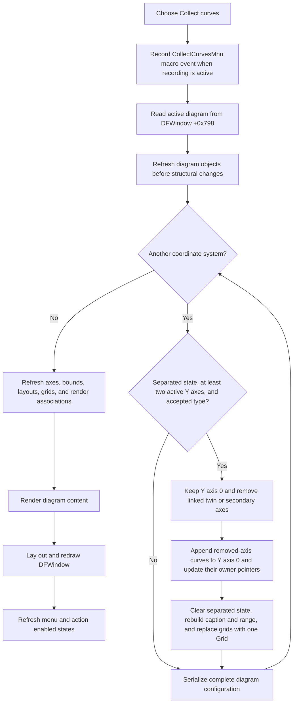

# Collect curves onto one Y axis

> Analysis status: Reviewed from recovered handler, diagram, coordinate-system, axis-migration, persistence, and redraw evidence.

## Control

| Property | Recovered value |
| --- | --- |
| Form | DFWindow |
| Component path | DFWindow.DFMainMenu.DFViewMnu.CollectCurvesMnu |
| Control class | TMenuItem |
| Caption | Collect curves |
| Hint | Not present in the recovered resource. |
| Text | Not present in the recovered resource. |
| Handler name | CollectCurvesMnuClick |
| Handler address | 01a78ff0 |
| Graph node | `resource:dfm:DFWindow/DFWindow.DFMainMenu.DFViewMnu.CollectCurvesMnu` |
| Handler node | `function:01a78ff0` |
| Graph layer | UI |

## What happens when clicked

`TDFWindow.CollectCurvesMnuClick` first records `CollectCurvesMnu` for the optional macro stream. It then passes the active diagram at DFWindow field `+0x798` to `FUN_01ae6350` with an empty settings-context argument.

`FUN_01ae6350` visits every coordinate system in the diagram's ordered `+0xd8` collection. For each system, `FUN_01ce74d0` tests whether the system is in the recovered separated-Y-axis state. A system is eligible only when all these conditions are true:

- at least two Y axes report active through their virtual query;
- the coordinate-system byte stored as `YAxesPosition` is nonzero;
- the recovered coordinate-system type is one of the two values accepted by the bit mask, type `0` or type `2`.

An ineligible coordinate system is unchanged. An eligible system is changed from separated Y axes to one collected Y axis.

## Axis and curve changes

For each eligible coordinate system, the collector keeps Y-axis item `0`. It removes a linked twin axis from that first item when present. It then repeatedly removes Y-axis item `1` until only item `0` remains.

The removal path does not discard the curves from a removed axis. `FUN_01ad6c70` appends each curve to the surviving first Y axis and changes the curve's Y-axis owner pointer to that axis. The list-add helper writes at the current list count, so the existing curves on axis `0` stay first. Curves from later axes follow in original axis order, and their order inside each source axis is retained.

The collector also:

- clears the separated `YAxesPosition` state;
- builds one caption for the surviving Y axis from the coordinate system's curve data;
- recalculates the surviving axis range;
- destroys the existing grid objects and creates one `Grid` object;
- links that grid to the first X axis and the surviving first Y axis.

The recovered code does not test the user's current curve or axis selection. It does not test a UI checked state or a curve visibility flag before it processes the coordinate-system collections. Thus the command is a whole-diagram, per-coordinate-system operation, not a selected-curve operation.

The outer function does not move a curve to another coordinate system or page. It does not add, remove, or reorder coordinate systems in the diagram's `+0xd8` list. Collection stays inside each source coordinate system.

## Persistence, redraw, and command state

After each coordinate system, including a system for which the collector made no change, `FUN_01ae6350` calls `FUN_01add6f0`. That function serializes the complete diagram configuration. The recovered keys include `AllCurves`, `CS.Count`, `YAxesPosition`, `XAxis.Count`, `YAxis.Count`, axis captions, scales, colors, and figure data.

The serializer is inside the coordinate-system loop. A diagram with three coordinate systems is therefore serialized three times, after systems `0`, `1`, and `2` are processed. There is no separate final save after the loop.

After collection, the model path updates axes, recalculates diagram bounds and render associations, updates axis layouts, and renders the coordinate systems and figures. The click handler then calls the shared DFWindow resize and redraw routine. That routine lays the active diagram into the window, draws it, and stores the resulting drawing width and height. Finally, the handler calls the shared DFWindow menu and action-state refresher `FUN_01a7fc90`, whose canonical description is owned by `TIARA-diz.6.7.270`.

The call path contains no undo-snapshot helper and no rollback call. The macro event is a replay or recording event; the recovered code does not use it as an undo record.

## Click flow

## Empty, no-op, and error paths

- The handler has no null check for DFWindow field `+0x798`. A direct call without an active diagram can fail before the later menu-state refresh. The source does not contain a local error message or recovery branch for this case.
- A valid diagram with no coordinate systems skips the collection and serialization loop. The model and window refresh routines still run.
- A coordinate system with fewer than two active Y axes, a zero `YAxesPosition` state, or an unsupported type is not changed. The complete diagram is still serialized after that system.
- There is no confirmation dialog. The command starts mutation immediately after the macro record.
- The handler and the collection routine have no local exception handler, returned-status test, retry, or rollback branch.
- Persistence occurs after each coordinate system. If processing or serialization fails on a later system, earlier systems can already be changed and the most recent successful serialization can contain a partially collected whole-diagram state.
- The structural configuration is serialized before the final model and window redraw stages. A later redraw failure therefore does not restore the old axes or settings.

## Handler evidence

- Primary handler: [FUN_01a78ff0](../../../DecompiledSources/Tina16/functions/0000000001A78FF0__FUN_01a78ff0.c) records `CollectCurvesMnu`, calls the diagram collector, redraws the DFWindow, and refreshes command state.
- Whole-diagram collector: [FUN_01ae6350](../../../DecompiledSources/Tina16/functions/0000000001AE6350__FUN_01ae6350.c) visits every coordinate system, invokes the per-system collector, serializes after each system, and runs the model render refresh.
- Per-system collector: [FUN_01ce74d0](../../../DecompiledSources/Tina16/functions/0000000001CE74D0__FUN_01ce74d0.c) checks the separated state and type, keeps the first Y axis, removes later axes, rebuilds the caption and range, and replaces the grids.
- Separated-state test: [FUN_01ce33d0](../../../DecompiledSources/Tina16/functions/0000000001CE33D0__FUN_01ce33d0.c) requires at least two active Y axes before it returns the stored `YAxesPosition` state.
- Active-axis count: [FUN_01ce3400](../../../DecompiledSources/Tina16/functions/0000000001CE3400__FUN_01ce3400.c) counts Y axes whose virtual active query returns true.
- Axis removal and curve migration: [FUN_01ad6c70](../../../DecompiledSources/Tina16/functions/0000000001AD6C70__FUN_01ad6c70.c) removes the chosen axis, appends its curves to the surviving axis, changes their owner pointers, and repairs grid references.
- Ordered list append: [FUN_004ae7e0](../../../DecompiledSources/Tina16/functions/00000000004AE7E0__FUN_004ae7e0.c) adds an object at the current list count and increments the count.
- Diagram serializer: [FUN_01add6f0](../../../DecompiledSources/Tina16/functions/0000000001ADD6F0__FUN_01add6f0.c) writes the complete curve, coordinate-system, axis, and figure configuration.
- Model layout pass: [FUN_01ada270](../../../DecompiledSources/Tina16/functions/0000000001ADA270__FUN_01ada270.c) updates every X and Y axis and rebuilds diagram bounds.
- Model renderer: [FUN_01aceb90](../../../DecompiledSources/Tina16/functions/0000000001ACEB90__FUN_01aceb90.c) draws coordinate systems, figures, and auxiliary diagram objects when the drawing bounds are valid.
- DFWindow redraw: [FUN_01a77f90](../../../DecompiledSources/Tina16/functions/0000000001A77F90__FUN_01a77f90.c) lays out and draws the active diagram and stores its output dimensions.
- Shared command-state refresh: [FUN_01a7fc90](../../../DecompiledSources/Tina16/functions/0000000001A7FC90__FUN_01a7fc90.c) refreshes DFWindow menu and action states after the change.
- Recovered component tree: [ui-evidence.json](../../../DecompiledSources/Tina16/resources/dfm/ui-evidence.json) supplies the caption and `CollectCurvesMnuClick` binding.
- Complexity: complex; the graph records six distinct outgoing calls from `FUN_01a78ff0`.

## Resource evidence

- `CollectCurvesMnu` is a `TMenuItem` under the DFWindow View menu.
- Its caption is `Collect curves`.
- It has no hint, text, action, image reference, or extracted glyph.
- The caption agrees with the recovered axis-migration call path, but the call path supplies the behavioral proof.

## Analysis limits

- The Delphi class and field names for several internal diagram flags are not recovered. This article uses the persisted key `YAxesPosition` because the serializer proves that name.
- The virtual active-axis query at offset `+0x60` is recovered, but its Delphi method name is not.
- The source proves that the command does not test selection or a UI visibility state. It does not prove the user-facing visibility meaning of the internal bytes that the collector sets to `1` on axes and curve objects.
- The settings backend selected by an empty settings-context argument is not named in the recovered source. The serializer proves the configuration keys and write timing, not the final storage file.
- No undo integration is visible in this call tree. This does not prove that a higher application layer cannot restore a prior project copy through another command.
