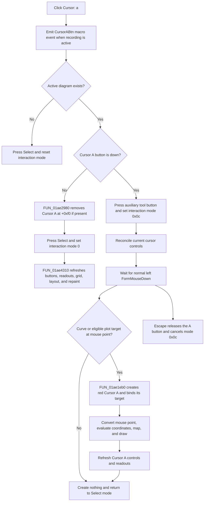

# Arm Cursor A placement or remove Cursor A

> Analysis status: Recovered resource, unique click handler, deferred mouse placement, curve binding, shared removal and UI reconciliation, keyboard cancellation, redraw, and no-op and error boundaries reviewed.

## Control

| Property | Recovered value |
| --- | --- |
| Form | DFWindow |
| Component path | DFWindow.DFToolPanel.ToolNoteBook.Diagram.CursorABtn |
| Control class | TSpeedButton |
| Caption | Not present in the recovered resource. |
| Hint | Cursor: a |
| AllowAllUp | true |
| GroupIndex | 2 |
| Handler name | CursorABtnClick |
| Handler address | 01a7b980 |
| Graph node | `resource:dfm:DFWindow/DFWindow.DFToolPanel.ToolNoteBook.Diagram.CursorABtn` |
| Handler node | `function:01a7b980` |
| Graph layer | UI |

## What happens when clicked

[`FUN_01a7b980`](../../../DecompiledSources/Tina16/functions/0000000001A7B980__FUN_01a7b980.c) uses the speed button's current `Down` byte to select one of two operations:

- When the button is down, it arms one-shot Cursor A placement by writing interaction mode `0x0c` at DFWindow offset `+0x7a8`.
- When the button is released, it removes Cursor A through the shared cursor-removal helper, restores normal selection mode, and reconciles the cursor controls.

The click always builds and sends a macro event with the literal `CursorABtn` before it tests the active diagram or the button state. The macro event records the command when macro recording is active. It is not persistence of the diagram cursor.

## Active-diagram guard

The handler reads the active diagram manager at form offset `+0x798`.

If that pointer is null, the handler presses the Select speed button at `+0xa90` and calls [`FUN_01a794b0`](../../../DecompiledSources/Tina16/functions/0000000001A794B0__FUN_01a794b0.c). The Select handler writes interaction mode zero and cannot clear a diagram selection because there is no diagram. This branch does not create or remove a cursor and does not call the shared cursor-state reconciler.

## Arm and create Cursor A

When an active diagram exists and `CursorABtn.Down` is true, the click handler presses an auxiliary speed button at form offset `+0xb58`, writes interaction mode `0x0c`, and calls the shared cursor-state reconciler. The recovered source does not establish the original Delphi field name for the auxiliary button. The click itself does not allocate a cursor and does not use a mouse coordinate.

Actual placement occurs on a later normal left-button `FormMouseDown` in [`FUN_01a730e0`](../../../DecompiledSources/Tina16/functions/0000000001A730E0__FUN_01a730e0.c). For mode `0x0c`, that path:

1. Hit-tests the mouse position.
2. Uses the first hit curve when the hit category is exactly `2`, or accepts a separate plot target only when its recovered eligibility bit is set.
3. Calls [`FUN_01ae1eb0`](../../../DecompiledSources/Tina16/functions/0000000001AE1EB0__FUN_01ae1eb0.c) with the Cursor A selector, the resolved curve or plot target, and the mouse point.
4. Reconciles cursor controls and readouts, presses the Select speed button, and resets the interaction mode to zero.

The placement is therefore one-shot. A modified left-button path can enter the form's separate selection-drag logic instead of the mode-`0x0c` creation branch.

### Cursor object and curve binding

The creation helper selects manager field `+0xf0` for Cursor A. If that field already contains a cursor, the helper first detaches, erases, destroys, and clears that old cursor before it resolves the new target. On successful target resolution, it:

- allocates a cursor and stores it at manager offset `+0xf0`;
- stores the diagram manager on the cursor and sets its A-selector byte at `+0x90` to `1`;
- assigns color value `0x000000ff`, the Delphi `TColor` value for red;
- stores the curve link at cursor offset `+0x58`, or the alternate plot owner at `+0x50`;
- registers a curve-bound cursor with the curve owner;
- converts the mouse point to curve coordinates, stores the X coordinate at `+0x78`, and evaluates or converts the Y coordinate into `+0x80`;
- maps the data position to screen coordinates and draws the cursor; and
- invokes the common cursor-state reconciler because the caller supplies its refresh flag.

For a curve-bound cursor, the Y value comes from the curve provider at the chosen X coordinate. A special provider class uses its recovered inverse and forward coordinate-conversion methods. The alternate plot-owner path creates an X-position cursor without a curve link.

## Remove Cursor A

When `CursorABtn.Down` is false, the handler calls the `.333`-owned shared removal helper [`FUN_01ae2980`](../../../DecompiledSources/Tina16/functions/0000000001AE2980__FUN_01ae2980.c) with selector true. That selector addresses Cursor A at manager offset `+0xf0`.

If Cursor A exists, the helper notifies its associated owner, erases it, invokes its diagram-update method, destroys the object, and clears manager `+0xf0`. A null Cursor A pointer makes the removal helper a no-op. The click handler still presses Select, writes interaction mode zero, and calls the common reconciler.

There is no confirmation dialog, Cancel button, undo registration, or cursor serializer in this removal path.

## Button state, readouts, and redraw

Cursor A placement and removal both finish through the `.333`-owned reconciler [`FUN_01ae4310`](../../../DecompiledSources/Tina16/functions/0000000001AE4310__FUN_01ae4310.c) when a diagram exists.

- With no cursor object yet, the reconciler can release both cursor buttons and hide `CursorPanel`. Interaction mode `0x0c`, not the button's later visual state, remains the placement-state value until a mouse click or cancellation resets it.
- After successful creation, the reconciler shows the applicable Cursor A controls, selects the A state, refreshes the A readouts and all-curves grid columns, adjusts layout, and reaches the diagram repaint path.
- After removal, it either hides the cursor panel when no cursor remains or keeps the Cursor B controls and B-only readouts when Cursor B remains. Two-cursor difference, frequency, and slope controls are not available with only one cursor.

The creation helper draws the new cursor before the shared reconciliation. The removal helper erases the old cursor before destruction. The reconciler then performs the common control, layout, grid, and repaint update.

## Keyboard cancellation

The DFWindow key-down path [`FUN_01a7d460`](../../../DecompiledSources/Tina16/functions/0000000001A7D460__FUN_01a7d460.c) dispatches Escape (`0x1b`) to [`FUN_01a7d1a0`](../../../DecompiledSources/Tina16/functions/0000000001A7D1A0__FUN_01a7d1a0.c). When interaction mode is `0x0c`, this cancellation helper releases `CursorABtn`, resets the interaction mode and mouse cursor, and refreshes diagram selection. It does not create or remove an existing cursor.

## No-op and error boundaries

- No active diagram causes a fallback to Select mode. It does not create or remove Cursor A.
- Releasing the button while manager `+0xf0` is null still resets the tool mode and reconciles the UI, but cursor removal itself is a no-op.
- A placement click with no acceptable curve or plot target creates no cursor. The mouse-down handler still returns to Select mode after the attempt.
- In the non-curve hit branch, the recovered mouse-down code reads the candidate returned by `FUN_01ad08c0` before a local null check. Safe behavior for a point with no returned plot candidate is not established.
- The creation helper removes an existing Cursor A before it validates the replacement target. An inconsistent direct call can therefore remove the old A and then fail to create the replacement.
- Creation, owner registration, coordinate conversion, drawing, removal, and UI reconciliation are sequential. There is no local exception handler or rollback. A failure can leave partially updated cursor, owner, button, readout, or pixel state.
- No function on this path shows an error message or retries a failed operation.
- The traced path changes live diagram and UI state. It does not call a Save command, document serializer, settings writer, recovered modified-state setter, or undo registrar.

## Click and deferred placement flow

## Handler and call-path evidence

- Click handler: [FUN_01a7b980](../../../DecompiledSources/Tina16/functions/0000000001A7B980__FUN_01a7b980.c)
- Select-mode handler: [FUN_01a794b0](../../../DecompiledSources/Tina16/functions/0000000001A794B0__FUN_01a794b0.c)
- Deferred mouse-down placement: [FUN_01a730e0](../../../DecompiledSources/Tina16/functions/0000000001A730E0__FUN_01a730e0.c)
- Cursor creation and binding: [FUN_01ae1eb0](../../../DecompiledSources/Tina16/functions/0000000001AE1EB0__FUN_01ae1eb0.c)
- Shared Cursor A or B removal: [FUN_01ae2980](../../../DecompiledSources/Tina16/functions/0000000001AE2980__FUN_01ae2980.c)
- Shared cursor-state reconciliation: [FUN_01ae4310](../../../DecompiledSources/Tina16/functions/0000000001AE4310__FUN_01ae4310.c)
- Escape cancellation: [FUN_01a7d1a0](../../../DecompiledSources/Tina16/functions/0000000001A7D1A0__FUN_01a7d1a0.c)
- Key-down dispatcher: [FUN_01a7d460](../../../DecompiledSources/Tina16/functions/0000000001A7D460__FUN_01a7d460.c)
- Macro-event builder: [FUN_01aee720](../../../DecompiledSources/Tina16/functions/0000000001AEE720__FUN_01aee720.c)
- Macro-event recorder: [FUN_01aed550](../../../DecompiledSources/Tina16/functions/0000000001AED550__FUN_01aed550.c)
- Cursor A glyph: [0087 CursorABtn Glyph](../../../glyph/0087_DFWindow_DFWindow_DFToolPanel_ToolNoteBook_Diagram_CursorABtn_Glyph_Data.png)

## Resource and graph evidence

- The recovered hint is `Cursor: a`.
- `AllowAllUp=true` lets the user release this speed button, which selects the removal branch.
- The extracted glyph shows a red lowercase `a` beside cursor lines. It confirms the A and red visual identity but does not by itself prove creation or deletion.
- The graph places the handler in the `UI` layer. It shows the DFM `OnClick` trigger, calls to the macro helpers, Select fallback, shared cursor removal, and shared reconciliation, and an incoming call from the selected-cursor deletion dispatcher.
- `.333` owns the canonical annotations for `FUN_01ae28b0`, `FUN_01ae2980`, and `FUN_01ae4310`. This article cites those shared roles and does not redefine them.

## Analysis limits

- The original Delphi names of the diagram manager, cursor class, auxiliary speed button at `+0xb58`, and several virtual methods are not recovered.
- The eligibility bit on an alternate plot target is proven by the mouse-down guard, but its original Delphi enumeration name is unavailable.
- This analysis does not infer persistence, undo support, or an error dialog where the recovered call path has no such function.
