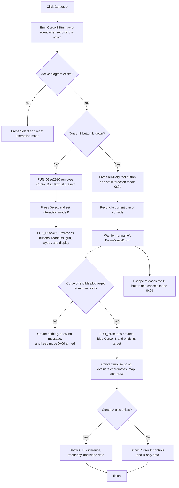

# Arm Cursor B placement or remove Cursor B

> Analysis status: Recovered resource, unique click handler, deferred mouse placement, curve binding, shared removal and UI reconciliation, Cursor A interaction, keyboard cancellation, redraw, and no-op and error boundaries reviewed.

## Control

| Property | Recovered value |
| --- | --- |
| Form | DFWindow |
| Component path | DFWindow.DFToolPanel.ToolNoteBook.Diagram.CursorBBtn |
| Control class | TSpeedButton |
| Caption | Not present in the recovered resource. |
| Hint | Cursor: b |
| AllowAllUp | true |
| GroupIndex | 3 |
| Handler name | CursorBBtnClick |
| Handler address | 01a7bac0 |
| Graph node | `resource:dfm:DFWindow/DFWindow.DFToolPanel.ToolNoteBook.Diagram.CursorBBtn` |
| Handler node | `function:01a7bac0` |
| Graph layer | UI |

## What happens when clicked

[`FUN_01a7bac0`](../../../DecompiledSources/Tina16/functions/0000000001A7BAC0__FUN_01a7bac0.c) reads the speed button's current `Down` byte and selects one of two operations:

- When the button is down, it arms one-shot Cursor B placement by writing interaction mode `0x0d` at DFWindow offset `+0x7a8`.
- When the button is released, it removes Cursor B through the shared cursor-removal helper, restores normal selection mode, and reconciles the cursor controls.

The click always builds and sends a macro event with the literal `CursorBBtn` before it tests the active diagram or the button state. The macro event records the command when macro recording is active. It does not save the diagram cursor.

## Active-diagram guard

The handler reads the active diagram manager at form offset `+0x798`.

If that pointer is null, the handler presses the Select speed button at `+0xa90` and calls [`FUN_01a794b0`](../../../DecompiledSources/Tina16/functions/0000000001A794B0__FUN_01a794b0.c). The Select handler writes interaction mode zero. It cannot clear a diagram selection because there is no diagram. This branch does not create or remove a cursor and does not call the shared cursor-state reconciler.

## Arm and create Cursor B

When an active diagram exists and `CursorBBtn.Down` is true, the click handler presses an auxiliary speed button at form offset `+0xb58`, writes interaction mode `0x0d`, and calls the shared cursor-state reconciler. The recovered source does not establish the original Delphi field name for the auxiliary button. The click itself does not allocate a cursor and does not use a mouse coordinate.

Actual placement occurs on a later normal left-button `FormMouseDown` in [`FUN_01a730e0`](../../../DecompiledSources/Tina16/functions/0000000001A730E0__FUN_01a730e0.c). For mode `0x0d`, that path:

1. Hit-tests the mouse position.
2. Uses the first hit curve when the hit category is exactly `2`, or accepts a separate plot target only when its recovered eligibility bit is set.
3. Calls [`FUN_01ae1eb0`](../../../DecompiledSources/Tina16/functions/0000000001AE1EB0__FUN_01ae1eb0.c) with the Cursor B selector, the resolved curve or plot target, and the mouse point.
4. Reconciles cursor controls and readouts, presses the Select speed button, and resets the interaction mode to zero after it calls the creation helper.

Successful placement, or a failed target-resolution attempt inside the creation helper, is therefore one-shot. If the initial hit tests reject the point, the mouse handler skips the creation and reset block. It leaves mode `0x0d` armed so the user can try another point. A modified left-button path can enter the form's separate selection-drag logic instead of the mode-`0x0d` creation branch.

### Cursor object and curve binding

The creation helper selects manager field `+0xf8` for Cursor B. If that field already contains a cursor, the helper first detaches, erases, destroys, and clears that old cursor before it resolves the new target. On successful target resolution, it:

- allocates a cursor and stores it at manager offset `+0xf8`;
- stores the diagram manager on the cursor and sets its A-or-B selector byte at `+0x90` to `0`;
- assigns color value `0x00ff0000`, the Delphi `TColor` value for blue;
- stores the curve link at cursor offset `+0x58`, or the alternate plot owner at `+0x50`;
- registers a curve-bound cursor with the curve owner;
- converts the mouse point to curve coordinates, stores the X coordinate at `+0x78`, and evaluates or converts the Y coordinate into `+0x80`;
- maps the data position to screen coordinates and draws the cursor; and
- invokes the common cursor-state reconciler because the caller supplies its refresh flag.

For a curve-bound cursor, the Y value comes from the curve provider at the selected X coordinate. A special provider class uses its recovered inverse and forward coordinate-conversion methods. The alternate plot-owner path creates an X-position cursor without a curve link.

## Remove Cursor B

When `CursorBBtn.Down` is false, the handler calls the `.333`-owned shared removal helper [`FUN_01ae2980`](../../../DecompiledSources/Tina16/functions/0000000001AE2980__FUN_01ae2980.c) with selector false. That selector addresses Cursor B at manager offset `+0xf8`.

If Cursor B exists, the helper notifies its associated owner, erases it, invokes its diagram-update method, destroys the object, and clears manager `+0xf8`. A null Cursor B pointer makes the removal helper a no-op. The click handler still presses Select, writes interaction mode zero, and calls the common reconciler.

There is no confirmation dialog, Cancel button, undo registration, or cursor serializer in this removal path.

## Cursor A interaction, button state, and readouts

Cursor A and Cursor B use separate manager pointers (`+0xf0` and `+0xf8`) and separate speed-button groups (`2` and `3`). A Cursor B operation does not remove Cursor A. Both cursors can therefore exist at the same time.

Cursor B placement and removal both finish through the `.333`-owned reconciler [`FUN_01ae4310`](../../../DecompiledSources/Tina16/functions/0000000001AE4310__FUN_01ae4310.c) when a diagram exists.

- With no cursor object yet, the reconciler can release both cursor buttons and hide `CursorPanel`. Interaction mode `0x0d`, not the button's later visual state, remains the placement-state value until a mouse click or cancellation resets it.
- After successful creation, the reconciler selects the Cursor B state, shows the applicable B controls, refreshes the B readouts and all-curves grid columns, adjusts layout, and reaches the diagram repaint path.
- If Cursor A also exists, the reconciler keeps both buttons selected and enables the applicable A-minus-B, frequency, and slope readouts and grid columns.
- After Cursor B removal, the reconciler hides the cursor panel when no cursor remains. If Cursor A remains, it keeps the Cursor A controls and A-only readouts. Two-cursor difference, frequency, and slope controls are not available with only Cursor A.

The creation helper draws the new cursor before the shared reconciliation. The removal helper erases the old cursor before destruction. The reconciler then updates controls, layout, grid content, and the diagram display.

## Keyboard cancellation

The DFWindow key-down path [`FUN_01a7d460`](../../../DecompiledSources/Tina16/functions/0000000001A7D460__FUN_01a7d460.c) dispatches Escape (`0x1b`) to [`FUN_01a7d1a0`](../../../DecompiledSources/Tina16/functions/0000000001A7D1A0__FUN_01a7d1a0.c). When interaction mode is `0x0d`, this cancellation helper releases `CursorBBtn`, resets the interaction mode and mouse cursor, and refreshes diagram selection. It does not create or remove an existing cursor.

## No-op and error boundaries

- No active diagram causes a fallback to Select mode. It does not create or remove Cursor B.
- Releasing the button while manager `+0xf8` is null still resets the tool mode and reconciles the UI, but cursor removal itself is a no-op.
- A placement click that fails the initial curve and eligible-plot hit tests creates no cursor, shows no message, and leaves mode `0x0d` armed for another click.
- If the hit tests accept a target but the creation helper cannot resolve its cursor context, the helper creates no cursor. The mouse-down handler then reconciles the unchanged cursor state and returns to Select mode.
- In the non-curve hit branch, the recovered mouse-down code reads the candidate returned by `FUN_01ad08c0` before a local null check. Safe behavior for a point with no returned plot candidate is not established.
- The creation helper removes an existing Cursor B before it validates the replacement target. An inconsistent direct call can therefore remove the old B and then fail to create the replacement.
- Creation, owner registration, coordinate conversion, drawing, removal, and UI reconciliation are sequential. There is no local exception handler or rollback. A failure can leave partially updated cursor, owner, button, readout, or pixel state.
- An error in shared reconciliation after a successful removal can leave Cursor B deleted while the button, readouts, grid, layout, or display still shows older state.
- No function on this path shows an error message or retries a failed operation.
- The traced path changes live diagram and UI state. It does not call a Save command, document serializer, settings writer, recovered modified-state setter, or undo registrar.

## Click and deferred placement flow

## Handler and call-path evidence

- Click handler: [FUN_01a7bac0](../../../DecompiledSources/Tina16/functions/0000000001A7BAC0__FUN_01a7bac0.c)
- Select-mode handler: [FUN_01a794b0](../../../DecompiledSources/Tina16/functions/0000000001A794B0__FUN_01a794b0.c)
- Deferred mouse-down placement: [FUN_01a730e0](../../../DecompiledSources/Tina16/functions/0000000001A730E0__FUN_01a730e0.c)
- Cursor creation and curve binding: [FUN_01ae1eb0](../../../DecompiledSources/Tina16/functions/0000000001AE1EB0__FUN_01ae1eb0.c)
- Shared Cursor A or B removal: [FUN_01ae2980](../../../DecompiledSources/Tina16/functions/0000000001AE2980__FUN_01ae2980.c)
- Shared cursor-state reconciliation: [FUN_01ae4310](../../../DecompiledSources/Tina16/functions/0000000001AE4310__FUN_01ae4310.c)
- Escape cancellation: [FUN_01a7d1a0](../../../DecompiledSources/Tina16/functions/0000000001A7D1A0__FUN_01a7d1a0.c)
- Key-down dispatcher: [FUN_01a7d460](../../../DecompiledSources/Tina16/functions/0000000001A7D460__FUN_01a7d460.c)
- Selected-cursor delete dispatcher: [FUN_01ae28b0](../../../DecompiledSources/Tina16/functions/0000000001AE28B0__FUN_01ae28b0.c)
- Macro-event builder: [FUN_01aee720](../../../DecompiledSources/Tina16/functions/0000000001AEE720__FUN_01aee720.c)
- Macro-event recorder: [FUN_01aed550](../../../DecompiledSources/Tina16/functions/0000000001AED550__FUN_01aed550.c)
- Cursor A control analysis: [Cursor A button](cursorabtn-f4bb312f27.md)
- Shared deletion and reconciliation analysis: [Delete selected cursor](deletecursormnu-c6ff8616fa.md)
- Cursor B glyph: [0088 CursorBBtn Glyph](../../../glyph/0088_DFWindow_DFWindow_DFToolPanel_ToolNoteBook_Diagram_CursorBBtn_Glyph_Data.png)

## Resource and graph evidence

- The recovered hint is `Cursor: b`.
- `AllowAllUp=true` lets the user release this speed button, which selects the removal branch.
- `CursorBBtn` has `GroupIndex=3`; `CursorABtn` has `GroupIndex=2`. Their group separation agrees with the two independent cursor pointers and permits both cursors to stay active.
- The extracted 20-by-20 raster glyph shows a blue lowercase `b` beside black cursor lines. It confirms the B and blue visual identity but does not by itself prove creation or deletion.
- The graph places the handler in the `UI` layer. It shows the DFM `OnClick` trigger, calls to the macro helpers, Select fallback, shared cursor removal, and shared reconciliation, and an incoming call from the selected-cursor deletion dispatcher.
- `.333` owns the canonical annotations for `FUN_01ae28b0`, `FUN_01ae2980`, and `FUN_01ae4310`. This article cites those shared roles and does not redefine them.

## Analysis limits

- The original Delphi names of the diagram manager, cursor class, auxiliary speed button at `+0xb58`, and several virtual methods are not recovered.
- The eligibility bit on an alternate plot target is proven by the mouse-down guard, but its original Delphi enumeration name is unavailable.
- Shared creation, mouse, cancellation, deletion, and reconciliation functions are cited for the full call path. This Bead annotates only the unique Cursor B click handler.
- This analysis does not infer persistence, undo support, or an error dialog where the recovered call path has no such function.
