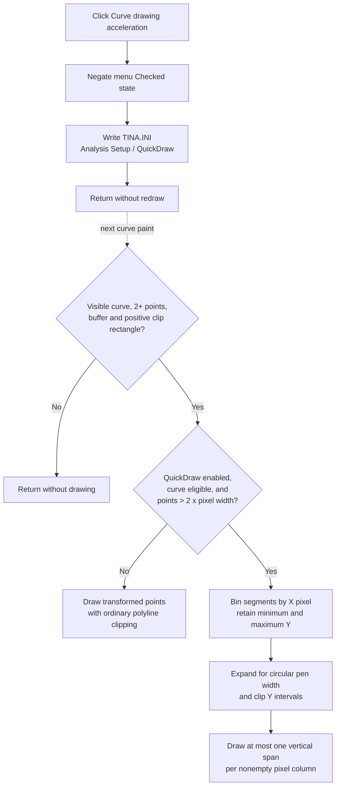

# Curve drawing acceleration

> Analysis status: Recovered resource, unique handler, QuickDraw persistence, menu-state reload, curve-render eligibility, dense-pixel threshold, per-column envelope algorithm, pen-width expansion, clipping, fallback renderer, and display, error, redraw, and persistence boundaries reviewed.

## Control

| Property | Recovered value |
| --- | --- |
| Form | DFWindow |
| Component path | DFWindow.DFMainMenu.DFViewMnu.CurveAccelMnu |
| Control class | TMenuItem |
| Caption | Curve drawing acceleration |
| Hint | Not present in the recovered resource. |
| Handler name | CurveAccelMnuClick |
| Handler address | 01a88390 |
| Graph node | `resource:dfm:DFWindow/DFWindow.DFMainMenu.DFViewMnu.CurveAccelMnu` |
| Handler node | `function:01a88390` |
| Graph layer | UI |

## What happens when clicked

`TDFWindow.CurveAccelMnuClick` toggles a global curve-rendering option named
`QuickDraw`. It does not calculate the physical acceleration of a selected
curve.

The handler performs two operations in order:

1. It reads the menu item's current `Checked` byte at offset `+0x80`, negates
   it, and applies the new checked state. The common VCL setter also publishes
   the state to the native menu.
2. It writes that new Boolean to `TINA.INI` under
   `[Analysis Setup] QuickDraw`.

There is no current-diagram test, selected-object query, or selected-curve
requirement. Repeated clicks alternate between enabled and disabled. When the
menu state is refreshed, `FUN_01a7fc90` reads the same INI value with a default
of false and synchronizes the check mark.

## What QuickDraw accelerates

The setting is read by `FUN_01d2b960` while it draws a curve to a device
context. The renderer first requires all of these basic conditions:

- the curve has at least two display points;
- the curve's visibility or drawable-state method returns true;
- a drawing target exists;
- the transformed point buffer exists; and
- the device-coordinate drawing rectangle has positive width and height.

If a basic condition fails, that renderer returns without drawing the curve.
These are render-time checks, not click-time guards.

The accelerated branch has three additional prerequisites:

- the curve's recovered fast-draw eligibility byte at offset `+0x5d` is set;
- `[Analysis Setup] QuickDraw` is true; and
- `pointCount > 2 * horizontalPixelSpan`.

The density test means acceleration is used only when there are more than two
transformed curve points for each horizontal output pixel. If any accelerated
condition fails, the renderer uses its ordinary point-by-point polyline and
clipping path.

## Pixel-envelope algorithm

`FUN_01d27ab0` receives already transformed integer device coordinates, the
point count, pen width, and the device clipping rectangle. It does not receive
the curve's physical units or original floating-point domain values.

The algorithm is:

1. Allocate one bucket for every horizontal pixel column from the clip-left
   coordinate through clip-right.
2. Rasterize every consecutive point pair across the columns that it crosses.
   For each column, retain the lowest and highest Y coordinate reached by the
   segment. Vertical segments update their single column.
3. If the recovered pen width is nonzero, cap it at 2000 device units and
   enlarge neighboring column envelopes with a circular pen footprint. At
   horizontal offset `d` from the stroke center, the vertical diameter is
   derived from `2 * sqrt(radius^2 - d^2)` and rounded to an integer.
4. Clip each resulting Y interval to the rectangle's top and bottom. When two
   adjacent columns have separated intervals, split the vertical gap at a
   midpoint so the neighboring spans remain visually connected without
   overlapping.
5. For each nonempty X-column bucket, draw one vertical segment from its
   clipped minimum Y through maximum Y.

This preserves the visible minimum and maximum of a dense curve in each pixel
column while reducing many input points to at most one vertical output span per
column. The result is a faster raster approximation for display. It is not a
numerical derivative, resampling operation, smoothing result, or new curve.

## Data, units, and output boundaries

- Input to the accelerator is already in integer device coordinates. X, Y,
  clipping bounds, and pen width are pixels or device units, not seconds,
  volts, amperes, or another analysis unit.
- The original point buffer, curve object, axes, and analysis results are not
  modified.
- The only output is drawing commands sent to the current graphics target.
- The ordinary path remains available for sparse or ineligible curves and
  processes the transformed points in order.
- No dialog asks for a tolerance, point count, unit, or quality level.

## Redraw and persistence

The click changes the menu check mark immediately and writes the Boolean to
`TINA.INI`. The curve renderer reads the INI setting when it draws, so the new
mode applies to later curve painting and persists across application sessions.

The handler does not invalidate the window, recalculate axes, request layout,
or call a repaint function. Existing pixels are not redrawn by this click
alone. The effect becomes visible when another action causes the curve to be
drawn again.

The setting is global under `Analysis Setup`; it is not stored in the current
`.tdr` diagram, a selected curve, or a per-axis property. No curve data Save is
needed for it.

## No-op and error behavior

- The handler always attempts a Boolean toggle. It does not require a diagram
  or curve selection and shows no warning when none exists.
- Missing `QuickDraw` INI state is read as false when the menu is synchronized.
- The INI writer returns no status to this handler. There is no local error
  dialog, retry, or rollback if persistence fails.
- Because the check mark changes before the INI write, a write failure can
  leave the current menu state changed without proving that the next process
  will reload the same value.
- There is no allocation or drawing error path in the click handler. The
  accelerator itself has no status result or local message dialog.
- QuickDraw never bypasses the renderer's visibility, point-buffer, rectangle,
  eligibility, or density guards.

## Click and render flow

## Handler and call-path evidence

- Toggle handler: [FUN_01a88390](../../../DecompiledSources/Tina16/functions/0000000001A88390__FUN_01a88390.c)
- QuickDraw-aware curve renderer: [FUN_01d2b960](../../../DecompiledSources/Tina16/functions/0000000001D2B960__FUN_01d2b960.c)
- Per-column pixel-envelope accelerator: [FUN_01d27ab0](../../../DecompiledSources/Tina16/functions/0000000001D27AB0__FUN_01d27ab0.c)
- Segment-to-column envelope mapper: [FUN_01d278b0](../../../DecompiledSources/Tina16/functions/0000000001D278B0__FUN_01d278b0.c)
- Menu-item checked-state setter: [FUN_007e2d20](../../../DecompiledSources/Tina16/functions/00000000007E2D20__FUN_007e2d20.c)
- Analysis Setup Boolean writer: [FUN_00f06730](../../../DecompiledSources/Tina16/functions/0000000000F06730__FUN_00f06730.c)
- Analysis Setup Boolean reader: [FUN_00f06890](../../../DecompiledSources/Tina16/functions/0000000000F06890__FUN_00f06890.c)
- DFWindow menu-state synchronizer: [FUN_01a7fc90](../../../DecompiledSources/Tina16/functions/0000000001A7FC90__FUN_01a7fc90.c)
- Recovered form evidence: [ui-evidence.json](../../../DecompiledSources/Tina16/resources/dfm/ui-evidence.json)

## Direct calls

- `FUN_007e2d20` - Applies the inverse checked state to CurveAccelMnu and
  publishes the native menu change.
- `FUN_00f06730` - Writes the new `QuickDraw` Boolean to the `Analysis Setup`
  section of `TINA.INI`.

## Resource evidence

- The menu caption is `Curve drawing acceleration ` in the recovered DFM; the
  trailing space has no behavioral role.
- The resource has no hint, shortcut, action, initial checked state,
  image-list entry, embedded glyph, or picture.
- The source key `QuickDraw` and its rendering consumer establish that this is
  a drawing-performance toggle. The caption alone does not establish the
  algorithm or imply physical acceleration.
- No nearby label applies to this menu item.

## Analysis limits

- Recovered Delphi field names are unavailable for the curve render record and
  its eligibility byte. Their roles follow from the visibility, point-buffer,
  clip-rectangle, density, and draw-call data flow.
- The accelerator operates after domain-to-device transformation. This source
  therefore cannot establish the original axis units from its integer inputs.
- The ordinary renderer contains additional line clipping and discontinuity
  handling. This article describes it only as the proven fallback and focuses
  on the setting's distinct accelerated branch.
- Shared VCL menu-state and INI helpers retain their existing canonical
  annotations. This analysis owns only the unique toggle handler and the two
  proven rendering functions.
