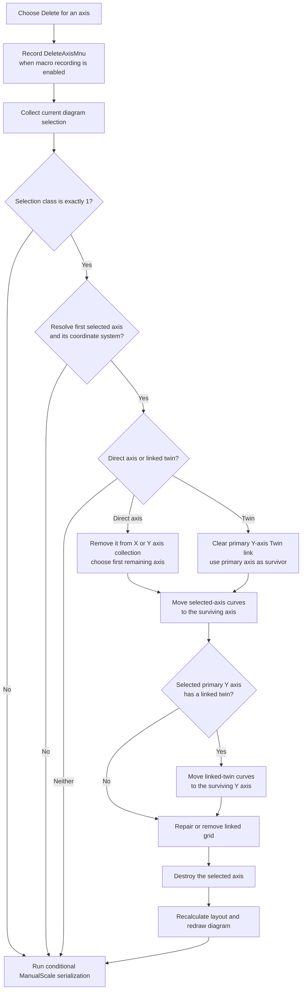

# Delete a selected axis

> Analysis status: Complete. This popup command removes one selected X or Y axis, moves its curves to the first remaining axis of the same orientation, repairs the related grid, redraws the active diagram, and conditionally serializes ManualScale options.

## Control

| Property | Recovered value |
| --- | --- |
| Form | DFWindow |
| Component path | DFWindow.DFPopupMnu.DeleteAxisMnu |
| Control class | TMenuItem |
| Caption | Delete |
| Hint | Not present in the recovered resource. |
| Handler name | DeleteAxisMnuClick |
| Handler address | `01a79330` |
| Graph node | `resource:dfm:DFWindow/DFWindow.DFPopupMnu.DeleteAxisMnu` |
| Handler node | `function:01a79330` |
| Graph layer | UI |

## What happens when clicked

`FUN_01a79330` performs three operations in order:

1. It records the `DeleteAxisMnu` macro action when macro recording is enabled.
2. It calls the shared axis-removal helper `FUN_01ad6c70` for the active diagram at DFWindow offset `+0x798`, with layout and redraw enabled.
3. It calls `FUN_01add6f0`, which serializes diagram options only when `Diagram Page Setup / ManualScale` is enabled in `TINA.INI`.

The handler does not inspect `Sender`, popup coordinates, or a hovered object. It does not ask for confirmation and has no Cancel branch. Its target comes from the selection already stored in the active diagram.

## Selection and type guards

The shared helper builds the current selected-object list through `FUN_01acff30`. It continues only when the recovered selection-class result is exactly `1`, the axis-selection path proved by the later axis orientation, owner, curve-list, twin, and grid fields.

It uses the first selected object and calls `FUN_01ad1090` to resolve its containing coordinate system. The resolver also unwraps the recovered selection proxy when needed and accepts an axis found in the coordinate system's X-axis list, Y-axis list, or a Y axis's `Twin` link.

These cases return without axis mutation or a message:

- the selection-class result is not exactly `1`;
- the selected object cannot be resolved to a coordinate system;
- the selected axis is neither in the orientation-matched axis list nor referenced as a twin by an axis in that list.

The click handler does not receive a success result from the helper. After any normal return, including these rejected cases, it still runs the conditional ManualScale serialization check. The macro attempt also occurs before validation.

## Axis removal and curve reassignment

The helper determines whether the selected axis uses the coordinate system's X-axis collection at `+0x70` or Y-axis collection at `+0x78`.

For an axis stored directly in that collection, it removes the selected axis entry and chooses item `0` of the remaining collection as the survivor. Thus the first remaining X or Y axis receives the curves. If the deleted axis was item `0`, the old item `1` becomes the survivor. If another axis was deleted, the existing item `0` remains the survivor.

For a selected twin axis that is not a direct collection item, the helper finds the primary Y axis whose `+0x118` field points to that twin. It clears the primary axis's twin link and uses that primary axis as the survivor.

The helper then processes every curve in the selected axis's curve list at `+0xF8`:

- it writes the survivor into the curve's recovered X-axis or Y-axis owner field, with the exact field selected by curve subtype and axis orientation;
- it appends the curve to the survivor's curve list;
- it does not destroy the curve or change its sample data.

When a directly selected Y axis has its own linked twin, the helper also moves every curve from that twin to the same surviving Y axis. The function does not issue a separate destruction call for that linked twin. It migrates the twin curves, then destroys the selected primary axis; whether the selected axis destructor also owns that linked twin is not visible in this function.

After curve and grid repair, the helper destroys the selected axis object. A selected twin is therefore destroyed after its link is cleared and its curves are moved. A directly selected axis is destroyed after its collection entry is removed and its curves are moved.

## Grid repair

The coordinate system stores grids in collection `+0x88`, and each axis can refer to a grid at `+0x100`.

- When the coordinate system has fewer than two grids, the helper keeps grid item `0` and rebinds its X-axis or Y-axis pointer to item `0` of the surviving axis collection. `FUN_01cd9880` and `FUN_01cd98a0` update both the grid pointer and the axis backlink.
- When it has at least two grids and the selected axis has a linked grid, the helper clears that grid's two axis backlinks, removes the grid from collection `+0x88`, and destroys the grid.
- When it has at least two grids but the selected axis has no linked grid, it does not remove another grid.

The helper does not delete the coordinate system, diagram page, other axes, or unrelated grids.

## Layout, redraw, and document state

The handler passes refresh flag `1`. After a successful axis removal, the helper recalculates the changed coordinate system, adds it to the diagram's refresh collection if absent, and runs the common diagram redraw path. The current DFWindow page and tab remain selected. The active diagram pointer at `+0x798` is not replaced.

The wrapper then calls the shared diagram-options serializer. When `ManualScale` is false, this call does not copy diagram options. When it is true, it writes the current curve, coordinate-system, X-axis, Y-axis, and figure configuration through the temporary `DiagOpt.tmp` representation into the associated diagram-data object.

This is document-owned option state, not a project-file Save. The command has no recovered undo snapshot, inverse transfer, or redo record.

## Click flow

## No-op, error, and partial-failure behavior

- A rejected selection or unresolved axis produces no message and no axis mutation. The macro attempt and final serialization check still occur.
- The popup resource has no recovered `OnPopup` handler, static Enabled value, or type-specific action binding. The handler itself has no active-diagram null guard.
- The removal helper has no explicit guard that one same-orientation axis remains. It removes a direct axis before it reads survivor item `0`. Removing the only X or Y axis can therefore reach an invalid collection access.
- The single-grid branch tests only whether the grid count is less than two before it reads grid item `0`. A zero-grid state can also reach an invalid collection access.
- There is no local exception handler, retry, transaction, or rollback. A failure after collection removal can leave the selected axis unlisted but not destroyed. A failure during curve migration can leave some curves reassigned and others attached to the selected axis.
- The twin link is cleared before the selected twin's curves are moved. A later failure can leave a detached live twin.
- Grid backlink changes and grid-list removal occur before selected-axis destruction. A failure can leave partial grid ownership changes.
- The redraw occurs before the wrapper's serialization call. A serialization failure can leave the live diagram changed and redrawn while the document-owned option copy remains older.

## Evidence

- [`FUN_01a79330`](../../../DecompiledSources/Tina16/functions/0000000001A79330__FUN_01a79330.c) is `DeleteAxisMnuClick`. It records the macro action, calls the shared removal helper with refresh enabled, and unconditionally calls the ManualScale serializer after a normal return.
- [`FUN_01ad6c70`](../../../DecompiledSources/Tina16/functions/0000000001AD6C70__FUN_01ad6c70.c) implements the axis-selection guard, direct-axis or twin lookup, curve transfer, grid repair, selected-axis destruction, layout, and redraw. Bead `TIARA-diz.6.7.303` owns its canonical annotation.
- [`FUN_01acff30`](../../../DecompiledSources/Tina16/functions/0000000001ACFF30__FUN_01acff30.c) rebuilds the selected-object list and returns the combined selection class.
- [`FUN_01ad1090`](../../../DecompiledSources/Tina16/functions/0000000001AD1090__FUN_01ad1090.c) resolves the selected axis or selection proxy to its containing coordinate system.
- [`FUN_01cd9880`](../../../DecompiledSources/Tina16/functions/0000000001CD9880__FUN_01cd9880.c) rebinds a grid's X axis and updates the axis backlink.
- [`FUN_01cd98a0`](../../../DecompiledSources/Tina16/functions/0000000001CD98A0__FUN_01cd98a0.c) rebinds a grid's Y axis and updates the axis backlink.
- [`FUN_01ae5650`](../../../DecompiledSources/Tina16/functions/0000000001AE5650__FUN_01ae5650.c) runs the common diagram redraw path after a successful mutation.
- [`FUN_01ada080`](../../../DecompiledSources/Tina16/functions/0000000001ADA080__FUN_01ada080.c) reads `Diagram Page Setup / ManualScale` from `TINA.INI`.
- [`FUN_01add6f0`](../../../DecompiledSources/Tina16/functions/0000000001ADD6F0__FUN_01add6f0.c) performs the conditional diagram-options serialization. It is a shared helper and is not annotated by this control fragment.
- [Recovered DFWindow resource](../../../DecompiledSources/Tina16/resources/dfm/ui-evidence.json) binds `DeleteAxisMnu.OnClick` to `01a79330` and supplies the `Delete` caption. It contains no hint, shortcut, action, image reference, or glyph.

## Analysis limits

- The recovered Delphi enum name for selection class `1` is not published. The downstream data flow proves that this accepted path processes an axis.
- The semantic Delphi names for the curve owner fields selected by orientation and subtype are not recovered. This article reports only their proven reassignment to the surviving axis.
- The selected primary axis's destructor is virtual. This function does not expose whether that destructor also frees a linked twin after twin-curve migration.
- No live UI test was performed. The DFM binding, read-only graph neighborhood, handler, shared removal helper, selection resolver, grid setters, redraw path, and serializer agree on the behavior above.
