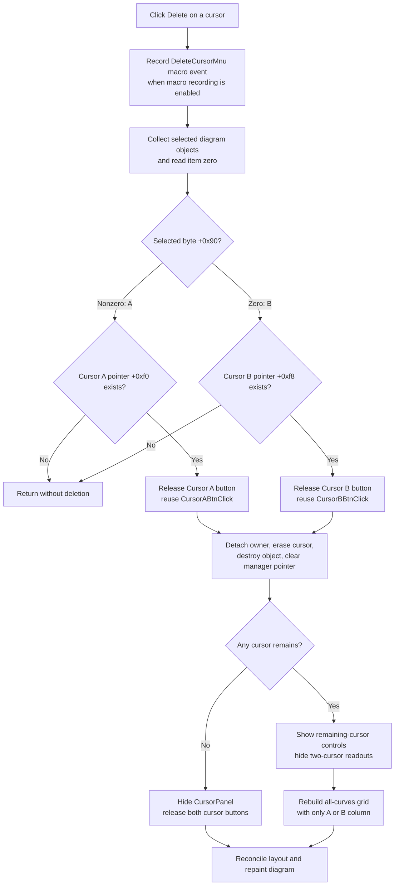

# Delete selected cursor

> Analysis status: Recovered resource, unique handler, macro-event logging, selected-object classification, Cursor A and B dispatch, cursor detach and destruction, pointer cleanup, cursor-panel and readout reconciliation, redraw and serialization boundaries, and no-op, empty-selection, error, and partial-failure paths reviewed.

## Control

| Property | Recovered value |
| --- | --- |
| Form | DFWindow |
| Component path | DFWindow.DFPopupMnu.DeleteCursorMnu |
| Control class | TMenuItem |
| Caption | Delete |
| Hint | Not present in the recovered resource. |
| Handler name | DeleteCursorMnuClick |
| Handler address | 01a7a990 |
| Graph node | `resource:dfm:DFWindow/DFWindow.DFPopupMnu.DeleteCursorMnu` |
| Handler node | `function:01a7a990` |
| Graph layer | UI |

## What happens when clicked

`TDFWindow.DeleteCursorMnuClick` deletes the selected diagram cursor. It does
not show a confirmation dialog.

The handler first creates and emits the application's macro-event text for
`DeleteCursorMnu`. It then passes the active diagram manager at DFWindow offset
`+0x798` to `FUN_01ae28b0`.

The dispatcher collects the diagram's selected objects through
`FUN_01acff30` and uses only item zero. It reads that selected object's byte at
`+0x90`:

- a nonzero byte classifies the selection as Cursor A and selects the manager
  pointer at `+0xf0`;
- a zero byte classifies it as Cursor B and selects the manager pointer at
  `+0xf8`.

For Cursor A, the dispatcher forces `CursorABtn` to its released state and
calls `TDFWindow.CursorABtnClick`. For Cursor B, it releases `CursorBBtn` and
calls `TDFWindow.CursorBBtnClick`. The recovered hints `Cursor: a` and
`Cursor: b`, the red `a` and blue `b` glyphs, and the two pointer branches
confirm this mapping.

## Cursor removal

Both button handlers use `FUN_01ae2980` when their speed button is released.
The handler passes true for Cursor A and false for Cursor B. The removal helper
checks the corresponding manager pointer again and, when it exists, performs
these operations in order:

1. If the cursor has an associated owner at `+0x58`, call that owner's
   recovered removal callback with the cursor.
2. Run the cursor drawing path against the manager's drawing context with its
   erase flag set.
3. Invoke the cursor's recovered diagram-update method with the manager's view
   and drawing contexts.
4. Destroy the cursor object.
5. Set the corresponding manager pointer at `+0xf0` or `+0xf8` to null.

The reused Cursor A or Cursor B handler then selects the recovered default
diagram tool by setting its speed button at DFWindow `+0xa90` down, resets the
interaction-mode byte at `+0x7a8` to zero, and calls the common cursor-state
reconciler.

## Readout and control cleanup

`FUN_01ae4310` reads the remaining Cursor A and Cursor B pointers and updates
the cursor UI.

If the deleted cursor was the last cursor, the reconciler:

- hides `CursorPanel`;
- releases both Cursor A and Cursor B speed buttons; and
- runs the DFWindow layout and repaint path.

This no-cursor branch returns before the detailed readout and all-curves grid
calculators run. Their cached text or cells are not explicitly cleared by this
branch, but the cursor panel is hidden.

If one cursor remains, the reconciler:

- shows the controls that apply to the remaining cursor and hides or disables
  the missing cursor, A-minus-B, and two-cursor controls;
- releases the deleted cursor's speed button and keeps the remaining cursor's
  button selected;
- calls the selected-readout updater, whose difference, frequency, and slope
  calculations require both active cursors and therefore do not run;
- rebuilds the all-curves grid with only the remaining A or B cursor column,
  without A-minus-B or `Freq & Slope` columns;
- adjusts the cursor-panel layout; and
- reaches the normal diagram repaint path.

The old numeric label text can remain stored in controls that are now hidden.
The cleanup is based on visibility, enabled state, available grid columns, and
repaint. It is not a blanket text reset.

## Shared Cursor A, Cursor B, and frequency helpers

This popup command deliberately reuses `CursorABtnClick` and
`CursorBBtnClick`; it does not implement separate A and B deletion logic. The
button handlers also support cursor-placement mode when their buttons are
pressed. The popup dispatcher forces the relevant button to released first,
so this path takes their deletion branch.

The common reconciler is the same `FUN_01ae4310` used by the previously
reviewed frequency-and-slope and cursor-format controls. It calls
`FUN_01ad1740` for selected A-to-B readouts and `FUN_01ad31e0` for the
all-curves grid. These are derived readouts from Cursor A and Cursor B. The
Delete command does not find or remove a third frequency cursor.

After a successful deletion, no two-cursor frequency or slope result can be
recalculated because at most one cursor remains. The reconciler hides those
controls and removes their grid column where the nonempty path rebuilds the
grid.

## Redraw, persistence, and undo boundary

The removal helper performs an erase pass for the cursor before destruction.
The later common reconciliation reaches `FUN_01a77f90`, which lays out and
repaints the active diagram. The deleted cursor therefore disappears from the
live diagram, and the cursor panel matches the remaining state.

The click path does not call a diagram serializer, settings writer, registry
API, INI writer, Save command, or recovered undo-registration helper. It also
does not set a recovered document-modified flag. The macro-event recorder can
record the command name when recording is enabled, but that event is not a
diagram-state serialization. Persistence or undo restoration of cursor state
is not established by this path.

## No-op, empty-selection, and error behavior

- The dispatcher uses only the first selected object. Additional selected
  objects do not cause additional cursor deletions.
- If the first object's classification selects Cursor A but manager `+0xf0`
  is null, or selects Cursor B but `+0xf8` is null, the dispatcher returns
  without deletion or UI reconciliation.
- The dispatcher does not compare the selected object's address with the
  selected A or B manager pointer. It relies on the popup-menu selection
  invariant and the classification byte.
- The dispatcher indexes selected item zero without checking that the
  collected list is nonempty. An empty selection can therefore raise an index
  error in the list accessor. There is no local error message or fallback.
- The removal helper repeats the cursor-pointer check. A pointer that becomes
  null before this check makes removal a no-op.
- Macro-event construction and optional recording happen before deletion. An
  error there prevents the delete call.
- Cursor detach, erase, diagram notification, destruction, and pointer clearing
  occur in sequence without rollback. An error before the final pointer clear
  can leave a partly detached or erased cursor while the manager still holds
  it.
- UI reconciliation occurs after the manager pointer is cleared. An error in
  the shared refresh can leave the cursor deleted while buttons, hidden
  readouts, grid columns, layout, or pixels show an older or partly updated
  state.
- No function in this path catches an error, retries the operation, or restores
  the previous cursor and UI state.

## Delete and cleanup flow

## Handler and call-path evidence

- Delete command handler: [FUN_01a7a990](../../../DecompiledSources/Tina16/functions/0000000001A7A990__FUN_01a7a990.c)
- Selected-cursor classifier and dispatcher: [FUN_01ae28b0](../../../DecompiledSources/Tina16/functions/0000000001AE28B0__FUN_01ae28b0.c)
- Selected-object collector: [FUN_01acff30](../../../DecompiledSources/Tina16/functions/0000000001ACFF30__FUN_01acff30.c)
- Cursor A button handler: [FUN_01a7b980](../../../DecompiledSources/Tina16/functions/0000000001A7B980__FUN_01a7b980.c)
- Cursor B button handler: [FUN_01a7bac0](../../../DecompiledSources/Tina16/functions/0000000001A7BAC0__FUN_01a7bac0.c)
- Shared A or B removal helper: [FUN_01ae2980](../../../DecompiledSources/Tina16/functions/0000000001AE2980__FUN_01ae2980.c)
- Cursor draw and erase path: [FUN_01ac1cf0](../../../DecompiledSources/Tina16/functions/0000000001AC1CF0__FUN_01ac1cf0.c)
- Common cursor-state reconciler: [FUN_01ae4310](../../../DecompiledSources/Tina16/functions/0000000001AE4310__FUN_01ae4310.c)
- Selected A-to-B readout updater: [FUN_01ad1740](../../../DecompiledSources/Tina16/functions/0000000001AD1740__FUN_01ad1740.c)
- All-curves cursor-grid rebuild: [FUN_01ad31e0](../../../DecompiledSources/Tina16/functions/0000000001AD31E0__FUN_01ad31e0.c)
- DFWindow layout and repaint: [FUN_01a77f90](../../../DecompiledSources/Tina16/functions/0000000001A77F90__FUN_01a77f90.c)
- Macro-event text builder: [FUN_01aee720](../../../DecompiledSources/Tina16/functions/0000000001AEE720__FUN_01aee720.c)
- Macro-event recorder: [FUN_01aed550](../../../DecompiledSources/Tina16/functions/0000000001AED550__FUN_01aed550.c)
- Cursor A glyph: [0087 CursorABtn Glyph](../../../glyph/0087_DFWindow_DFWindow_DFToolPanel_ToolNoteBook_Diagram_CursorABtn_Glyph_Data.png)
- Cursor B glyph: [0088 CursorBBtn Glyph](../../../glyph/0088_DFWindow_DFWindow_DFToolPanel_ToolNoteBook_Diagram_CursorBBtn_Glyph_Data.png)
- Recovered form evidence: [ui-evidence.json](../../../DecompiledSources/Tina16/resources/dfm/ui-evidence.json)

## Direct calls

- `FUN_01aee720` - Builds the command-specific macro-event identifier.
- `FUN_01aed550` - Records the macro event only when recording is enabled.
- `FUN_01ae28b0` - Classifies the first selected cursor and dispatches to the
  Cursor A or Cursor B deletion branch.
- `FUN_00414480` - Releases the temporary UnicodeString used for macro-event
  text.

## Resource evidence

- The popup-menu caption is only `Delete`; its parent is `DFPopupMnu`.
- The Delete item has no hint, action, shortcut, checked state, image-list
  reference, embedded glyph, or picture.
- The shared speed buttons have hints `Cursor: a` and `Cursor: b`, use
  independent button groups, and have red `a` and blue `b` cursor glyphs.
- The recovered CursorPanel contains A, B, A-minus-B, frequency, slope, and
  all-curves grid controls. These resources agree with the common refresh data
  flow but do not by themselves prove deletion behavior.
- No nearby label applies to this popup-menu item.

## Analysis limits

- The private Delphi class names of the diagram manager, selected-object list,
  and cursor object are unavailable. This article uses recovered field offsets
  and repeated A and B call-site behavior.
- The owner callback and cursor virtual update method names are not recovered.
  Their placement in the detach, erase, destroy, and pointer-clear sequence is
  proven; this article does not invent more specific names.
- `FUN_01ae4310` serves many cursor controls. This analysis owns its canonical
  shared annotation. The earlier frequency and format articles retain
  ownership of their unique handlers and calculation descriptions.
- Future Cursor A and Cursor B control analyses own `FUN_01a7b980` and
  `FUN_01a7bac0`. This analysis cites but does not annotate those handlers.
- No proprietary UI action was executed. The findings use recovered resource,
  glyph, graph, handler, callee, and shared-caller evidence.
