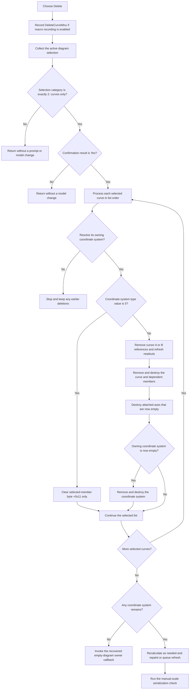

# Delete selected curves

## Control

| Property | Recovered value |
| --- | --- |
| Form | DFWindow |
| Component path | DFWindow.DFPopupMnu.DeletecurveMnu |
| Control class | TMenuItem |
| Caption | Delete |
| Hint | Not present in the recovered resource. |
| Handler name | DeletecurveMnuClick |
| Handler address | 01a790d0 |
| Graph node | `resource:dfm:DFWindow/DFWindow.DFPopupMnu.DeletecurveMnu` |
| Handler node | `function:01a790d0` |
| Graph layer | UI |

The resource identifies a popup-menu command named `Delete`. It has no hint, action, image, or nearby label. The source, not the caption alone, establishes that this command deletes selected curves from the active diagram.

## What happens when clicked

`FUN_01a790d0` first submits the command text `DeleteCurveMnu` to the macro recorder. The recorder writes it only when recording is enabled. This step occurs before any selection or confirmation check, so a cancelled or inapplicable attempt can still be recorded. The handler then passes the active diagram at form offset `+0x798` to `FUN_01ad6320` with deletion flags `(0, 0, 1)`. The last flag enables confirmation. The first flag permits removal of empty axes and coordinate systems.

The deletion helper collects the current diagram selection with `FUN_01acff30`. It continues only when the returned combined category is exactly `2`, which the recovered callers establish as a selection that contains curves only. An empty selection, a non-curve selection, or a mixed selection returns without a prompt and without a model change. When the selection is valid, the helper displays a resource-backed confirmation dialog and continues only for result `6` (`mrYes`). The exact localized prompt text is not recovered.

After confirmation, the helper processes all selected curves in list order:

- It resolves each selected member to its owning coordinate system. A failed resolution stops the operation immediately.
- For the recovered coordinate-system type value `5`, it only clears byte `+0x11` on the selected member. The source does not establish a safe domain name for this type or field.
- For other types, it removes cursor A and cursor B when either cursor refers to the curve. Each cursor removal is followed by the shared cursor UI refresh, which updates the affected readout and menu state.
- It removes the curve from the coordinate-system collection and from both attached axis collections. It also destroys dependent collection members on the recovered curve branch.
- It destroys an X axis when its attached-curve list becomes empty. For an empty Y axis, it also removes and destroys the associated Y/grid object. The recovered structure uses two axis-field layouts, selected by a coordinate-system type mask; the original Delphi type names are not available.
- It destroys the curve. If its coordinate system has no curves after this step, it removes and destroys that coordinate system.

After the list is processed, the helper recalculates the full layout when both axes and a coordinate system were removed. It recalculates the surviving coordinate system when only axes were removed. It then either requests a full clear and repaint after coordinate-system deletion, or queues the surviving coordinate system and runs the deferred diagram refresh. If no coordinate system remains, it invokes a recovered virtual callback on the diagram owner instead. The callback's original Delphi name and exact window-management effect are not recovered.

The final `FUN_01add6f0` call checks and serializes manual-scale diagram options. This is not the normal document Save command. The click changes the live diagram model, so a later document save can persist the deletion, but this handler does not write the document file itself. The empty-diagram owner-callback path returns without this manual-scale serialization call.

## Click flow

## Boundary and failure behavior

- The handler has no active-diagram null guard. It passes offset `+0x798` directly to the helper, which dereferences the value. A missing active diagram can therefore cause an access error instead of a clean no-op.
- Repeated use after all curves are gone normally fails the exact curve-selection test and returns without a prompt. This assumes the active diagram still exists after the empty-diagram owner callback.
- A non-Yes confirmation result leaves the diagram unchanged. No cleanup, repaint, or manual-scale serialization runs.
- There is no transaction, rollback, or local exception handler. If ownership resolution fails on a later list item, earlier curve, cursor, axis, or coordinate-system deletions remain. An exception during destructive cleanup can also leave partial state.
- The source does not show an undo entry, a dirty-document flag write, or a normal Save call.

## Handler and call-path evidence

- [FUN_01a790d0](../../../DecompiledSources/Tina16/functions/0000000001A790D0__FUN_01a790d0.c) formats and records `DeleteCurveMnu`, reads the active diagram at `+0x798`, and calls the central helper with `(0, 0, 1)`.
- [FUN_01ad6320](../../../DecompiledSources/Tina16/functions/0000000001AD6320__FUN_01ad6320.c) implements the exact category check, confirmation, ordered deletion, cursor cleanup, axis and coordinate-system cleanup, refresh selection, and manual-scale serialization boundary.
- [FUN_01acff30](../../../DecompiledSources/Tina16/functions/0000000001ACFF30__FUN_01acff30.c) collects selected diagram members and returns their combined category mask. Its canonical annotation belongs to `TIARA-diz.6.7.274`.
- [FUN_01ad1090](../../../DecompiledSources/Tina16/functions/0000000001AD1090__FUN_01ad1090.c) resolves a selected member to its owning coordinate system.
- [FUN_01ae2980](../../../DecompiledSources/Tina16/functions/0000000001AE2980__FUN_01ae2980.c) detaches and destroys cursor A or B and clears the corresponding diagram pointer.
- [FUN_01ae4310](../../../DecompiledSources/Tina16/functions/0000000001AE4310__FUN_01ae4310.c) refreshes cursor-dependent controls after a cursor is removed.
- [FUN_01ae5650](../../../DecompiledSources/Tina16/functions/0000000001AE5650__FUN_01ae5650.c) processes the queued diagram refresh. It already has a canonical graph annotation.
- [FUN_01add6f0](../../../DecompiledSources/Tina16/functions/0000000001ADD6F0__FUN_01add6f0.c) performs the manual-scale option serialization check; it is not the document-file Save path.

## Analysis limits

- The original Delphi names for the central deletion helper, coordinate-system subtype value `5`, axis-field layouts, and empty-diagram owner callback are not recovered.
- The confirmation text is stored through a resource-string record. The decompiled source does not expose its localized text.
- The popup resource has no target identity. The current diagram selection is the only recovered source of the curves to delete.
