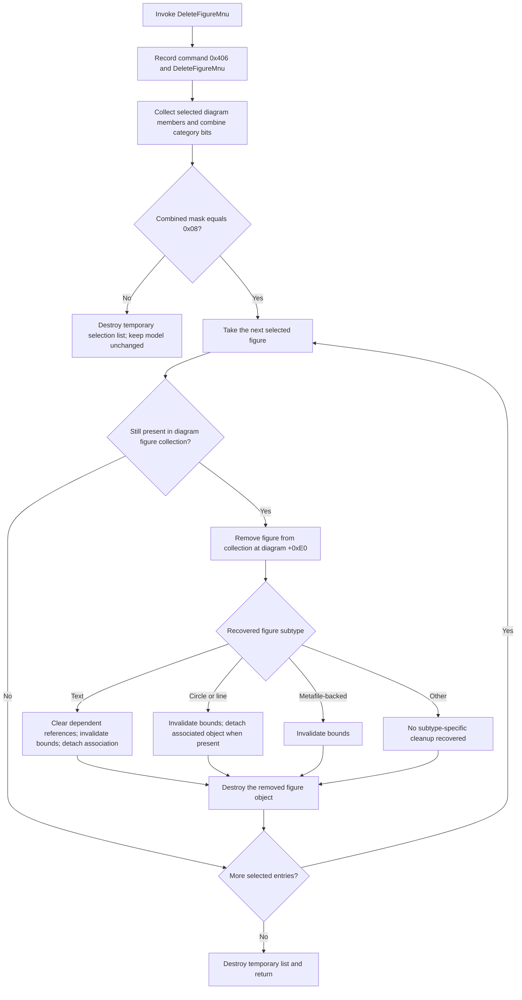

# Delete selected figure objects

> Analysis status: Reviewed from the recovered menu handler, selection classifier, figure-deletion helper, figure constructors, paste path, keyboard path, and DFM resource evidence.

## Control

| Property | Recovered value |
| --- | --- |
| Form | DFWindow |
| Component path | DFWindow.DFPopupMnu.DeleteFigureMnu |
| Control class | TMenuItem |
| Caption | `Delete` |
| Shortcut | `46` (Delete key) |
| Hint | Not present in the recovered resource. |
| Handler name | DeleteFigureMnuClick |
| Handler address | 01a7aa50 |
| Graph node | `resource:dfm:DFWindow/DFWindow.DFPopupMnu.DeleteFigureMnu` |
| Handler node | `function:01a7aa50` |
| Graph layer | UI |

## What happens when invoked

[FUN_01a7aa50](../../../DecompiledSources/Tina16/functions/0000000001A7AA50__FUN_01a7aa50.c) first records command code `0x406`, the current DFWindow context value at form offset `+0x6b8`, and the literal `DeleteFigureMnu`. It submits that record before it attempts any deletion. It then passes the active diagram at form offset `+0x798` to [FUN_01ae3e90](../../../DecompiledSources/Tina16/functions/0000000001AE3E90__FUN_01ae3e90.c).

The helper uses the shared [selection classifier](../../../DecompiledSources/Tina16/functions/0000000001ACFF30__FUN_01acff30.c). It deletes objects only when the complete selection mask is exactly `0x08`, the recovered figure category. This exact comparison is important:

- no selection is a no-op;
- a selection that contains only one or more figures is accepted;
- a mixed selection, such as figures plus a curve, cursor, or axis, is a no-op for this command.

The handler does not ask for confirmation and does not inspect a success result.

## Recovered deletion flow

## Figure classification and ownership

The classifier scans the diagram's figure collection at `+0xe0`. Each member whose selection byte at `+0x10` is set is appended to a temporary list and contributes bit `0x08`. The same classifier also collects axes, cursors, curves, and other plot children, so the helper's exact `0x08` test rejects mixed categories rather than deleting only the figure subset.

For each accepted entry, the helper searches the live `+0xe0` collection again. If the object is still present, it removes the collection entry first, performs subtype cleanup, and then calls the nil-safe Delphi destruction helper on the object. The temporary selection list holds references only. The helper destroys that list after the loop; it does not use the list as the owner of the figures.

If an entry from the temporary list is not found in the live collection, the helper skips cleanup and destruction for that entry. Under the normal path, both collections came from the same diagram immediately before the loop. This branch is a defensive or inconsistent-state path rather than the usual result.

## Subtype-specific cleanup

The recovered type tests can be tied to application controls and paste behavior:

- `PTR_FUN_010ecd58` is the object constructed by the [Circle tool](../../../DecompiledSources/Tina16/functions/0000000001A7B400__FUN_01a7b400.c).
- `LAB_00f10748` is the object constructed by the [Line tool](../../../DecompiledSources/Tina16/functions/0000000001A7B4F0__FUN_01a7b4f0.c).
- `PTR_FUN_01a5c280` is the text/picture annotation object constructed by the [Text tool](../../../DecompiledSources/Tina16/functions/0000000001A7A4A0__FUN_01a7a4a0.c) and by several analysis-annotation commands.
- `PTR_FUN_010ef9a8` is the metafile-backed figure object constructed by the [Paste handler](../../../DecompiledSources/Tina16/functions/0000000001A7EE10__FUN_01a7ee10.c) for enhanced or classic metafile clipboard data.

Every recognized subtype receives a virtual `+0xd8` call with its recovered bounds and the diagram's drawing context fields at `+0x78` and `+0x80`. Related create and placement paths use this virtual method to invalidate an object's rectangle. This is local figure cleanup; it is not a recovered whole-diagram redraw call.

Circle and line objects also use an optional reference at object offset `+0x80`. When it exists, the helper calls that referenced object's virtual `+0x108` method with the figure being deleted. Text objects use the corresponding optional association at `+0xa8`. The source proves detachment from those associated objects, but it does not recover their original Delphi field names.

Before a text object is destroyed, the helper scans every remaining figure of recovered class `LAB_00f12330`. It clears fields `+0xf0` and `+0xf8` when either field points to the text object. This prevents those remaining objects from retaining those direct references to freed text. The semantic names of the two fields are not recovered, so this article does not assign stronger names to them.

An unrecognized figure subtype is still removed and destroyed. It does not receive one of the four recovered subtype cleanup branches.

## Selection and model state after deletion

The selected figure objects cease to exist after their collection entries are removed and their destructors run. Their selection flags therefore disappear with the objects. The helper does not clear selection flags on axes, cursors, curves, or other figures outside the accepted list. It does not reset DFWindow's interaction mode or rebuild a persistent selection collection.

The active diagram model changes immediately because its figure collection is mutated. There is no staging object, OK button, Cancel path, or rollback transaction. A later consumer of the live collection will no longer see the deleted figures.

The recovered menu-click path does not call the known diagram recalculation, full redraw, menu-state refresh, ManualScale option serializer, document writer, dirty-state setter, undo recorder, or redo recorder. Its only drawing-related work is the per-object virtual bounds invalidation described above. Therefore this source proves an in-memory delete, but it does not prove an immediate file save or recoverable undo entry.

## Delete-key relation

The DFM assigns shortcut value `46`, which identifies the Delete key. DFWindow's separate [FormKeyDown handler](../../../DecompiledSources/Tina16/functions/0000000001A7D460__FUN_01a7d460.c) also tests key code `0x2e`. That keyboard branch calls the same figure-deletion helper and then calls the curve-deletion helper.

This article documents `DeleteFigureMnuClick`. It does not merge the later curve-deletion, confirmation, redraw, and conditional serialization behavior of the separate FormKeyDown branch into this menu handler. The recovered sources do not establish which VCL route wins when the menu shortcut and the form key handler can both observe the Delete key.

## No-op, error, and partial-failure behavior

- The command record is submitted before classification. A zero or mixed selection can therefore be recorded even though the model does not change.
- The handler has no active-diagram null guard. Normal UI routing is expected to provide a valid diagram, but a direct call with form field `+0x798` equal to zero reaches helper dereferences and can fail.
- The helper has no recovered confirmation prompt, exception handler, retry, or rollback.
- Collection removal occurs before subtype cleanup and destruction. A failure after removal can leave a detached live object or incomplete reference cleanup.
- With multiple selected figures, earlier entries can already be destroyed when a later cleanup or destructor fails.
- A failure while clearing text dependents can leave only some `+0xf0` or `+0xf8` references cleared.
- No recovered code converts these failures into a user-facing message in this handler.

## Handler and source evidence

- Menu handler: [FUN_01a7aa50](../../../DecompiledSources/Tina16/functions/0000000001A7AA50__FUN_01a7aa50.c) records the command and calls the figure-deletion helper with DFWindow field `+0x798`.
- Figure-deletion helper: [FUN_01ae3e90](../../../DecompiledSources/Tina16/functions/0000000001AE3E90__FUN_01ae3e90.c) requires exact mask `0x08`, removes matching objects from collection `+0xe0`, performs recovered subtype cleanup, and destroys each removed object.
- Shared selection classifier: [FUN_01acff30](../../../DecompiledSources/Tina16/functions/0000000001ACFF30__FUN_01acff30.c) builds the temporary selected-object list and combines category bits.
- Keyboard path: [FUN_01a7d460](../../../DecompiledSources/Tina16/functions/0000000001A7D460__FUN_01a7d460.c) independently handles key code `0x2e` and adds a curve-deletion call after figure deletion.
- Resource evidence: [ui-evidence.json](../../../DecompiledSources/Tina16/resources/dfm/ui-evidence.json) supplies the component path, caption, shortcut, event name, Delphi handler name, and resolved handler address.

## Resource evidence

- The menu item caption is `Delete` and its shortcut value is `46`.
- It has no hint, action binding, image, glyph, image-list index, checked state, or explicit disabled state in the recovered DFM.
- Its popup siblings include separate Delete commands for curves, axes, and cursors. Their handlers are not called by `DeleteFigureMnuClick`.

## Analysis limits

- The original Delphi class and field names are unavailable. The circle, line, text, and metafile identities come from their recovered constructors and UI or clipboard call sites.
- The exact semantic names of the associated objects at figure offsets `+0x80` and `+0xa8`, and of dependent fields `+0xf0` and `+0xf8`, are not recovered.
- The source proves per-object invalidation and model removal. It does not show the timing of the next window paint or whether another framework callback marks the document dirty after this handler returns.
- No live proprietary-UI execution was used. Error outcomes describe reachable source ordering, not reproduced dialogs or crashes.
