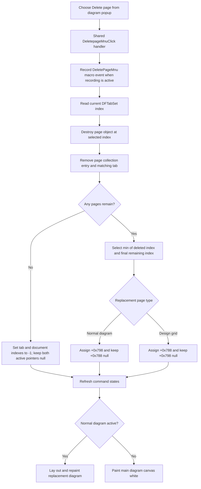

# Delete the current page from the diagram popup menu

> Analysis status: Reviewed from the recovered popup and main-menu bindings, shared handler, page destruction, tab removal, replacement selection, canvas refresh, and failure-order evidence.

## Control

| Property | Recovered value |
| --- | --- |
| Form | DFWindow |
| Component path | DFWindow.DFPopupMnu.Deletepage1 |
| Control class | TMenuItem |
| Caption | Delete page |
| Hint | Not present in the recovered resource. |
| Text | Not present in the recovered resource. |
| Handler name | DeletepageMnuClick |
| Handler address | 01a79ac0 |
| Other binding | DFWindow.DFMainMenu.DFViewMnu.DeletepageMnu |
| Graph node | `resource:dfm:DFWindow/DFWindow.DFPopupMnu.Deletepage1` |
| Handler node | `function:01a79ac0` |
| Graph layer | UI |

## Popup-specific invocation

The diagram popup item and the View-menu `Delete page` item bind to the same `TDFWindow.DeletepageMnuClick` handler.

The popup route does not supply a page index, tab object, diagram point, or page object. The shared handler reads the selected index directly from `DFTabSet` at DFWindow `+0xa68`. It does not branch on Sender before deletion. Sender is only forwarded to the later DFWindow resize path when a normal diagram page remains.

Thus this popup command deletes the page that is current in `DFTabSet`. It does not locate a different page from the popup position.

## What happens when clicked

The handler performs these steps in order:

1. Build and conditionally record the macro action `DeletePageMnu`.
2. Read the current `DFTabSet` index.
3. Call the shared page-removal helper with the document at `+0x7a0`, that index, both active-page pointer locations, and the tab control.
4. If a normal diagram page remains at `+0x798`, run the DFWindow layout and repaint path.
5. Otherwise, paint the main diagram canvas at `+0x780` white over the current form width and height.

There is no confirmation dialog, prompt, or Cancel branch before the model page is destroyed.

## Page destruction and tab removal

The shared helper uses the selected index to get the page object from the document's page collection at `+0x10`. It destroys that object through the nil-safe Delphi object-destruction helper and then removes the same collection entry.

It clears both active-page pointers:

- `+0x798` for a normal diagram page;
- `+0x788` for the recovered design-grid page class.

It then removes the same index from `DFTabSet.Items`. The page object is destroyed before either the page-collection entry or tab text is removed. Cleanup of curves, axes, figures, or other objects owned by the page belongs to that page's destructor; the click path does not enumerate them itself.

## Replacement page selection

When pages remain, the helper selects:

`min(deleted index, remaining page count - 1)`

This gives these results:

- If a successor moved into the deleted position, that successor becomes current.
- If the deleted page was last, the previous page becomes current.
- If the deleted page was the only page, the tab and document indexes become `-1`, and both active-page pointers stay null.

For a remaining page, the helper reads the selected object from the page collection. A normal diagram is stored at `+0x798`; a recovered design-grid page is stored at `+0x788`. It writes the selected tab index to document offset `+0x18` and refreshes shared DFWindow command states.

The two active-page pointers are mutually exclusive after this repair.

## Canvas result

After selection repair, the handler checks only the normal-diagram pointer at `+0x798`.

- A normal diagram runs `FUN_01a77f90`, which lays out and repaints that diagram.
- No normal diagram paints the main canvas white. This includes both an empty document and a selected design-grid page held at `+0x788`.

The command-state refresh occurs inside the helper before this final canvas operation.

## Persistence and undo

The handler does not call the diagram serializer, document Save command, or file writer. It also does not write the recovered document save-warning byte at `+0x40`. The source proves an in-memory deletion, but it does not prove that this click marks the document dirty or writes the project file.

No undo record, retained page object, inverse insertion, transaction, or rollback call appears in the handler or page-removal helper. The recorded macro event is a replay command, not a recovered undo snapshot.

The shared handler annotation is canonically owned by `TIARA-diz.6.7.315`. The page-removal helper `FUN_01cec240` is also owned there. This article's fragment duplicates only the required complete handler annotation.

## Click flow

## No-op, error, and partial-state behavior

- There is no normal no-op after the popup handler starts. It does not ask for confirmation or offer Cancel.
- The handler does not validate the selected tab index before it reads the page collection. A stale popup invocation with index `-1` or another invalid index reaches the collection without a local guard.
- The popup resource has no separate enabled-state or validity guard in its recovered properties. Any normal prevention is outside this OnClick path.
- There is no local exception handler, retry, returned-status test, or rollback.
- A destructor failure occurs before page-collection and tab removal.
- A collection-removal failure after destruction can leave a destroyed object reference in the collection.
- A tab-removal or replacement-selection failure can occur after the model page is already gone.
- Command states are refreshed before the final canvas update. A later resize or paint failure can leave the model and command states updated while the old pixels remain until another repaint.
- Macro recording happens before indexed page access. A recorded macro entry does not prove that deletion completed.

## Handler and call-path evidence

- Shared popup and View-menu handler: [FUN_01a79ac0](../../../DecompiledSources/Tina16/functions/0000000001A79AC0__FUN_01a79ac0.c) records `DeletePageMnu`, reads `DFTabSet`, invokes page removal, and selects the diagram repaint or white-canvas path.
- Page removal and selection repair: [FUN_01cec240](../../../DecompiledSources/Tina16/functions/0000000001CEC240__FUN_01cec240.c) destroys one indexed page, removes its model and tab entries, selects the nearest remaining page, repairs active pointers, writes the document index, and refreshes commands. Its canonical annotation is owned by `TIARA-diz.6.7.315`.
- Nearest-index helper: [FUN_00b905f0](../../../DecompiledSources/Tina16/functions/0000000000B905F0__FUN_00b905f0.c) returns the smaller of the deleted index and the final remaining index.
- Normal-diagram repaint: [FUN_01a77f90](../../../DecompiledSources/Tina16/functions/0000000001A77F90__FUN_01a77f90.c) lays out and redraws the selected normal diagram.
- White-canvas painter: [FUN_01d2dc30](../../../DecompiledSources/Tina16/functions/0000000001D2DC30__FUN_01d2dc30.c) paints the white rectangle used when no normal diagram is active.
- Command-state refresh: [FUN_01a7fc90](../../../DecompiledSources/Tina16/functions/0000000001A7FC90__FUN_01a7fc90.c) recalculates shared DFWindow menu and action states.
- Recovered component tree: [ui-evidence.json](../../../DecompiledSources/Tina16/resources/dfm/ui-evidence.json) proves both `Delete page` resources bind to `01a79ac0` and supplies the popup component path.
- Complexity: complex; the graph records nine distinct outgoing calls from `FUN_01a79ac0`.

## Resource evidence

- This resource is `Deletepage1` in `DFWindow.DFPopupMnu`.
- Its caption is `Delete page`.
- The View menu has a separate `DeletepageMnu` item with the same caption and handler.
- The popup item has no hint, action, shortcut, image reference, glyph, checked state, radio state, or submenu.

## Analysis limits

- The recovered Delphi class name for the normal diagram page is not published. The alternate branch is identified as the design-grid page by the class test used in its related creation and display paths.
- The source proves direct page destruction and selection repair. It does not expose a user-facing undo service or dirty-state update for this command.
- The source does not prove what popup-opening logic ran before OnClick. It proves only that the handler uses the tab index current at click time.
- A live UI test was not performed.
