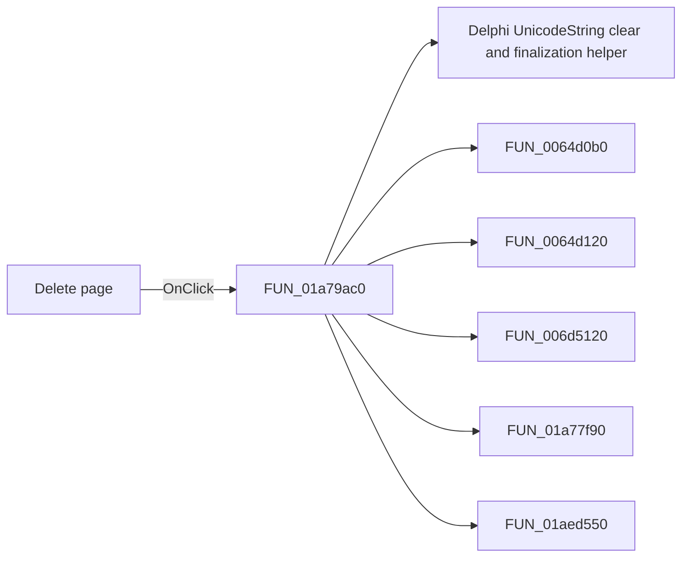

# Delete page

> Analysis status: Pending individual source review.

## Control

| Property | Recovered value |
| --- | --- |
| Form | DFWindow |
| Component path | DFWindow.DFPopupMnu.Deletepage1 |
| Control class | TMenuItem |
| Caption | Delete page |
| Hint | Not present in the recovered resource. |
| Text | Not present in the recovered resource. |
| Handler name | DeletepageMnuClick |
| Handler address | 01a79ac0 |
| Graph node | `resource:dfm:DFWindow/DFWindow.DFPopupMnu.Deletepage1` |
| Handler node | `function:01a79ac0` |
| Graph layer | UI |

## What happens when clicked

Pending individual analysis. An agent must read the recovered handler source and its relevant callees before it replaces this text.

## Click flow

## Handler evidence

- Source: [DecompiledSources/Tina16/functions/0000000001A79AC0__FUN_01a79ac0.c](../../../DecompiledSources/Tina16/functions/0000000001A79AC0__FUN_01a79ac0.c)
- Recovered role: Not present in the recovered resource.
- Current graph summary: Handles 2 Delphi UI events: DFWindow.DFMainMenu.DFViewMnu.DeletepageMnu.OnClick, DFWindow.DFPopupMnu.Deletepage1.OnClick.
- Current graph behavior: Not present in the recovered resource.
- Current graph evidence: Not present in the recovered resource.
- Complexity: complex
- Distinct outgoing calls: 9

## Direct calls

- `function:00414480` — Delphi UnicodeString clear and finalization helper
- `function:0064d0b0` — FUN_0064d0b0
- `function:0064d120` — FUN_0064d120
- `function:006d5120` — FUN_006d5120
- `function:01a77f90` — Handles 1 Delphi UI event: DFWindow.OnResize.
- `function:01aed550` — FUN_01aed550
- `function:01aee720` — FUN_01aee720
- `function:01cec240` — FUN_01cec240
- `function:01d2dc30` — FUN_01d2dc30

## Resource evidence

- Kind: Not present in the recovered resource.
- Modal result: Not present in the recovered resource.
- Checked state: Not present in the recovered resource.
- List items: Not present in the recovered resource.
- Image reference: Not present in the recovered resource.
- Extracted glyph: None.

## Nearby label candidates

Nearby labels are layout candidates only. They are not proof of behavior.

- No same-parent label candidate is available.

## Analysis limits

- Do not infer behavior from the control class, caption, hint, glyph, or nearby label alone.
- Do not replace the pending status until the handler source and relevant call path provide enough evidence.
