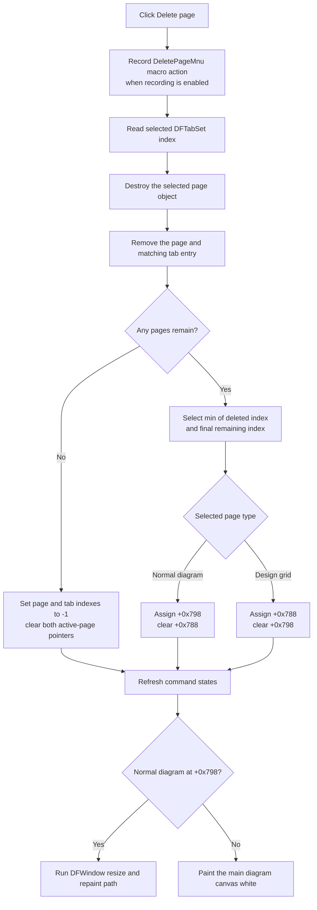

# Delete page

> Analysis status: Complete. This command destroys the page selected in `DFTabSet`, removes its tab, selects the nearest remaining page, and refreshes the diagram view without a confirmation dialog.

## Control

| Property | Recovered value |
| --- | --- |
| Form | DFWindow |
| Component path | DFWindow.DFMainMenu.DFViewMnu.DeletepageMnu |
| Control class | TMenuItem |
| Caption | Delete page |
| Hint | Not present in the recovered resource. |
| Handler name | DeletepageMnuClick |
| Handler address | `01a79ac0` |
| Graph node | `resource:dfm:DFWindow/DFWindow.DFMainMenu.DFViewMnu.DeletepageMnu` |
| Handler node | `function:01a79ac0` |
| Graph layer | UI |

The popup item `DFWindow.DFPopupMnu.Deletepage1` uses the same recovered handler.

## What happens when clicked

`FUN_01a79ac0` first records the `DeletePageMnu` macro action when macro recording is enabled. It then reads the selected index from `DFTabSet` at form offset `+0xA68` and passes that index to `FUN_01cec240`. There is no question, modal dialog, result test, or Cancel path before deletion.

The helper changes the document and tab state in this order:

1. It gets the page object at the selected index from the primary page collection at document offset `+0x10`.
2. It destroys that page object through the Delphi object-destruction helper.
3. It removes the same index from the page collection.
4. It clears the two recovered active-page pointers at form offsets `+0x798` and `+0x788`.
5. It removes the same index from `DFTabSet.Items`.
6. It selects a remaining tab and writes that index to document offset `+0x18`.
7. It assigns the selected object to one of the two active-page pointers. A normal diagram page goes to `+0x798`. A recovered design-grid page goes to `+0x788`.
8. It refreshes menu and toolbar command states through `FUN_01a7fc90`.

The selected replacement index is `min(deleted index, remaining count - 1)`. Therefore:

- Deleting a page before the final page selects the successor that moves into the deleted index.
- Deleting the final page selects the preceding page.
- Deleting the only page sets the tab index and document page index to `-1` and leaves both active-page pointers null.

After the helper returns, the handler tests the normal-diagram pointer at `+0x798`. If it is non-null, the handler calls the recovered `DFWindow.OnResize` path to lay out and repaint that diagram. If it is null, the handler paints the main diagram canvas at `+0x780` with a white rectangle that uses the current form width and height. The second branch applies both when no page remains and when the selected replacement is a design-grid page at `+0x788`.

## Page ownership, selection, and cursors

The helper destroys the selected page before it removes the collection entry. The page's class destructor therefore owns cleanup of objects inside that page. The click handler does not separately enumerate curves, axes, figures, selections, or cursor objects.

The command removes the page selection by removing the collection and tab entries, then establishes the replacement selection through the tab index, document index, and mutually exclusive active-page pointers. It does not call the standalone `CursorWindow` Hide method, clear its displayed labels, or reset an independent cursor-window field. The recovered path does not prove how an already visible standalone cursor window reacts after its source page is destroyed.

## Click flow

## Confirmation, persistence, and undo

- The handler does not ask for confirmation. It has no normal Cancel or no-op branch after entry.
- The command changes only the in-memory document and UI state. It does not call a file serializer or save routine.
- It does not write the document save-warning byte at `+0x40`. The recovered path therefore does not prove that deletion marks the document as modified.
- It does not register an undo record or retain the destroyed page in a recovered undo collection. No undo operation is available in this call path.
- Macro logging occurs before page access and destruction. A recorded macro event does not prove that deletion completed.

## Empty and error behavior

The shared View-menu state updater enables this main-menu item only when a current tab exists and form-mode byte `+0x1088` is `1`. The handler itself does not repeat either check. The popup item has the same handler, and its DFM resource has no separate guard.

A direct or stale call with no valid selected index reaches the page collection lookup without a local guard. The recovered source does not expose the exact collection error or message. The handler has no local exception handler, retry, or rollback.

Failures can leave partial state because the operations are sequential:

- A destructor failure occurs before collection and tab removal.
- A collection-removal failure after destruction can leave a destroyed object reference in the collection.
- A tab-removal or tab-selection failure can occur after the model page is already gone.
- Command states are refreshed before the final canvas update. A later resize or paint failure can leave the model and commands updated while old pixels remain until another repaint.

## Evidence

- [`FUN_01a79ac0`](../../../DecompiledSources/Tina16/functions/0000000001A79AC0__FUN_01a79ac0.c) is the shared `DeletepageMnuClick` handler. It records the macro action, reads `DFTabSet` selection, calls the page-removal helper, and chooses the resize or white-canvas path.
- [`FUN_01cec240`](../../../DecompiledSources/Tina16/functions/0000000001CEC240__FUN_01cec240.c) destroys and removes one indexed page, removes the matching tab, selects the nearest remaining index, updates the active-page pointers and document index, and refreshes command states.
- [`FUN_00b905f0`](../../../DecompiledSources/Tina16/functions/0000000000B905F0__FUN_00b905f0.c) returns the smaller of the deleted index and the final remaining index.
- [`FUN_01a77f90`](../../../DecompiledSources/Tina16/functions/0000000001A77F90__FUN_01a77f90.c) is the recovered `DFWindow.OnResize` path used when a normal diagram page remains active.
- [`FUN_01d2dc30`](../../../DecompiledSources/Tina16/functions/0000000001D2DC30__FUN_01d2dc30.c) prepares and paints the white rectangle used when no normal diagram page is active.
- [`FUN_01a7fc90`](../../../DecompiledSources/Tina16/functions/0000000001A7FC90__FUN_01a7fc90.c) recalculates command enablement after the page and tab state changes.
- [Recovered DFWindow resource](../../../DecompiledSources/Tina16/resources/dfm/ui-evidence.json) binds both `DeletepageMnu` and `Deletepage1` to `01a79ac0`, identifies `DFTabSet` as a `TTabControl`, and supplies the `Delete page` caption. It contains no hint, action binding, image, or glyph for this command.

## Analysis limits

- The recovered class name for the normal diagram page is not published. The design-grid branch is identified by the same class test used by the `GridViewDesign` creation and display paths.
- The source proves direct page destruction and selection repair. It does not expose a user-facing undo service or a dirty-state update for this command.
- A live UI test was not performed. The DFM bindings, handler, page helper, tab-selection logic, and redraw calls agree on the behavior above.
