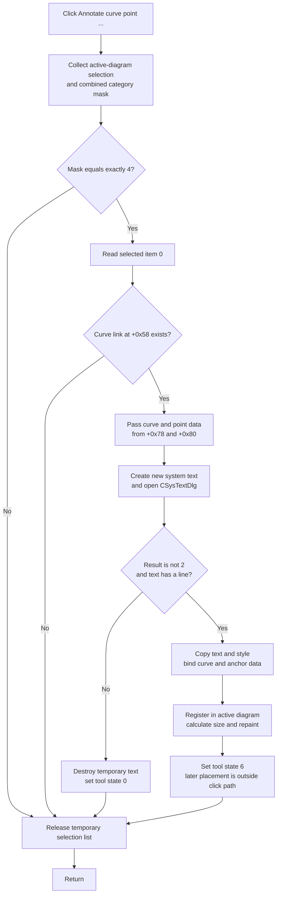

# Annotate curve point ...

> Analysis status: Complete from recovered resource, handler, selection, curve-point, annotation-dialog, and serialization evidence.

## Control

| Property | Recovered value |
| --- | --- |
| Form | DFWindow |
| Component path | DFWindow.DFPopupMnu.DFAnnotatecurvepointMnu |
| Control class | TMenuItem |
| Caption | Annotate curve point ... |
| Hint | Not present in the recovered resource. |
| Handler name | DFAnnotatecurvepointMnuClick |
| Handler address | 01a8a700 |
| Graph node | `resource:dfm:DFWindow/DFWindow.DFPopupMnu.DFAnnotatecurvepointMnu` |
| Handler node | `function:01a8a700` |

## What happens when clicked

The command starts a new text annotation for the first selected curve-point marker. It does not edit an existing annotation.

The handler collects the active diagram selection and requires the combined category mask to equal `4`. The selection helper assigns category `4` to the diagram's two direct curve-point markers. Exact equality is important: no selection and a mixed selection do nothing. If both category-4 markers are selected, the handler uses only list item zero. The collector adds the marker in diagram slot `+0xF0` before the marker in slot `+0xF8`.

The handler does not perform a run-time class test on list item zero. It instead requires that item's curve link at offset `+0x58` to be non-null. It then passes the curve and the two floating-point data values at offsets `+0x78` and `+0x80` to the shared annotation helper. Curve-point creation and cursor measurement code confirm that these fields hold the curve data coordinate and value, not the marker's screen position.

## Text dialog and commit

The shared helper creates a new system-text object and opens `CSysTextDlg` with a staged copy. This menu handler supplies no initial result lines. The dialog therefore does not receive preformatted analysis text from the click.

The helper commits only when the modal result is not `2` and the staged text contains at least one line. On this branch it:

1. Copies the accepted text and style from the dialog into the new object.
2. Stores the selected curve at offset `+0xA8` and the point's data coordinate and value at `+0xB0` and `+0xB8`.
3. Invokes the curve binding method and registers and finalizes the object in the active diagram.
4. Copies the accepted font back to DFWindow's current text-style state for later text objects.
5. Gives the annotation a provisional screen position of `(-100, -100)`, calculates its display size, and repaints that rectangle.
6. Sets the DFWindow tool-state byte to `6`.

The recovered click path ends at tool state `6`. It does not show the later pointer interaction that places or moves the annotation, so the exact final screen position is outside this handler.

## Cancel, empty text, and no-op cases

Modal result `2` and an empty staged text list use the same rejection path. The helper destroys the temporary annotation and dialog, clears the temporary-object field, and sets the DFWindow tool state to `0`. It does not bind a curve or request the accepted-object repaint.

The command also returns without opening the dialog when the selection mask is not exactly `4` or when the first selected marker has no curve link. The temporary selection list is released on every normal handler branch. There is no repeated-click toggle: each eligible click starts a separate new annotation dialog.

The handler reads the active diagram before the shared annotation helper's own null guard. It therefore assumes the popup command runs with an active diagram; it does not provide a local no-diagram branch. Neither the handler nor the shared helper has a local exception handler, an error message, or a returned failure status.

## Document and persistence boundary

An accepted annotation becomes part of the in-memory curve and diagram object graph. The system-text class is registered with persistence type `0x408`. During later diagram serialization, the writer enumerates the `Figure` collection and calls the system-text serializer. That serializer writes the content, font, display fields, `PointCurve`, `PointToX`, and `PointToY`. This proves that a later document save can preserve the curve binding and anchor values.

The click and shared helper do not call the recovered diagram modified-state helper or a file writer. The source therefore does not prove an immediate dirty-flag change, an automatic save, or error handling for a later file write.

## Click flow

## Evidence

- [DFAnnotatecurvepointMnuClick](../../../DecompiledSources/Tina16/functions/0000000001A8A700__FUN_01a8a700.c) creates the temporary list, requires selection mask `4`, reads item zero, tests its curve link, and passes fields `+0x58`, `+0x78`, and `+0x80` to the shared annotation helper.
- [The selection classifier](../../../DecompiledSources/Tina16/functions/0000000001ACFF30__FUN_01acff30.c) adds selected direct markers from diagram slots `+0xF0` and `+0xF8`, in that order, and ORs category bit `4` for them. It can also add other selected object categories, which explains the handler's exact mask test.
- [The shared annotation helper](../../../DecompiledSources/Tina16/functions/0000000001A8A3C0__FUN_01a8a3c0.c) creates and stages system text, tests modal result `2` and line count, copies accepted state, binds the curve and anchor data, prepares the object in the active diagram, repaints, and selects tool state `6`. Its rejection branch destroys the staged object and selects state `0`.
- [Curve-point creation](../../../DecompiledSources/Tina16/functions/0000000001AE1EB0__FUN_01ae1eb0.c) stores the curve link at `+0x58` and calculated curve data at `+0x78` and `+0x80`. [Cursor measurement](../../../DecompiledSources/Tina16/functions/0000000001AD1740__FUN_01ad1740.c) reads the same two fields as floating-point values for coordinate and value differences.
- [The persistence registry](../../../DecompiledSources/Tina16/functions/00000000011569A0__FUN_011569a0.c) maps type `0x408` to the system-text class. [Diagram serialization](../../../DecompiledSources/Tina16/functions/0000000001ADD6F0__FUN_01add6f0.c) enumerates `Figure` objects and dispatches system text to [its field serializer](../../../DecompiledSources/Tina16/functions/0000000001A5F630__FUN_01a5f630.c), which writes content, font, `PointCurve`, `PointToX`, and `PointToY`.
- The recovered DFM resource identifies this popup item, caption, and handler. It contains no hint, secondary text, glyph, or image resource for the item.

## Limits

- Category `4` and the field layout prove a selected curve-point marker path. The handler contains no explicit class-cast check for list item zero.
- Tool state `6` is proven, but the final placement gesture and its exact commit timing are not present in this click path.
- Persistence fields are proven. The click path does not prove when the document becomes dirty or when the user saves it.
