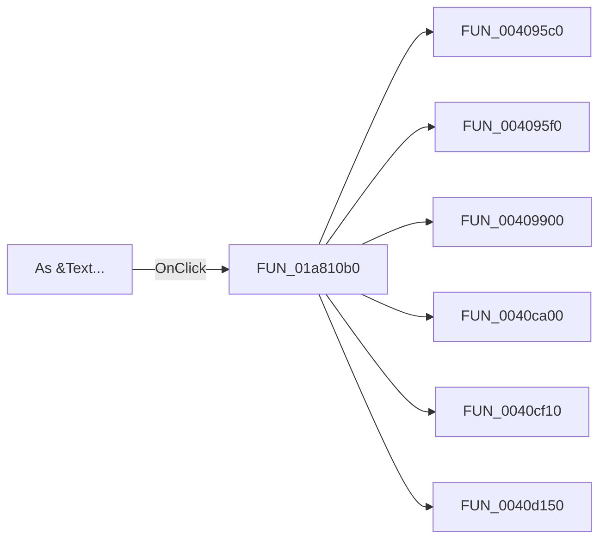

# As &Text...

> Analysis status: Pending individual source review.

## Control

| Property | Recovered value |
| --- | --- |
| Form | DFWindow |
| Component path | DFWindow.DFMainMenu.DFFileMnu.DFExportMnu.DFAsTextMnu |
| Control class | TMenuItem |
| Caption | As &Text... |
| Hint | Not present in the recovered resource. |
| Text | Not present in the recovered resource. |
| Handler name | DFAsTextMnuClick |
| Handler address | 01a810b0 |
| Graph node | `resource:dfm:DFWindow/DFWindow.DFMainMenu.DFFileMnu.DFExportMnu.DFAsTextMnu` |
| Handler node | `function:01a810b0` |
| Graph layer | UI |

## What happens when clicked

Pending individual analysis. An agent must read the recovered handler source and its relevant callees before it replaces this text.

## Click flow

## Handler evidence

- Source: [DecompiledSources/Tina16/functions/0000000001A810B0__FUN_01a810b0.c](../../../DecompiledSources/Tina16/functions/0000000001A810B0__FUN_01a810b0.c)
- Recovered role: Not present in the recovered resource.
- Current graph summary: Handles 1 Delphi UI event: DFWindow.DFMainMenu.DFFileMnu.DFExportMnu.DFAsTextMnu.OnClick.
- Current graph behavior: Not present in the recovered resource.
- Current graph evidence: Not present in the recovered resource.
- Complexity: complex
- Distinct outgoing calls: 43

## Direct calls

- `function:004095c0` — FUN_004095c0
- `function:004095f0` — FUN_004095f0
- `function:00409900` — FUN_00409900
- `function:0040ca00` — FUN_0040ca00
- `function:0040cf10` — FUN_0040cf10
- `function:0040d150` — FUN_0040d150
- `function:0040ef30` — FUN_0040ef30
- `function:0040f200` — FUN_0040f200
- `function:0040f3d0` — FUN_0040f3d0
- `function:0040f590` — FUN_0040f590
- `function:00410e60` — FUN_00410e60
- `function:00410f20` — Nil-safe Delphi object destruction helper
- `function:004113d0` — FUN_004113d0
- `function:004113f0` — FUN_004113f0
- `function:00414480` — Delphi UnicodeString clear and finalization helper
- `function:00414560` — Delphi UnicodeString array finalization helper
- `function:00414ad0` — Delphi UnicodeString assignment helper
- `function:00414b50` — FUN_00414b50
- `function:00416ba0` — FUN_00416ba0
- `function:00416cd0` — FUN_00416cd0
- `function:00416db0` — FUN_00416db0
- `function:00416dc0` — FUN_00416dc0
- `function:004170c0` — FUN_004170c0
- `function:0043e1a0` — FUN_0043e1a0
- `function:0043f750` — FUN_0043f750
- `function:00441a10` — FUN_00441a10
- `function:00448450` — FUN_00448450
- `function:004ae7e0` — FUN_004ae7e0
- `function:004aeac0` — FUN_004aeac0
- `function:004aeba0` — FUN_004aeba0
- `function:00723990` — FUN_00723990
- `function:00724270` — FUN_00724270
- `function:00724380` — FUN_00724380
- `function:00b909d0` — FUN_00b909d0
- `function:00f121a0` — FUN_00f121a0
- `function:01a80fc0` — FUN_01a80fc0
- `function:01acff30` — FUN_01acff30
- `function:01aed550` — FUN_01aed550
- `function:01aee720` — FUN_01aee720
- `function:01cc0ae0` — FUN_01cc0ae0
- `function:01cc6ed0` — FUN_01cc6ed0
- `function:01cd6430` — FUN_01cd6430
- `function:01ce92d0` — FUN_01ce92d0

## Resource evidence

- Kind: Not present in the recovered resource.
- Modal result: Not present in the recovered resource.
- Checked state: Not present in the recovered resource.
- List items: Not present in the recovered resource.
- Image reference: Not present in the recovered resource.
- Extracted glyph: None.

## Nearby label candidates

Nearby labels are layout candidates only. They are not proof of behavior.

- No same-parent label candidate is available.

## Analysis limits

- Do not infer behavior from the control class, caption, hint, glyph, or nearby label alone.
- Do not replace the pending status until the handler source and relevant call path provide enough evidence.
