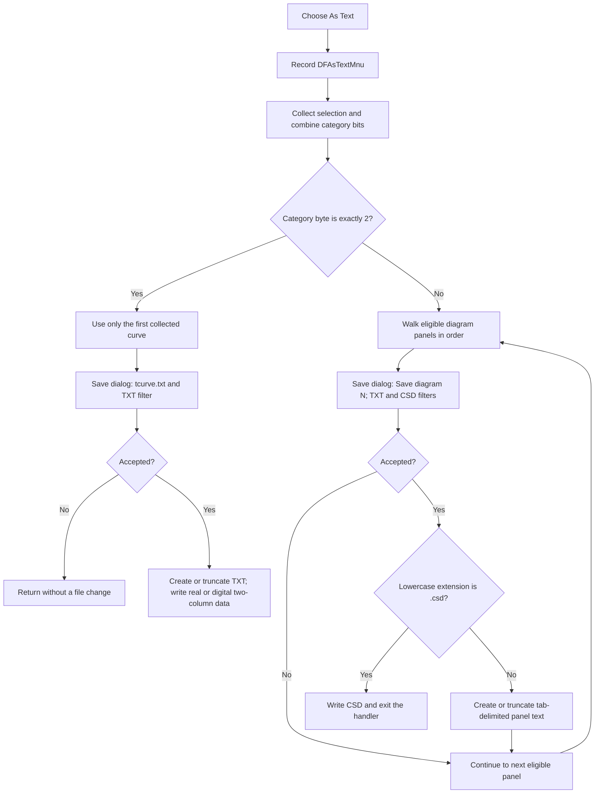

# Export selected curve or diagram data as text

> Analysis status: Complete. The recovered handler exports the first collected curve for a pure curve selection. For every other selection result, it offers a separate TXT or CSD export for each eligible diagram panel.

## Control

| Property | Recovered value |
| --- | --- |
| Form | DFWindow |
| Component path | DFWindow.DFMainMenu.DFFileMnu.DFExportMnu.DFAsTextMnu |
| Control class | TMenuItem |
| Caption | `As &Text...` |
| Hint | Not present in the recovered resource. |
| Handler name | DFAsTextMnuClick |
| Handler address | 01a810b0 |
| Graph node | `resource:dfm:DFWindow/DFWindow.DFMainMenu.DFFileMnu.DFExportMnu.DFAsTextMnu` |
| Handler node | `function:01a810b0` |
| Graph layer | UI |

The DFM has no shortcut, action, image, glyph, or explicit enabled-state value for this menu item.

## What happens when clicked

[`FUN_01a810b0`](../../../DecompiledSources/Tina16/functions/0000000001A810B0__FUN_01a810b0.c) first records `DFAsTextMnu` through the DFWindow command-log path. It then calls the common selection classifier [`FUN_01acff30`](../../../DecompiledSources/Tina16/functions/0000000001ACFF30__FUN_01acff30.c).

The classifier returns a combined category byte and a list of selected objects. The handler treats only an exact value of `2` as a selected-curve export. Axis, cursor, figure, empty, mixed, and other category values use the diagram-panel export path instead.

### Exact curve-selection result `2`

The handler uses only element zero of the collected selection list. Therefore, a pure selection that contains more than one curve still exports only the first curve in the classifier's collection order.

It creates one Save dialog with these values:

| Dialog property | Recovered value |
| --- | --- |
| Default extension | `txt` |
| Initial file name | `tcurve.txt` |
| Filter | `Text files (*.txt)|*.txt` |
| Title | No explicit title; the VCL dialog default remains in use. |
| Initial directory | Not assigned by this handler. |
| Options | `0x116`: overwrite prompt, hide read-only, show Help, and require an existing path. |

If the user accepts, the handler creates or truncates the chosen file. It supports two recovered curve classes:

- A sampled real curve produces a two-column table: X value, then Y value.
- A digital curve produces a two-column step table: X value, then state `0` or `1`. At a state change, it writes the old and new states at the transition coordinate. It also writes the final endpoint and state.

Both layouts use a tab between columns and CRLF after each row. The header is the X-axis caption before the first `[` or `(` suffix, a tab, and the recovered curve label. Thus an X-axis unit in brackets or parentheses is deliberately removed from this header. There is no separate unit row.

If the first collected object is neither supported recovered curve class, the accepted file has already been created or truncated, but the handler writes no rows to it.

### Every other selection result

The handler ignores the collected selection list and walks the active diagram's panel collection in panel order. It processes panels whose list at `panel + 0x70` contains exactly one member. If panel mode byte `+0x58` is `2`, only panel index zero is eligible. A value of zero from the selection classifier is not a no-op: it can export all eligible panels.

Each eligible panel gets its own Save dialog:

| Dialog property | Recovered value |
| --- | --- |
| Default extension | `txt` |
| Initial file name | `tcurve.txt` |
| Filter | `Text files (*.txt)|*.txt|Common Simulation Data Format (*.csd)|*.csd` |
| Title | `Save diagram N`, where `N` is the one-based panel index. |
| Initial directory | Not assigned by this handler. |
| Options | The same `0x116` option set. |

The handler lowercases the selected file extension. Exact `.csd` selects the CSD writer. Every other extension uses the tab-delimited text writer. The first filter is TXT, and the handler does not set a different initial filter index.

## Text columns and order

The diagram text path selects one of these layouts from the recovered curve class and panel mode. Business names for two curve classes are not present in the recovered RTTI, so the table describes their exact output instead of inventing names.

| Recovered layout | Header columns | Data columns and order |
| --- | --- | --- |
| Sampled real or complex series | `*` plus the X-axis caption prefix; then series columns in plot order after duplicate source objects are removed | X first. A real series adds one raw value. A complex series adds magnitude, then phase. Separate source groups end with a blank line. |
| Digital step series | X-axis caption prefix; curve label | X, then `0` or `1`. Transition coordinates contain an old-state row followed by a new-state row. Curves are written in panel collection order and separated by a blank line. |
| Recovered interval/value class | X-axis caption prefix; an empty second header; a descriptor formed as `name#suffix` when the suffix exists | Previous boundary, next boundary, then the held value. The last row uses the curve endpoint as the second boundary. Curves are written in panel collection order and separated by a blank line. |

For the sampled-series layout, related values from [`FUN_01cc6ed0`](../../../DecompiledSources/Tina16/functions/0000000001CC6ED0__FUN_01cc6ed0.c) keep their recovered series order. [`FUN_01a80fc0`](../../../DecompiledSources/Tina16/functions/0000000001A80FC0__FUN_01a80fc0.c) finds the corresponding data-column index for a shared plot source. A second list prevents the same source object from being exported twice.

The sampled-series header adds these exact suffixes:

- A real series uses its recovered label without an added suffix.
- A complex series uses `-abs`, followed by `-phase (deg)`.
- When the source's dB flag is set, the magnitude suffix is `-abs (dB)` and the value is `20 * log10(raw value)`. The recovered logarithm returns zero for a nonpositive input.
- Phase is converted from radians to degrees with factor `57.29577951308232`.

After an accepted sampled-series export with the dB source flag, the handler sets its stop flag and does not offer dialogs for later panels. Other accepted or canceled panel dialogs continue with the next eligible panel.

## CSD output

For `.csd`, [`FUN_01ce92d0`](../../../DecompiledSources/Tina16/functions/0000000001CE92D0__FUN_01ce92d0.c) writes a Common Simulation Data Format document and then the click handler exits without offering later panel dialogs.

The CSD header starts with `#H` and includes the TINA version, generated title, subtitle, time, date, temperature, analysis, complex-value flag, node count, sweep variable and mode, X range, and format. It then writes curve and value records for supported sampled data. This is a different structured format; it is not the tab-delimited layout described above.

The CSD writer temporarily forces the global decimal separator to `.` and restores the previous value on its normal return. It also assigns a recovered per-column index at curve field `+0xe8` while it maps output values. No recovered statement restores that field.

## Encoding and numeric formatting

The text-file initializer receives code-page argument zero, which selects the current Delphi default text code page. The recovered runtime snapshot stores code page `65001`, so the text rows use UTF-8 conversion in this image. The handler has no explicit byte-order-mark write.

The tab-delimited writer formats floating-point values through the shared Delphi format-settings object. Its recovered runtime decimal separator is `,`. The handler does not replace that locale setting for TXT. In contrast, CSD forces `.` for the duration of its normal write path.

## Export flow

## Cancel, overwrite, and error behavior

- Canceling the single selected-curve dialog leaves the file system unchanged and returns.
- Canceling a panel dialog skips that panel but does not cancel later panel dialogs. Files written for earlier panels remain.
- The Save dialog requests an overwrite prompt. After acceptance, the handler uses Rewrite semantics, so it truncates an existing target before it writes the first row.
- The text-record path accepts at most 259 UTF-16 path characters. A longer path sets a Delphi runtime I/O error before the copied path is used.
- The handler checks Delphi I/O status after open, every row write, blank-line write, and close. An error raises through the outer UI exception mechanism. There is no local message, retry, temporary file, atomic rename, delete, or rollback.
- An error after Rewrite can leave an empty or partly written file. In a multi-panel export, files completed for earlier panels remain.
- The recovered handler has no `try/finally` around the text file. A failure before the explicit close does not prove that this handler closes the record itself.
- A CSD error before the normal restore statements can leave the global decimal separator at `.`. The source has no local recovery for that partial state.
- The handler dereferences the active-diagram field before it checks for null. Normal command-state preparation can prevent this invocation, but the handler itself has no no-diagram guard.

## State and persistence boundary

The TXT path reads curve samples and writes external files. It does not remove curves, change plot values, mark the document dirty, save the diagram document, or add an undo record. It creates and destroys temporary selection and deduplication lists.

The CSD path has the recovered per-column field assignment described above, but it has no document-save or dirty-state call. The external TXT or CSD file is the persistent result.

## Recovered evidence

- Main handler: [`FUN_01a810b0`](../../../DecompiledSources/Tina16/functions/0000000001A810B0__FUN_01a810b0.c) contains the selection branch, dialog setup, type-specific tables, numeric transforms, per-panel loop, file calls, and cleanup.
- Selection classifier: [`FUN_01acff30`](../../../DecompiledSources/Tina16/functions/0000000001ACFF30__FUN_01acff30.c) rebuilds the selected-object list and returns the combined category byte. Other recovered DFWindow paths identify exact category `2` as curves.
- Shared-source index lookup: [`FUN_01a80fc0`](../../../DecompiledSources/Tina16/functions/0000000001A80FC0__FUN_01a80fc0.c) matches a plot source and returns its data-column index for the deduplication test.
- Related-series collector: [`FUN_01cc6ed0`](../../../DecompiledSources/Tina16/functions/0000000001CC6ED0__FUN_01cc6ed0.c) collects the contiguous related data objects used to form sampled-series columns.
- CSD writer: [`FUN_01ce92d0`](../../../DecompiledSources/Tina16/functions/0000000001CE92D0__FUN_01ce92d0.c) writes the structured CSD header and data records and forces the decimal separator during the write.
- Text-file setup and close: [`FUN_0040cf10`](../../../DecompiledSources/Tina16/functions/000000000040CF10__FUN_0040cf10.c) initializes the Delphi text record and path; [`FUN_0040ca00`](../../../DecompiledSources/Tina16/functions/000000000040CA00__FUN_0040ca00.c) performs Rewrite; [`FUN_0040d150`](../../../DecompiledSources/Tina16/functions/000000000040D150__FUN_0040d150.c) closes the text record.
- String and numeric output: [`FUN_0040f200`](../../../DecompiledSources/Tina16/functions/000000000040F200__FUN_0040f200.c), [`FUN_0040f3d0`](../../../DecompiledSources/Tina16/functions/000000000040F3D0__FUN_0040f3d0.c), [`FUN_0040ef30`](../../../DecompiledSources/Tina16/functions/000000000040EF30__FUN_0040ef30.c), and [`FUN_00448450`](../../../DecompiledSources/Tina16/functions/0000000000448450__FUN_00448450.c) write strings, tabs, integer states, and locale-formatted floating-point values.
- Save-dialog file-name access: [`FUN_00724270`](../../../DecompiledSources/Tina16/functions/0000000000724270__FUN_00724270.c) returns the accepted file name; [`FUN_00724380`](../../../DecompiledSources/Tina16/functions/0000000000724380__FUN_00724380.c) sets `tcurve.txt`.
- UI resource evidence: [`ui-evidence.json`](../../../DecompiledSources/Tina16/resources/dfm/ui-evidence.json).

## Analysis limits

- The business names of the digital and interval/value curve classes are not recovered. Their documented layouts come from the exact branch code, fields, and row writes.
- The field at `panel + 0x70` is a recovered collection. Its business name is unknown. This article states the proven one-member eligibility test only.
- The exact dialog folder depends on VCL and operating-system state because this handler does not assign `InitialDir`.
- The recovered runtime snapshot proves code page 65001 and decimal separator `,` for this image. Application or locale initialization can change the shared format settings before a later click.
- No proprietary UI or file export was executed. The conclusions use the DFM event binding, read-only graph, recovered handler and callees, and constants from the verified rebuilt runtime image.
