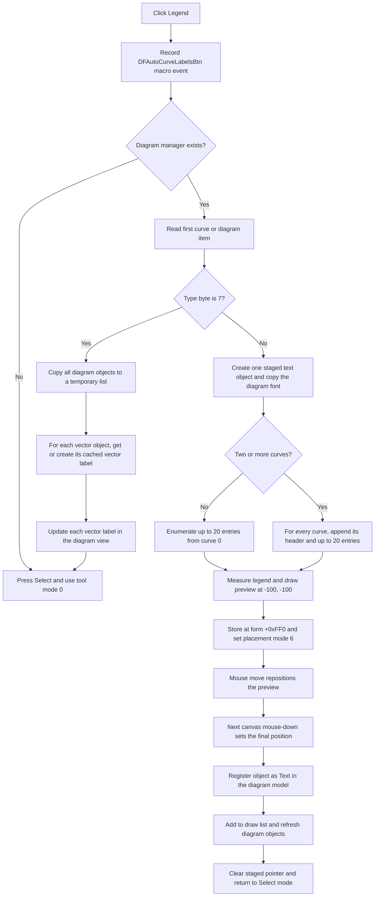

# Legend

> Analysis status: Evidence-backed source review complete.

## Control

| Property | Recovered value |
| --- | --- |
| Form | DFWindow |
| Component path | DFWindow.DFToolPanel.ToolNoteBook.Diagram.DFAutoLabelsBtn |
| Control class | TSpeedButton |
| Caption | Not present in the recovered resource. |
| Hint | Legend |
| Text | Not present in the recovered resource. |
| Handler name | DFAutoLabelsBtnClick |
| Handler address | 01a7bdc0 |
| Graph node | `resource:dfm:DFWindow/DFWindow.DFToolPanel.ToolNoteBook.Diagram.DFAutoLabelsBtn` |
| Handler node | `function:01a7bdc0` |
| Graph layer | UI |

## What happens when clicked

The button prepares automatic labels for the current diagram. Its effect depends on the type byte of the first curve or diagram item. One path creates or updates a label for each vector object. The other path builds one multi-line legend text object and waits for the user to place it on the canvas.

The handler first records macro event `0x410` with the recovered command name `DFAutoCurveLabelsBtn`. If the form has no diagram manager at `+0x798`, it presses the Select button and calls the Select handler. It does not create a label.

When the manager exists, the handler reads item zero from the manager's curve collection at `+0xD8` and tests that item's type byte at `+0x58`. The recovered source has no count guard before this item-zero access.

### Type-7 vector-label path

When the first item has type `7`, the handler copies the manager's diagram-object collection at `+0xE0` into a temporary list. It visits every object in that list, but it processes only objects that match the recovered vector class.

For each matching vector, it calls `FUN_00f15c70`. That shared formatter returns the vector's cached text label or creates one from the vector's complex value, selected vector-label style, unit, and optional suffix. A new label is registered as `Text for Vector Label`. The handler then calls the label's display-update method with the diagram window and view. After the loop, it selects the normal Select tool, sets tool mode `+0x7A8` to `0`, and releases the temporary list.

This path covers all vector objects in the diagram-object collection, not only a selected vector. The formatter caches the label at vector offset `+0xF0`. Therefore, a repeated click reuses existing vector labels instead of adding a second cached label to each vector. It still calls the display-update method again.

### Multi-line legend path

For every other first-item type, the handler creates one text object and stores it temporarily at form offset `+0xFF0`. It enables the recovered text options, copies the diagram font from `+0x1038`, and appends legend lines to the text model.

If the curve collection contains fewer than two curves, the handler enumerates legend entries from curve index `0`. If it contains two or more curves, it visits every curve. For each curve in this multi-curve path, it first derives a curve-name header from the first nested curve item. It then enumerates that curve's result items.

`FUN_01ae85a0` resets the per-manager enumeration key to `-1`. Repeated calls to `FUN_01ae8bc0` return the next eligible item identifier and its recovered name and value text. The handler resolves the identifier against the analysis object tree. It emits literal italic `p` or `z` numbered forms for two recognized object classes. It emits a generic identifier, name, and value form for other recognized entries. The `p` and `z` counters start at `1` and continue across curves. The handler accepts at most 20 returned entries for each curve.

The 20-entry limit is a display limit in this handler. It does not remove curve data or measurement data. If enumeration ends earlier, the handler stops that curve normally. If there are no returned entries, the text object can still contain a curve header in the multi-curve path.

### Preview, placement, and model insertion

The handler first positions the new legend at `(-100, -100)`. It measures the text width and height, assigns the diagram manager as owner, updates its geometry, and draws an initial preview rectangle. It then sets tool mode `+0x7A8` to `6`. At this point, the legend is staged at `+0xFF0`; it is not yet in the manager's named object collection.

`DFWindow.FormMouseMove` reads mode `6` and moves the preview rectangle with the pointer. On the next canvas mouse-down, `DFWindow.FormMouseDown` reads the same mode. It moves the staged text to the click coordinates, assigns the manager, recalculates its geometry, and registers it in the manager's collection with the name `Text`. It adds the object to the diagram draw list, refreshes diagram objects, clears `+0xFF0`, presses Select, and returns the tool mode to `0`.

The click handler and the later placement path do not call a file, INI, or registry writer. Model insertion occurs only at the placement click. The source does not show direct serialization. Later diagram-save ownership is outside this path.

## Difference from Auto label

The adjacent `AutoLabelBtn` has hint `Auto label` and handler `FUN_01a7bce0`. That handler only sets tool mode `20` when a diagram manager exists. A later canvas click hit-tests one diagram object and creates or retrieves a label for that clicked object.

`DFAutoLabelsBtn` has hint `Legend`. It does not arm the one-object mode. It either processes all vector objects immediately or builds one combined legend from the curve collection and arms placement mode `6`.

## Repeat, no-op, and failure behavior

- No diagram manager: the command changes to the Select tool and creates nothing.
- Empty curve collection: the handler has no guard before it reads item zero. The normal list accessor error can propagate.
- Type-7 path with no vector objects: the loop adds no labels, then the handler returns to Select mode.
- Multi-line path with no returned legend entries: the handler still stages the text object and enters placement mode.
- Repeated type-7 use reuses each vector's cached label. Repeated completed multi-line use can add another `Text` object because the handler has no duplicate search.
- The handler does not test whether `+0xFF0` already holds a staged object before it assigns a new object. If the command is invoked again before placement, the recovered path has no local cleanup for the previous staged pointer.
- The handler and placement functions have no local exception handler or rollback. A failure during an object loop can leave earlier vector labels created. A failure after text registration can leave the legend in the model before the final redraw or Select reset.
- The source does not expose a cancel action for the staged legend in this handler. Cleanup after another tool interrupts mode `6` is not proven here.

## Click flow

## Evidence

- Handler source: [FUN_01a7bdc0](../../../DecompiledSources/Tina16/functions/0000000001A7BDC0__FUN_01a7bdc0.c)
- Adjacent one-object Auto label handler: [FUN_01a7bce0](../../../DecompiledSources/Tina16/functions/0000000001A7BCE0__FUN_01a7bce0.c)
- Legend enumeration reset: [FUN_01ae85a0](../../../DecompiledSources/Tina16/functions/0000000001AE85A0__FUN_01ae85a0.c)
- Legend entry enumerator: [FUN_01ae8bc0](../../../DecompiledSources/Tina16/functions/0000000001AE8BC0__FUN_01ae8bc0.c)
- Cached vector-label formatter: [FUN_00f15c70](../../../DecompiledSources/Tina16/functions/0000000000F15C70__FUN_00f15c70.c)
- Later canvas placement consumer: [FUN_01a730e0](../../../DecompiledSources/Tina16/functions/0000000001A730E0__FUN_01a730e0.c)
- Diagram draw-list insertion: [FUN_01a8dee0](../../../DecompiledSources/Tina16/functions/0000000001A8DEE0__FUN_01a8dee0.c)
- Diagram object refresh: [FUN_01ae5650](../../../DecompiledSources/Tina16/functions/0000000001AE5650__FUN_01ae5650.c)
- Extracted glyph: [`0101_DFWindow_DFWindow_DFToolPanel_ToolNoteBook_Diagram_DFAutoLabelsBtn_Glyph_Data.png`](../../../glyph/0101_DFWindow_DFWindow_DFToolPanel_ToolNoteBook_Diagram_DFAutoLabelsBtn_Glyph_Data.png)
- Recovered role: Creates diagram-wide vector labels or builds and stages one curve legend for later placement.
- Current graph summary: Handles `DFWindow.DFToolPanel.ToolNoteBook.Diagram.DFAutoLabelsBtn.OnClick`.
- Complexity: complex
- Distinct outgoing calls: 27

## Resource evidence

- Hint: `Legend`.
- The 20 by 20 glyph shows a curve line above a small three-row color key. This is consistent with a legend, but the source establishes the actual scope and data flow.
- Caption, text, action, checked state, modal result, and image-list reference: Not present in the recovered resource.

## Analysis limits

- The recovered source exposes the first-item type value `7`, but it does not recover a Delphi enum name for that type.
- Several string separators in the generated legend are address-only constants. The proven output includes curve headers, literal `p` and `z` numbered forms, and generic identifier, name, and value fragments. The exact rendered punctuation is not fully recovered.
- The later save serializer and the cleanup path for an interrupted placement are outside the recovered click path.
