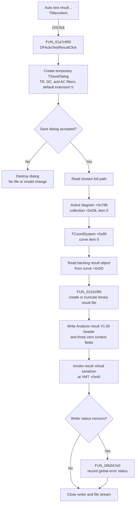

# Auto test result...

> Analysis status: Complete. This command saves the backing analysis-result object of the first curve in the first coordinate system to a proprietary TINA result file.

## Control

| Property | Recovered value |
| --- | --- |
| Form | DFWindow |
| Component path | DFWindow.DFMainMenu.DFFileMnu.DFExportMnu.DFAutoTestResult |
| Control class | TMenuItem |
| Caption | Auto test result... |
| Hint | Not present in the recovered resource. |
| Handler name | DFAutoTestResultClick |
| Handler address | 01a7c950 |
| Graph node | `resource:dfm:DFWindow/DFWindow.DFMainMenu.DFFileMnu.DFExportMnu.DFAutoTestResult` |
| Handler node | `function:01a7c950` |
| Graph layer | UI |

## What happens when clicked

`DFAutoTestResultClick` constructs a temporary `TSaveDialog`. It does not use a dialog component stored on `DFWindow`. The recovered dialog settings are:

| Setting | Value |
| --- | --- |
| Title | `Save auto test result` |
| Filter | `TR result (*.tr)|*.tr|DC result (*.dc)|*.dc|AC result (*.ac)|*.ac` |
| Initial filter index | `1`, the TR filter |
| Default extension | `tr` |
| Initial file name | Empty |
| Default options | Mask `0x80004`: hide the read-only check box and allow sizing; the mask does not request an overwrite prompt |

The dialog owner is the recovered application-global object at `02004030`. The handler does not seed a directory or copy a previous path into the dialog. If the user cancels, it destroys the temporary dialog and returns. It does not read diagram data or create a file.

After acceptance, the handler gets the chosen full path and follows this fixed object path:

1. Read the active diagram from `DFWindow + 0x798`.
2. Get item `0` from the diagram collection at `diagram + 0xD8` and cast it to `TCoordSystem`.
3. Get item `0` from the coordinate system's curve collection at `coord-system + 0x80`.
4. Read that curve object's backing result pointer at `curve + 0xD0`.
5. Pass the chosen path and that object to `FUN_012d19f0`. The three additional result-context values are all zero on this command path.

This is not a selected-curve export. The handler does not query diagram selection, a current curve index, the save-dialog filter index, or the requested extension. It always uses index `0` at both collection levels. `FUN_00f16900` establishes the matching object layout: it creates a `TCoordSystem`, adds generated `TCurve` objects to its `+0x80` collection, and stores the supplied analysis-result object at a standard curve's `+0xD0` field. Other result-view construction code registers these coordinate systems under names such as `Analysis CurveWriter 1`.

## Destination and file format

`FUN_012d19f0` opens the selected path as a file stream in Delphi `fmCreate` mode. The path is created or truncated. The handler's dialog option mask does not include `ofOverwritePrompt`, and there is no second confirmation in this call path.

The output is a proprietary binary result container, not CSV or another text format. The writer emits a metadata header containing:

- `Analysis result`
- format version `V1.00`
- the fixed format string `08/08/01 17:00 CET`
- `TINA ` followed by the current application version
- the recovered DesignSoft copyright text

It then writes the three caller-supplied context fields. For this menu command these are an eight-byte zero, a four-byte zero, and another four-byte zero. Finally, it invokes the result object's virtual serialization method at VMT slot `+0x40`. Choosing TR, DC, or AC in the dialog changes only the file-name filter presented to the user; this handler does not select a different serializer or context block.

## Availability, errors, and persistence

The common `DFWindow` command-state refresh maps `DFExportMnu` to form field `+0x948` and disables that parent menu when `DFWindow + 0x798` has no active diagram. The published field table maps this child item to `DFWindow + 0xE48`. The refresh does not add a separate item-count, curve-type, or selection guard for this child.

The handler itself has no null check, collection-count check, type check for the first curve, local exception handler, or retry path. If it is invoked without the expected active diagram, first coordinate system, first curve, or backing result object, the dereference, collection access, checked cast, or virtual serialization can fail. No validation message is produced by this handler.

After serialization, a nonzero writer status is passed to `FUN_00b047e0`. That helper records the first status in process-global error state; it does not show a dialog here. File creation and later writing have no rollback or file-delete path, so a failure after `fmCreate` can leave a truncated or partial file. Object and stream cleanup is present on the normal path, but the recovered function has no local exception cleanup block.

The chosen path is kept only in a local Unicode string. The command does not store it on the form, change the active diagram or curve selection, update the result model, or write a preference. The output file is the only intended persistent change. Repeating the command opens a new empty save dialog and exports the then-current first coordinate system and first curve.

## Click flow

## Recovered evidence

- [`FUN_01a7c950`](../../../DecompiledSources/Tina16/functions/0000000001A7C950__FUN_01a7c950.c) is the DFM-bound handler. It configures the temporary save dialog, gates the export on dialog acceptance, follows the two fixed item-zero accesses, and calls the serializer with three zero context values.
- [`FUN_012d19f0`](../../../DecompiledSources/Tina16/functions/00000000012D19F0__FUN_012d19f0.c) creates the file in `fmCreate` mode, writes the binary result header and context fields, calls the result object's serializer, and reports a nonzero writer status.
- [`FUN_00723990`](../../../DecompiledSources/Tina16/functions/0000000000723990__FUN_00723990.c) constructs the common dialog with filter index `1` and option mask `0x80004`.
- [`FUN_00724270`](../../../DecompiledSources/Tina16/functions/0000000000724270__FUN_00724270.c) returns the accepted full file name.
- [`FUN_00f16900`](../../../DecompiledSources/Tina16/functions/0000000000F16900__FUN_00f16900.c) creates `TCoordSystem` result views and stores the supplied analysis-result object in a standard `TCurve` at offset `+0xD0`.
- [`FUN_013e19a0`](../../../DecompiledSources/Tina16/functions/00000000013E19A0__FUN_013e19a0.c) registers a coordinate system created by `FUN_00f16900` as `Analysis CurveWriter 1`, which confirms the result-view collection relationship used by the export handler.
- [`FUN_01a7fc90`](../../../DecompiledSources/Tina16/functions/0000000001A7FC90__FUN_01a7fc90.c) disables the parent Export menu when no active diagram exists. It does not validate the nested collections used by this command.
- [`FUN_00b047e0`](../../../DecompiledSources/Tina16/functions/0000000000B047E0__FUN_00b047e0.c) latches a reported status in process-global error state without displaying a message.
- UI resource evidence: [`ui-evidence.json`](../../../DecompiledSources/Tina16/resources/dfm/ui-evidence.json)

## Resource evidence and limits

The DFM supplies the caption `Auto test result...` and binds `OnClick` to `DFAutoTestResultClick`. It supplies no hint, action, image index, or embedded glyph. The behavior above comes from the recovered handler and serializer, not from the caption.

- The checked-cast target is recovered as `TCoordSystem`, and the standard curve constructor is recovered as `TCurve`. The private Delphi name of the object stored at `TCurve + 0xD0` is not recovered, so this article calls it the backing analysis-result object.
- The exact internal schema produced by that object's virtual serializer depends on its runtime class and is not recovered by this call path.
- A live UI save was not performed. The DFM binding, RTTI field offsets, handler data flow, result-view construction, and binary writer path agree on the behavior described here.
