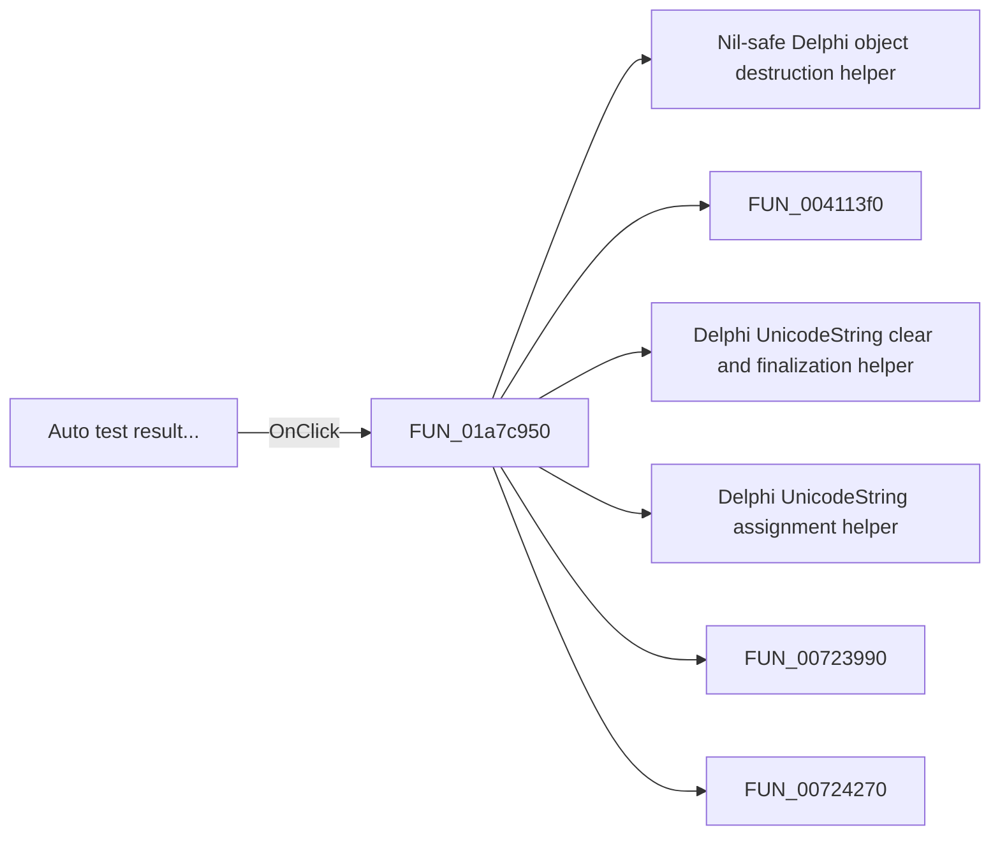

# Auto test result...

> Analysis status: Pending individual source review.

## Control

| Property | Recovered value |
| --- | --- |
| Form | DFWindow |
| Component path | DFWindow.DFMainMenu.DFFileMnu.DFExportMnu.DFAutoTestResult |
| Control class | TMenuItem |
| Caption | Auto test result... |
| Hint | Not present in the recovered resource. |
| Text | Not present in the recovered resource. |
| Handler name | DFAutoTestResultClick |
| Handler address | 01a7c950 |
| Graph node | `resource:dfm:DFWindow/DFWindow.DFMainMenu.DFFileMnu.DFExportMnu.DFAutoTestResult` |
| Handler node | `function:01a7c950` |
| Graph layer | UI |

## What happens when clicked

Pending individual analysis. An agent must read the recovered handler source and its relevant callees before it replaces this text.

## Click flow

## Handler evidence

- Source: [DecompiledSources/Tina16/functions/0000000001A7C950__FUN_01a7c950.c](../../../DecompiledSources/Tina16/functions/0000000001A7C950__FUN_01a7c950.c)
- Recovered role: Not present in the recovered resource.
- Current graph summary: Handles 1 Delphi UI event: DFWindow.DFMainMenu.DFFileMnu.DFExportMnu.DFAutoTestResult.OnClick.
- Current graph behavior: Not present in the recovered resource.
- Current graph evidence: Not present in the recovered resource.
- Complexity: complex
- Distinct outgoing calls: 8

## Direct calls

- `function:00410f20` — Nil-safe Delphi object destruction helper
- `function:004113f0` — FUN_004113f0
- `function:00414480` — Delphi UnicodeString clear and finalization helper
- `function:00414ad0` — Delphi UnicodeString assignment helper
- `function:00723990` — FUN_00723990
- `function:00724270` — FUN_00724270
- `function:00724380` — FUN_00724380
- `function:012d19f0` — FUN_012d19f0

## Resource evidence

- Kind: Not present in the recovered resource.
- Modal result: Not present in the recovered resource.
- Checked state: Not present in the recovered resource.
- List items: Not present in the recovered resource.
- Image reference: Not present in the recovered resource.
- Extracted glyph: None.

## Nearby label candidates

Nearby labels are layout candidates only. They are not proof of behavior.

- No same-parent label candidate is available.

## Analysis limits

- Do not infer behavior from the control class, caption, hint, glyph, or nearby label alone.
- Do not replace the pending status until the handler source and relevant call path provide enough evidence.
