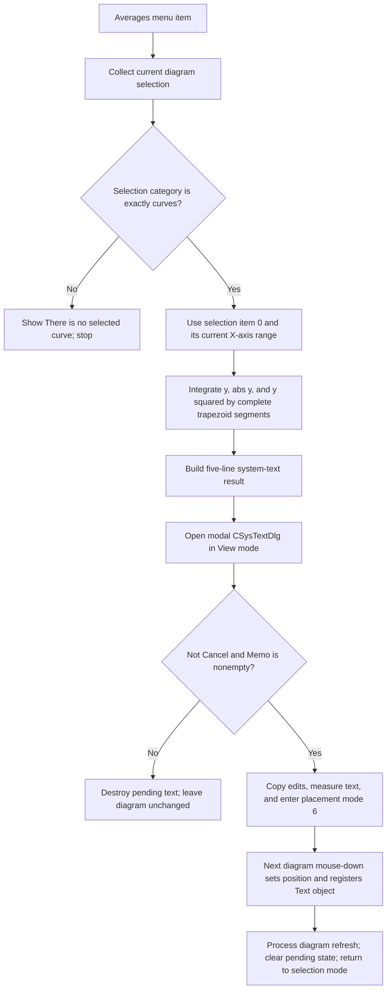

# Calculate and place curve-average text

> Analysis status: Source reviewed through curve selection, integration,
> result formatting, text editing, interactive placement, and failure bounds.

## Control

| Property | Recovered value |
| --- | --- |
| Form | DFWindow |
| Component path | DFWindow.DFMainMenu.DFProcessingMnu.DFAveragesMnu |
| Control class | TMenuItem |
| Caption | Averages ... |
| Hint | Not present in the recovered resource. |
| Text | Not present in the recovered resource. |
| Handler name | DFAveragesMnuClick |
| Handler address | 01a85a10 |
| Graph node | `resource:dfm:DFWindow/DFWindow.DFMainMenu.DFProcessingMnu.DFAveragesMnu` |
| Handler node | `function:01a85a10` |
| Graph layer | UI |

## What happens when clicked

This command calculates three time-domain statistics for the first selected
curve. It opens `CSysTextDlg` with the results and, after acceptance, lets the
user place the resulting text object on the current diagram.

It does not create an averaged curve. It does not combine several curves,
align their sample grids, resample data, or assign an output-curve name.

`FUN_01ae68a0` rebuilds the current diagram selection and requires its combined
selection-category byte to equal 2. Other recovered DFWindow callers establish
that exact category as curves. A mixed selection does not pass. Although more
than one selected curve can still produce category 2, this routine reads only
item 0 from the rebuilt selection list. The remaining selected curves do not
contribute to the calculation.

If the category is not exactly curves, the helper shows the recovered message
**There is no selected curve** and returns false. The click handler then makes
no text object and opens no editor.

## Domain and averaging algorithm

The selected curve provides its data reader and its X-axis object. The wrapper
passes the X-axis lower and upper values at offsets `0xb8` and `0xc0` as the
requested domain. The user does not enter a separate start, end, sample count,
or averaging method in this command. Changing the visible X-axis range before
the click therefore changes the calculation interval.

`FUN_01abde90` reads consecutive `(x, y)` samples from the selected curve. A
sample segment contributes only when both endpoints are inside the requested
X range. The routine does not interpolate a new sample at a boundary that cuts
through a segment. For each accepted segment, it uses the trapezoidal rule:

- average value accumulates `(x1 - x0) * (y0 + y1) / 2`;
- absolute average value accumulates
  `(x1 - x0) * (abs(y0) + abs(y1)) / 2`; and
- RMS accumulates `(x1 - x0) * (y0 * y0 + y1 * y1) / 2`.

The routine tracks the minimum and maximum X coordinates of all accepted
segment endpoints. It divides the first two integrals by that actual span and
takes the square root of the third integral divided by the same span. Thus the
displayed starting and ending times are the first and last covered coordinates
after the whole-segment filter. They can differ from the requested axis bounds.

This is a single-curve calculation. There is no cross-curve alignment rule.

## Result text and dialog

The handler creates a pending system-text object and copies the DFWindow text
font into it. It formats five lines:

1. `Starting time: ` plus the covered lower X value;
2. `Ending time: ` plus the covered upper X value;
3. `Average Value:` plus the signed average;
4. `Absolute Average Value:` plus the average magnitude; and
5. `RMS Value:` plus the root-mean-square value.

The last three labels are resources 0x82d through 0x82f. Their values pass
through the application value-and-unit formatter. No curve caption or generated
curve name is added to the text.

The handler creates a `TCSysTextDlg`, loads the pending object into its staged
editor model, switches to the rendered View page, and calls `ShowModal`. The
dialog caption is **Text**. The user can edit the five lines and their text
style; the command does not recalculate the statistics after an edit.

Modal result 2 is the cancel path. It destroys both the pending text object and
the dialog. Any other result is considered only when the Memo contains at
least one line. An empty Memo also discards the pending object. No diagram
element is added on either path.

## Acceptance, placement, redraw, and persistence

For an accepted, nonempty result, the handler copies the dialog's staged text
object back to the pending object. It also copies the chosen font into
DFWindow's current text-font field. It measures the formatted text on the
diagram canvas, assigns the active diagram as owner, prepares an initial point
at `(-100, -100)`, draws the temporary placement rectangle, and sets DFWindow
interaction mode 6.

Acceptance does not yet commit the text at a diagram coordinate. The next
DFWindow mouse-down in mode 6 performs the commit:

1. It moves the pending text object to the clicked canvas coordinate.
2. If the current selection is still category 2 and the text does not already
   have a curve link, it links the object to selection item 0.
3. It registers the object in the active diagram under the recovered collection
   key `Text`.
4. It queues and processes a diagram-element refresh, clears the pending-object
   field, restores selection mode, and invalidates the affected view.

The click therefore adds a text annotation, not a data curve. The redraw occurs
when placement is committed. The menu handler itself only draws the temporary
placement rectangle after dialog acceptance.

No diagram-save or settings-persistence function is called in the menu or
placement path. The inserted text becomes part of the in-memory diagram model
and must be saved through a separate diagram-save workflow.

## Guards, errors, and partial state

The normal menu-state path is expected to prevent invalid use, but the handler
calls its selection helper before its later active-diagram check. A direct call
with no valid diagram is therefore not a supported no-op path.

The integration routine has no accepted-segment or zero-span guard. With no
complete segment in the axis range, or with a zero-width covered span, the
division can produce nonfinite or sentinel-derived values. The handler still
formats the returned values and can open the text editor. No recovered warning
identifies this condition.

The handler has no local exception recovery and no transaction. An allocation,
formatting, dialog, measurement, or drawing error can propagate after it has
allocated the pending object or updated the default text font. After the dialog
is accepted, the diagram is not changed until the placement click. During that
interval, DFWindow owns the pending object and its mode-6 placement state. A
failure during the later registration or refresh can leave an inserted object
or selection state partly updated.

## Click flow

## Handler evidence

- Source: [FUN_01a85a10](../../../DecompiledSources/Tina16/functions/0000000001A85A10__FUN_01a85a10.c)
- Recovered role: Calculates curve statistics, edits the result as system text,
  and starts interactive placement of that text.
- Input evidence: `FUN_01ae68a0` requires curve-only selection category 2 and
  uses selection-list item 0.
- Calculation evidence: The selected curve's X-axis bounds and sample reader
  flow into `FUN_01abde90`.
- Output evidence: Accepted nonempty text is stored at DFWindow offset `0xff0`,
  measured, outlined, and left for mouse interaction mode 6 to place.
- Complexity: complex
- Distinct outgoing calls: 24

## Relevant calls

- [`FUN_01acff30`](../../../DecompiledSources/Tina16/functions/0000000001ACFF30__FUN_01acff30.c)
  collects selected diagram members and returns their combined category mask.
- [`FUN_01ae68a0`](../../../DecompiledSources/Tina16/functions/0000000001AE68A0__FUN_01ae68a0.c)
  validates curve-only selection, selects item 0, and obtains five statistics.
- [`FUN_01ab5580`](../../../DecompiledSources/Tina16/functions/0000000001AB5580__FUN_01ab5580.c)
  passes the curve data reader and X-axis range to the integration routine.
- [`FUN_01abde90`](../../../DecompiledSources/Tina16/functions/0000000001ABDE90__FUN_01abde90.c)
  computes the signed average, absolute average, RMS, and covered X limits.
- [`FUN_0146a9a0`](../../../DecompiledSources/Tina16/functions/000000000146A9A0__FUN_0146a9a0.c)
  loads the pending system-text object into `CSysTextDlg` staging and controls.
- [`FUN_0146a6e0`](../../../DecompiledSources/Tina16/functions/000000000146A6E0__FUN_0146a6e0.c)
  selects the dialog's rendered View page and refreshes its preview.
- [`FUN_01a5eb60`](../../../DecompiledSources/Tina16/functions/0000000001A5EB60__FUN_01a5eb60.c)
  copies the accepted staged system-text object back to the pending object.
- [`FUN_01a730e0`](../../../DecompiledSources/Tina16/functions/0000000001A730E0__FUN_01a730e0.c)
  is DFWindow's mouse-down handler. Its mode-6 branch commits the pending text
  at the clicked position and requests a diagram-element refresh.

## Resource evidence

- The menu item has caption **Averages ...**. It has no recovered hint, action,
  image reference, or embedded glyph.
- `CSysTextDlg` has caption **Text** and includes View/Edit pages, a Memo,
  `bkOK`, and `bkCancel` buttons. The result text is therefore editable before
  placement, but its statistics are already fixed before the dialog opens.

## Analysis limits

- The Delphi class and field names for the curve, axis, sample reader, pending
  text object, and interaction-mode byte are not recovered.
- The source establishes whole-segment inclusion and the three formulas. It
  does not establish special handling for decreasing or duplicate X values.
- The exact numeric notation and unit selected by the application formatter
  depend on shared runtime state that this handler does not change.
