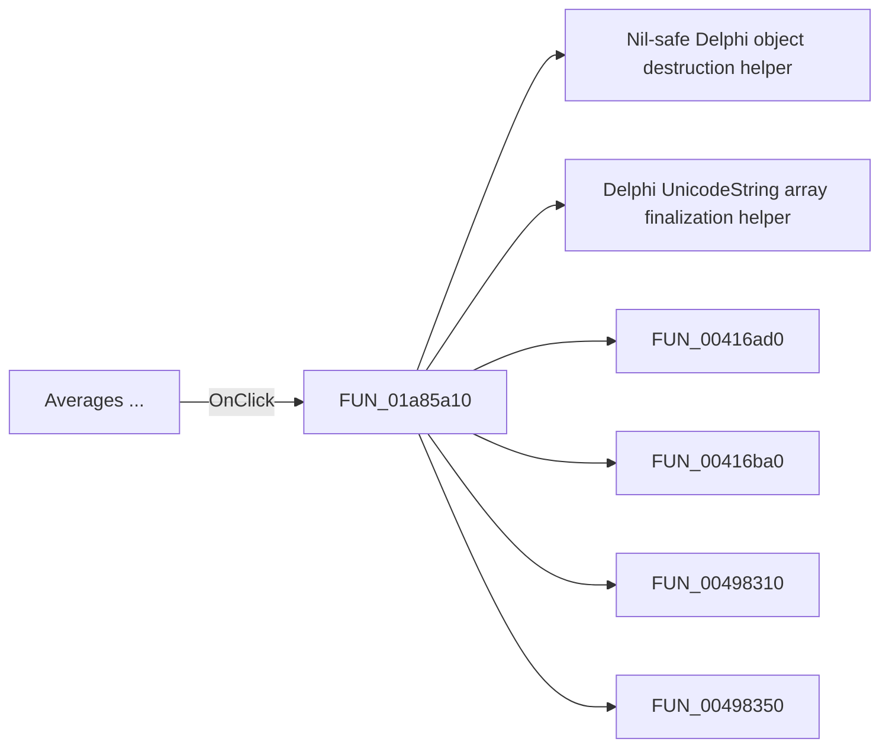

# Averages ...

> Analysis status: Pending individual source review.

## Control

| Property | Recovered value |
| --- | --- |
| Form | DFWindow |
| Component path | DFWindow.DFMainMenu.DFProcessingMnu.DFAveragesMnu |
| Control class | TMenuItem |
| Caption | Averages ... |
| Hint | Not present in the recovered resource. |
| Text | Not present in the recovered resource. |
| Handler name | DFAveragesMnuClick |
| Handler address | 01a85a10 |
| Graph node | `resource:dfm:DFWindow/DFWindow.DFMainMenu.DFProcessingMnu.DFAveragesMnu` |
| Handler node | `function:01a85a10` |
| Graph layer | UI |

## What happens when clicked

Pending individual analysis. An agent must read the recovered handler source and its relevant callees before it replaces this text.

## Click flow

## Handler evidence

- Source: [DecompiledSources/Tina16/functions/0000000001A85A10__FUN_01a85a10.c](../../../DecompiledSources/Tina16/functions/0000000001A85A10__FUN_01a85a10.c)
- Recovered role: Not present in the recovered resource.
- Current graph summary: Handles 1 Delphi UI event: DFWindow.DFMainMenu.DFProcessingMnu.DFAveragesMnu.OnClick.
- Current graph behavior: Not present in the recovered resource.
- Current graph evidence: Not present in the recovered resource.
- Complexity: complex
- Distinct outgoing calls: 24

## Direct calls

- `function:00410f20` — Nil-safe Delphi object destruction helper
- `function:00414560` — Delphi UnicodeString array finalization helper
- `function:00416ad0` — FUN_00416ad0
- `function:00416ba0` — FUN_00416ba0
- `function:00498310` — FUN_00498310
- `function:00498350` — FUN_00498350
- `function:0064e140` — FUN_0064e140
- `function:0080cc70` — FUN_0080cc70
- `function:0082a6c0` — FUN_0082a6c0
- `function:00b89270` — FUN_00b89270
- `function:00b8e520` — FUN_00b8e520
- `function:00b8fd60` — FUN_00b8fd60
- `function:00f05f60` — FUN_00f05f60
- `function:0146a6e0` — Handles 1 Delphi UI event: CSysTextDlg.ToolsPanel.ViewBtn.OnClick.
- `function:0146a9a0` — FUN_0146a9a0
- `function:01a5d940` — FUN_01a5d940
- `function:01a5eb60` — FUN_01a5eb60
- `function:01a5ee60` — FUN_01a5ee60
- `function:01a5eed0` — FUN_01a5eed0
- `function:01a5f250` — FUN_01a5f250
- `function:01a794b0` — Handles 1 Delphi UI event: DFWindow.DFToolPanel.ToolNoteBook.Diagram.DFSelectBtn.OnClick.
- `function:01a8dd40` — FUN_01a8dd40
- `function:01ae68a0` — FUN_01ae68a0
- `function:01aebb40` — FUN_01aebb40

## Resource evidence

- Kind: Not present in the recovered resource.
- Modal result: Not present in the recovered resource.
- Checked state: Not present in the recovered resource.
- List items: Not present in the recovered resource.
- Image reference: Not present in the recovered resource.
- Extracted glyph: None.

## Nearby label candidates

Nearby labels are layout candidates only. They are not proof of behavior.

- No same-parent label candidate is available.

## Analysis limits

- Do not infer behavior from the control class, caption, hint, glyph, or nearby label alone.
- Do not replace the pending status until the handler source and relevant call path provide enough evidence.
