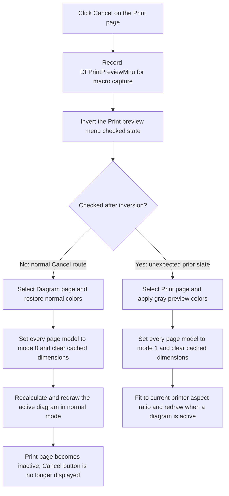

# Leave the embedded print preview

> Analysis status: Source reviewed through the shared preview toggle, notebook
> selection, page-model reset, redraw, print-job separation, and failure
> boundaries.

## Control

| Property | Recovered value |
| --- | --- |
| Form | DFWindow |
| Component path | DFWindow.DFToolPanel.ToolNoteBook.Print.DFCancelBtn |
| Control class | TSpeedButton |
| Caption | Not present in the recovered resource. |
| Hint | Cancel |
| Text | Not present in the recovered resource. |
| Handler name | DFPrintpreviewMnuClick |
| Handler address | 01a7ce40 |
| Graph node | `resource:dfm:DFWindow/DFWindow.DFToolPanel.ToolNoteBook.Print.DFCancelBtn` |
| Handler node | `function:01a7ce40` |
| Graph layer | UI |

## What the Cancel button cancels

`DFCancelBtn` leaves the modeless print-preview view in the existing
`DFWindow`. It does not cancel a modal dialog and it does not abort a printer
job. The button and the **Print preview** menu item use the same
`FUN_01a7ce40` handler. The handler does not inspect the event sender, so the
button has no private Cancel branch.

In the normal button route, preview is already active and the **Print** page is
the selected `ToolNoteBook` page. The handler records the
`DFPrintPreviewMnu` command for the macro path and toggles the menu item's
checked state from true to false. It then:

- selects notebook page 0, whose recovered caption is **Diagram**;
- restores the standard DFWindow background and the white diagram canvas;
- sets the rendering-mode byte at offset `+0xb0` to 0 in every page model;
- clears cached dimensions `+0x100` and `+0x104` in every page model; and
- runs the shared DFWindow layout and redraw routine.

Selecting the **Diagram** page makes the **Print** page inactive. Its Cancel,
Margin, and Print child buttons are therefore no longer displayed. The handler
does not directly write the Cancel button's `Visible` or `Enabled` property.
It updates the checked state of the menu item and the selected notebook page.

## No sender-specific no-op

The handler always inverts the **Print preview** checked state. It does not
test whether `DFCancelBtn` sent the event. If the handler is called through the
Cancel button while the menu item is unexpectedly unchecked, it takes the
opposite branch: it selects notebook page 1 (**Print**), changes the canvas to
gray, sets all page models to preview mode 1, clears their caches, and redraws
the preview. Thus, this control is a route to the shared toggle, not an
idempotent `LeavePreview` operation.

The normal UI sequence keeps the two states aligned because entering preview
selects the **Print** page and makes this button available there. The recovered
DFM sets **Diagram** as the initial active page. The `ToolNoteBook.OnChange`
handler only adjusts a child width; it does not synchronize the preview menu
state.

## Redraw and printer state

`FUN_01a77f90` lays out and paints the existing active diagram after the mode
change. On the normal Cancel branch, the preview flag is already clear when
`FUN_01a782f0` computes the canvas rectangle. This branch does not query the
global printer dimensions. It uses the normal diagram rectangle and rendering
mode instead.

The handler does not create, destroy, or update the process-wide `TPrinter`.
It does not call `BeginDoc`, `EndDoc`, `NewPage`, or `Abort`, and it does not
change the selected printer, page range, copies, margins, paper, or
orientation. The separate Print button and **Print...** menu command own the
modal print dialog and print job. The `PrinterAbortDlg` Abort button owns
active-job cancellation.

The separate Margin button opens the shared Border window. The separate
**Print Setup...** command opens the VCL printer-setup dialog. This Cancel
button does not close either dialog or reverse changes made through them.

## Model, persistence, and empty states

The writes to mode `+0xb0` and cache fields `+0x100` and `+0x104` affect every
page model in the current DFWindow page manager. They are rendering state, not
curve, axis, annotation, margin, or printer data. The handler does not call a
document save routine, a modified-state setter, or an undo recorder.

The command-state updater disables the **Print preview** menu item when there
is no active diagram. `FUN_01a7ce40` itself has no active-diagram guard. If it
is invoked directly in that state, it still toggles the menu check, selects a
notebook page, changes colors, and visits the page-manager collection. The
common redraw routine cannot enter its normal diagram-paint branch when no
active diagram exists. It can still use a separate auxiliary-image path when
field `+0x788` is non-null; otherwise it returns without painting. An empty
page-model collection skips the loop, but the menu, notebook, colors, and
redraw call still occur.

## Errors and partial state

There is no local exception handler, rollback, or user-facing error message.
The handler toggles the menu item before it changes the notebook, colors, page
models, and canvas. An exception during those later operations can leave only
part of the view state updated. A later exception during layout or painting
can occur after all page modes and caches have changed. The normal Cancel
branch does not have a recovered printer call, so printer initialization is
not part of that branch's failure surface.

## Click flow

## Handler and related evidence

- [Shared preview handler](../../../DecompiledSources/Tina16/functions/0000000001A7CE40__FUN_01a7ce40.c)
  toggles the menu checked byte, selects notebook page 0 or 1, changes colors,
  updates every page model, and calls the common redraw path. It does not test
  the sender argument.
- [Menu checked-state setter](../../../DecompiledSources/Tina16/functions/00000000007E2D20__FUN_007e2d20.c)
  writes the VCL checked property and updates its native menu state.
- [Notebook page selector](../../../DecompiledSources/Tina16/functions/00000000006D8180__FUN_006d8180.c)
  selects an indexed page when the index is valid.
- [DFWindow redraw routine](../../../DecompiledSources/Tina16/functions/0000000001A77F90__FUN_01a77f90.c)
  lays out and paints the active diagram. Without one, it can use its separate
  auxiliary-image path or return without normal diagram painting.
- [Canvas rectangle calculation](../../../DecompiledSources/Tina16/functions/0000000001A782F0__FUN_01a782f0.c)
  uses printer dimensions only while the preview menu item is checked.
- [Notebook change handler](../../../DecompiledSources/Tina16/functions/0000000001A89BE0__FUN_01a89be0.c)
  changes a child width and does not synchronize preview state.
- [Command-state updater](../../../DecompiledSources/Tina16/functions/0000000001A7FC90__FUN_01a7fc90.c)
  disables the preview menu command when no active diagram exists.
- [Print handler](../../../DecompiledSources/Tina16/functions/0000000001A7AB10__FUN_01a7ab10.c)
  owns the print dialog, printer document, page rendering, and preview-state
  restoration. See [Print diagram pages](dfprintmnu-44edd8f753.md).
- [Printer abort handler](../../../DecompiledSources/Tina16/functions/0000000001800670__FUN_01800670.c)
  is the separate active-job cancellation path.
- The menu-specific route and the full preview renderer are documented in
  [Toggle diagram print preview](dfprintpreviewmnu-0ae484db52.md).
- Printer selection is documented in
  [Configure the process-wide printer](dfprintsetupmnu-e90fab9613.md).
- The recovered component tree and bindings are in
  [ui-evidence.json](../../../DecompiledSources/Tina16/resources/dfm/ui-evidence.json).

## Resource and glyph evidence

- The control is a `TSpeedButton` on the **Print** tab. It has hint **Cancel**,
  no caption, and no modal-result or built-in Cancel property.
- Its embedded 36 by 18 BMP was extracted as a PNG with two 18-pixel frames.
  The [glyph](../../../glyph/0110_DFWindow_DFWindow_DFToolPanel_ToolNoteBook_Print_DFCancelBtn_Glyph_Data.png)
  shows a red X and a gray X. The gray frame is consistent with disabled-state
  rendering, but the resource does not set the button disabled. The shared
  handler source proves that this specific control leaves preview.
- The sibling buttons have hints **Margin** and **Print** and use different
  handlers. Their distinct bindings agree with the recovered separation of
  preview cancellation, margin editing, and physical printing.

## Analysis limits

- The recovered Delphi names of the DFWindow fields at offsets `+0x780`,
  `+0x798`, `+0x7a0`, `+0x910`, and `+0xa70` are not present. Their roles come
  from the DFM binding, page order, repeated field use, and downstream calls.
- The source does not prove whether another runtime path can expose or invoke
  the Cancel button while preview is unchecked. The opposite toggle branch is
  documented because the handler has no sender or prior-page guard.
- The source proves that the normal Cancel branch does not call printer APIs.
  It does not define how higher-level VCL exception handling reports a layout
  or paint failure.
