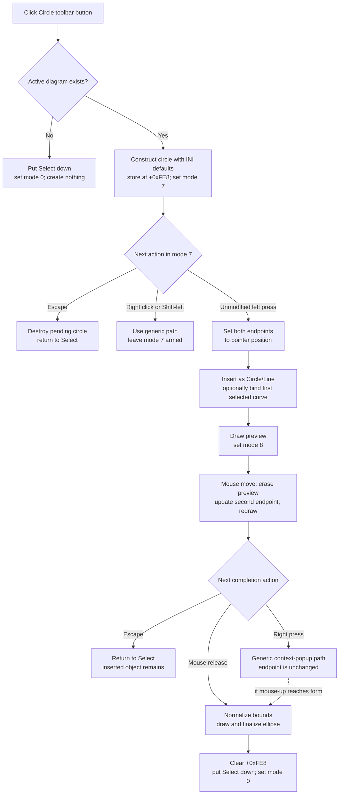

# Circle toolbar button

> Analysis status: Complete from recovered resource, handler, constructor, mouse-state, renderer, and serializer evidence.

## Control

| Property | Recovered value |
| --- | --- |
| Form | DFWindow |
| Component path | DFWindow.DFToolPanel.ToolNoteBook.Diagram.DFCircleBtn |
| Control class | TSpeedButton |
| Caption | Not present in the recovered resource. |
| Hint | Circle |
| Group index | 1 |
| Handler name | DFCircleBtnClick |
| Handler address | 01a7b400 |
| Graph node | `resource:dfm:DFWindow/DFWindow.DFToolPanel.ToolNoteBook.Diagram.DFCircleBtn` |
| Handler node | `function:01a7b400` |
| Graph layer | UI |

## What happens when clicked

The toolbar button arms DFWindow's two-point circle drawing tool. It does not create visible geometry or insert an object when the click handler runs.

`DFCircleBtnClick` records command name `DFCircleBtn` and tests DFWindow's active-diagram field at offset `+0x798`.

- If no active diagram exists, it puts the Select button down and calls the Select handler. The interaction mode becomes `0`. No circle is allocated, and no error message appears.
- If an active diagram exists, it constructs a circle object, stores it in the form's pending-circle field at `+0xFE8`, and sets interaction mode `7` at `+0x7A8`.

The DFM places this speed button in group `1` with the other drawing tools. The handler itself does not set the button's down state. The VCL speed-button interaction occurs before its `OnClick`; the no-diagram branch explicitly restores Select.

## Circle defaults

`FUN_010ed740` initializes the recovered circle class `PTR_FUN_010ecd58`. It creates the object's line-pen and fill-style objects. It reads these integer values from `TINA.INI`, section `Diagram Page Setup`:

| Key | Recovered fallback |
| --- | ---: |
| `Circle width` | `2` |
| `Circle color` | `0xff0000` |
| `Circle style` | `0` |

The constructor applies those values to the line pen and sets the second drawing-style object to mode `1`. The source does not recover a symbolic color name or the original Delphi enum names.

## First point and model insertion

Form mouse-down consumes mode `7` only for the left-button path when recovered Shift-state bit `1` is clear. It writes the pointer coordinate to both endpoint pairs at circle offsets `+0x68` and `+0x70`. The initial bounding rectangle therefore has zero width and height.

The shared insertion helper then adds the object to the active diagram's figure collection under name `Circle/Line` and stores the active diagram at object offset `+0x78`. A selection is not required.

If the combined current-selection category is exactly `2`, the helper also stores the first selected curve at object offset `+0x80` and registers the circle with that curve. Empty, mixed, and other selection categories leave the curve association null and do not stop insertion. The selected curve does not have to be under the pointer.

After insertion, mouse-down draws the first preview and changes interaction mode from `7` to `8`.

## Preview and finalization

While mode `8` is active, each mouse-move call draws the old preview again, replaces the second endpoint at `+0x70` with the current pointer coordinate, and draws the new preview. This is the recovered rubber-band update.

On mouse release in mode `8`, the handler removes the current preview, sorts the two X values into left and right and the two Y values into top and bottom, then calls the object's normal draw and finalization methods. It clears the form's pending-circle field, puts Select down, and resets the interaction mode to `0`. The tool is single-use after a completed placement.

There is no minimum-size or equal-radius check. A press and release at one coordinate commits a zero-size object. Unequal horizontal and vertical drag distances create an axis-aligned ellipse. The renderer calculates independent horizontal and vertical centers and radii and samples the outline with 101 points. The recovered UI calls the tool **Circle**, but the geometry is not restricted to a mathematical circle.

## Escape and right-click behavior

Escape has different results in the two modes:

- In armed mode `7`, Escape destroys the uninserted object at `+0xFE8`, clears that field, puts Select down, resets mode and cursor, and refreshes the active diagram. No model object remains.
- In drag mode `8`, the object is already in the figure collection. Escape puts Select down, resets mode and cursor, and refreshes the diagram, but it does not remove or destroy that object. The current zero-size or preview bounds remain in the live model.

A right-button mouse-down does not use the circle-specific first-point branch. In mode `7`, it follows DFWindow's generic selection and context-popup path and leaves the circle tool armed; its mouse-up branch does nothing for mode `7`. In mode `8`, right-button mouse-down does not update the second endpoint. The mode-`8` mouse-up completion branch does not test which button was released, so it finalizes the circle from the last stored endpoint if that mouse-up event reaches the form. Static source does not prove how native popup dispatch affects delivery of that event.

A Shift-modified left press also bypasses the mode-`7` start branch and leaves the pending circle armed.

## Errors, redraw, and persistence

The activation, insertion, preview, and completion paths have no local exception handler, error dialog, rollback transaction, or returned failure test. An allocation, collection, drawing, or virtual-method failure can propagate to higher-level Delphi handling. A failure after the first point can leave an inserted, partly initialized figure.

If the toolbar handler is invoked again while a circle is already armed, it allocates another object and overwrites `+0xFE8` without an explicit cleanup call. The speed-button group can prevent a normal repeated click from emitting this event, so the source does not prove that users can reach this overwrite through the normal UI.

Preview and final drawing update the visible canvas. The direct path does not call a file writer, create an explicit undo record, or call the recovered diagram modified-state helper. It therefore does not prove an immediate dirty-flag change.

The circle serializer writes its coordinate fields, active-diagram and optional curve reference identifiers, and line style. The loader restores those values, re-registers the optional curve association, and adds the object to the active diagram as `Circle`. Thus, a later diagram serialization can preserve a completed object. This toolbar click does not invoke that serialization.

## Click and drawing flow

## Evidence

- [DFCircleBtnClick](../../../DecompiledSources/Tina16/functions/0000000001A7B400__FUN_01a7b400.c) logs `DFCircleBtn`, falls back to Select without an active diagram, or stores a newly constructed object at `+0xFE8` and writes mode `7`.
- [The circle constructor](../../../DecompiledSources/Tina16/functions/00000000010ED740__FUN_010ed740.c) creates the drawing-style objects and reads `Circle width`, `Circle color`, and `Circle style`. [The settings reader](../../../DecompiledSources/Tina16/functions/0000000000F06B50__FUN_00f06b50.c) proves that these values come from `TINA.INI` section `Diagram Page Setup`.
- [DFWindow mouse-down](../../../DecompiledSources/Tina16/functions/0000000001A730E0__FUN_01a730e0.c) handles mode `7`, assigns both endpoint pairs, inserts the object, draws the first preview, and changes to mode `8`. Its separate right-button branch performs generic selection and popup work.
- [The shared insertion helper](../../../DecompiledSources/Tina16/functions/0000000001AE4B90__FUN_01ae4b90.c) performs the optional exact-category-`2` curve association and adds the object to the figure collection as `Circle/Line`.
- [DFWindow mouse-move](../../../DecompiledSources/Tina16/functions/0000000001A74A50__FUN_01a74a50.c) erases and redraws the mode-`8` preview around the updated second endpoint.
- [DFWindow mouse-up](../../../DecompiledSources/Tina16/functions/0000000001A77260__FUN_01a77260.c) normalizes the four bounds, draws and finalizes the object, clears `+0xFE8`, and returns to Select. Its mode-`8` branch does not inspect the released mouse-button parameter.
- [Escape handling](../../../DecompiledSources/Tina16/functions/0000000001A7D1A0__FUN_01a7d1a0.c) destroys the pending object in mode `7`, but its generic mode-`8` exit does not destroy or remove the already inserted object.
- [Circle rendering](../../../DecompiledSources/Tina16/functions/00000000010EDA50__FUN_010eda50.c) calculates independent X and Y radii from the two endpoint pairs. [Hit testing](../../../DecompiledSources/Tina16/functions/00000000010EDE80__FUN_010ede80.c) uses the ellipse equation and handles degenerate point and line cases.
- [Circle serialization](../../../DecompiledSources/Tina16/functions/00000000010EEA60__FUN_010eea60.c) writes geometry, references, and line style. [Circle loading](../../../DecompiledSources/Tina16/functions/00000000010EE900__FUN_010ee900.c) restores them and registers the object as `Circle`.
- The recovered DFM gives the button hint `Circle`, group index `1`, and a 20 by 20 pixel embedded glyph. The [extracted glyph](../../../glyph/0103_DFWindow_DFWindow_DFToolPanel_ToolNoteBook_Diagram_DFCircleBtn_Glyph_Data.png) shows an outlined circle. These resources identify the tool; the handler and mouse-state sources prove its behavior.

## Ownership and limits

- This Bead owns the toolbar handler `FUN_01a7b400` and circle constructor `FUN_010ed740` annotations.
- The popup `CircleMnu` wrapper is owned by Bead `.329`. Selection, insertion, mouse-event, render, and serialization functions are shared call-path evidence and are not annotated here.
- Original Delphi class, field, enum, and method names are not available. Offset and mode names in this article describe proven use.
