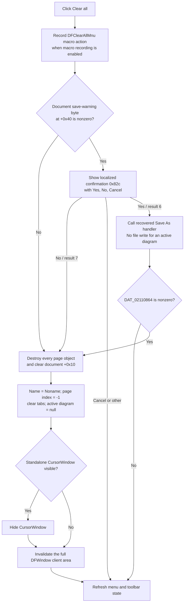

# Clear all diagram pages

> Analysis status: Evidence-backed from the recovered menu resource, confirmation branch, document reset helper, page-tab selection path, cursor-window lifecycle, repaint path, and command-state refresh.

## Control

| Property | Recovered value |
| --- | --- |
| Form | DFWindow |
| Component path | DFWindow.DFMainMenu.DFFileMnu.DFClearAllMnu |
| Control class | TMenuItem |
| Caption | `&Clear all` |
| Handler name | DFClearAllMnuClick |
| Handler address | `01a83f90` |
| Graph node | `resource:dfm:DFWindow/DFWindow.DFMainMenu.DFFileMnu.DFClearAllMnu` |
| Handler node | `function:01a83f90` |

## What happens when clicked

The handler records the `DFClearAllMnu` macro action before it makes any decision. It then reads the document-container byte at offset `+0x40`. This byte is initialized to zero and is used here as the save-warning condition.

- If the byte is zero, the handler clears the document without a dialog.
- If the byte is nonzero, the handler loads localized string ID `0x82c` and opens a confirmation dialog with Yes, No, and Cancel buttons. The recovered string table lookup does not expose the exact prompt text, so this article does not invent it.
- No (`mrNo`, result `7`) clears immediately.
- Cancel or any result other than Yes and No leaves the document unchanged.
- Yes (`mrYes`, result `6`) invokes `DFSaveAsMnuClick`. The recovered Demo handler does not open a dialog or write a file when a diagram exists. Clear All then tests global byte `DAT_02110864` and clears only when that byte is nonzero. No recovered writer links that byte to this Save As call. The captured runtime value is zero. Therefore, the source does not prove that Yes saves or clears the document.

The handler refreshes command enablement after every normal branch, including Cancel and the Yes branch that does not pass the global-byte gate.

## Exact state removed by a successful clear

The common reset helper operates on the document container at `DFWindow +0x7a0`:

1. It iterates the primary page-object collection at document offset `+0x10` and destroys every object.
2. It clears that collection after the destruction loop.
3. It writes `-1` to the document's current-page index at `+0x18`.
4. It replaces the document name at `+0x48` with `Noname` and updates the DFWindow caption from that name and the recovered `" - "` suffix.
5. It clears the page-tab control's item strings and sets its selected tab index to `-1`.
6. It sets the active diagram pointer at `DFWindow +0x798` to null.

The primary collection is the same indexed source used by the single-page delete and page-selection paths. Its items are the diagram pages. Destruction removes each page and its owned curves, x and y axes, figures, annotations, and cursor objects as a unit. Clear All does not keep one blank page and does not retain a selected curve or axis from a destroyed page.

The helper does not clear every field in the document container. It does not write the auxiliary collections at `+0x20`, `+0x28`, `+0x30`, or `+0x38`, the save-warning byte at `+0x40`, or the default curve width at `+0x50`. The recovered source does not establish that any auxiliary collection is an undo history, so this article does not assign those collections an unproven role.

## Selection, cursor, redraw, and command state

Clearing the page-tab strings, selecting tab `-1`, and nulling `DFWindow +0x798` remove the current page selection. The destroyed pages also remove their selected diagram members and their cursor A and cursor B objects. If the standalone `CursorWindow` is visible, the handler hides it after the model reset.

The path does not explicitly blank the embedded cursor-value labels, reset the tool-mode byte at `DFWindow +0x7a8`, or write neighboring form fields `+0x788` and `+0x790`. Their post-clear state is not inferred. They no longer have an active diagram at `+0x798` to operate on.

After the reset, the handler obtains the DFWindow native handle and calls the recovered invalidation thunk with a null rectangle and a true flag. This requests a repaint of the full client area. It then calls the common command-state refresh. That refresh disables commands that require an active diagram and recalculates the remaining menu and toolbar enablement.

## Persistence and undo boundary

The successful clear path does not call the diagram serializer, the diagram-settings writer, a file API, or an undo registration helper. It destroys the existing page objects directly. No recovered command in this path can restore them.

The No branch discards the in-memory pages without first writing them. The Yes branch calls the recovered no-file Save As handler, then uses the unrelated or unresolved global-byte gate described above. No branch saves the new empty state. The only guaranteed external side effect before the decision is the optional macro-recorder event; a recorded event does not prove that the clear completed.

## Click flow

## Empty, error, and partial-failure behavior

- The handler tests the save-warning byte, not the page count. If the byte is zero, an already empty document still goes through the name, tab, active-pointer, repaint, and command-state reset.
- If the byte is nonzero, an empty primary collection can still produce the confirmation dialog. The reset helper does not clear that byte.
- Cancel and an ungated Yes leave the model unchanged but still refresh command enablement.
- There is no local exception handler, retry, or rollback. If an object destructor fails during the loop, earlier objects can already be destroyed while the collection still contains its original entries.
- A failure after the collection is cleared but before the active pointer, page tabs, or caption are reset can leave those views inconsistent with the model.
- A failure after the model reset but before invalidation can leave the old pixels visible until another repaint.
- The handler shows no special message for an empty document. Only the save-warning branch shows the localized confirmation.

## Evidence

- [FUN_01a83f90](../../../DecompiledSources/Tina16/functions/0000000001A83F90__FUN_01a83f90.c) implements the save-warning decision, Yes/No/Cancel result branches, clear calls, cursor-window hide, repaint request, and unconditional normal-return command refresh.
- [FUN_01cec530](../../../DecompiledSources/Tina16/functions/0000000001CEC530__FUN_01cec530.c) destroys and clears the page collection, resets `Noname`, clears page tabs, resets the page and tab indexes, updates the caption, and nulls the active diagram pointer.
- [FUN_01cebb70](../../../DecompiledSources/Tina16/functions/0000000001CEBB70__FUN_01cebb70.c) initializes the document collections, current-page index, save-warning byte, `Noname`, and default curve width.
- [FUN_01cec240](../../../DecompiledSources/Tina16/functions/0000000001CEC240__FUN_01cec240.c) proves that the primary collection and page-tab index are the paired sources for single-page deletion and current-page selection.
- [FUN_0072d440](../../../DecompiledSources/Tina16/functions/000000000072D440__FUN_0072d440.c) forwards the localized message to the VCL modal-message path with the recovered confirmation type and button set.
- [FUN_01a7e680](../../../DecompiledSources/Tina16/functions/0000000001A7E680__FUN_01a7e680.c) proves that the Yes branch's recovered Save As target does not write a file for an active diagram.
- [FUN_00805990](../../../DecompiledSources/Tina16/functions/0000000000805990__FUN_00805990.c) hides the standalone cursor form when it is visible.
- [FUN_0065b870](../../../DecompiledSources/Tina16/functions/000000000065B870__FUN_0065b870.c) obtains the DFWindow native handle used by the invalidation call.
- [FUN_01a7fc90](../../../DecompiledSources/Tina16/functions/0000000001A7FC90__FUN_01a7fc90.c) recalculates command enablement from the active-diagram and selection state.
- [Recovered DFWindow resource](../../../DecompiledSources/Tina16/resources/dfm/ui-evidence.json) binds `DFClearAllMnuClick` to `01a83f90` and supplies the `&Clear all` caption.

## Analysis limits

- Localized string ID `0x82c` is recovered, but its resolved text is not present in the extracted resource evidence.
- `DAT_02110864` has no recovered writer and is not described as save success. Its nonzero branch is documented only as the gate that the handler tests.
- The reset removes all objects in the primary diagram-page collection. The exact semantics of the four untouched auxiliary document collections are not recovered.
- The native invalidation target is a recovered thunk without an imported symbol. Its handle, null-rectangle, true-flag call shape and placement after reset establish the repaint request, but not a named Win32 import.
