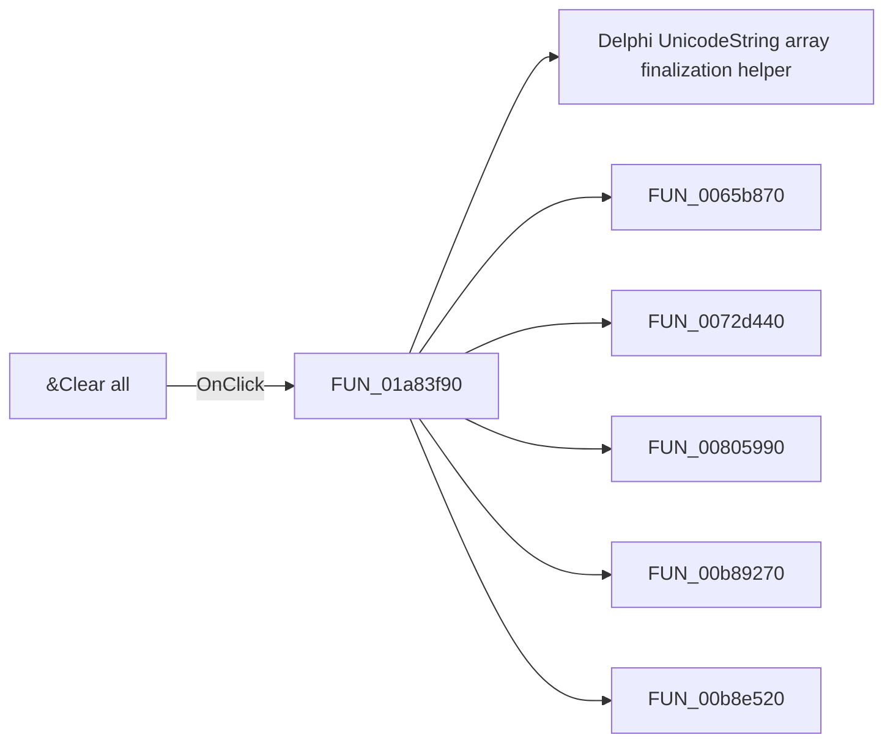

# &Clear all

> Analysis status: Pending individual source review.

## Control

| Property | Recovered value |
| --- | --- |
| Form | DFWindow |
| Component path | DFWindow.DFMainMenu.DFFileMnu.DFClearAllMnu |
| Control class | TMenuItem |
| Caption | &Clear all |
| Hint | Not present in the recovered resource. |
| Text | Not present in the recovered resource. |
| Handler name | DFClearAllMnuClick |
| Handler address | 01a83f90 |
| Graph node | `resource:dfm:DFWindow/DFWindow.DFMainMenu.DFFileMnu.DFClearAllMnu` |
| Handler node | `function:01a83f90` |
| Graph layer | UI |

## What happens when clicked

Pending individual analysis. An agent must read the recovered handler source and its relevant callees before it replaces this text.

## Click flow

## Handler evidence

- Source: [DecompiledSources/Tina16/functions/0000000001A83F90__FUN_01a83f90.c](../../../DecompiledSources/Tina16/functions/0000000001A83F90__FUN_01a83f90.c)
- Recovered role: Not present in the recovered resource.
- Current graph summary: Handles 1 Delphi UI event: DFWindow.DFMainMenu.DFFileMnu.DFClearAllMnu.OnClick.
- Current graph behavior: Not present in the recovered resource.
- Current graph evidence: Not present in the recovered resource.
- Complexity: complex
- Distinct outgoing calls: 11

## Direct calls

- `function:00414560` — Delphi UnicodeString array finalization helper
- `function:0065b870` — FUN_0065b870
- `function:0072d440` — FUN_0072d440
- `function:00805990` — FUN_00805990
- `function:00b89270` — FUN_00b89270
- `function:00b8e520` — FUN_00b8e520
- `function:01a7e680` — Handles 1 Delphi UI event: DFWindow.DFMainMenu.DFFileMnu.DFSaveAsMnu.OnClick.
- `function:01a7fc90` — FUN_01a7fc90
- `function:01aed550` — FUN_01aed550
- `function:01aee720` — FUN_01aee720
- `function:01cec530` — FUN_01cec530

## Resource evidence

- Kind: Not present in the recovered resource.
- Modal result: Not present in the recovered resource.
- Checked state: Not present in the recovered resource.
- List items: Not present in the recovered resource.
- Image reference: Not present in the recovered resource.
- Extracted glyph: None.

## Nearby label candidates

Nearby labels are layout candidates only. They are not proof of behavior.

- No same-parent label candidate is available.

## Analysis limits

- Do not infer behavior from the control class, caption, hint, glyph, or nearby label alone.
- Do not replace the pending status until the handler source and relevant call path provide enough evidence.
