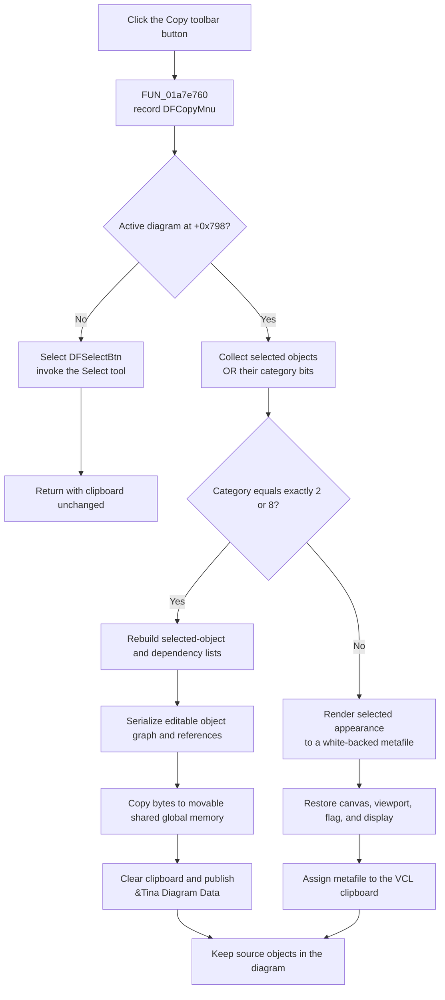

# Copy the diagram selection from the toolbar

> Analysis status: Evidence-backed source review complete.

## Control

| Property | Recovered value |
| --- | --- |
| Form | DFWindow |
| Toolbar path | DFToolPanel > ToolNoteBook > Diagram > DFCopyBtn |
| Component path | DFWindow.DFToolPanel.ToolNoteBook.Diagram.DFCopyBtn |
| Control class | TSpeedButton |
| Caption | Not present in the recovered resource. |
| Hint | Copy |
| Handler name | DFCopyMnuClick |
| Handler address | 01a7e760 |
| Graph node | `resource:dfm:DFWindow/DFWindow.DFToolPanel.ToolNoteBook.Diagram.DFCopyBtn` |
| Handler node | `function:01a7e760` |
| Graph layer | UI |

The button is on the `Diagram` page of `ToolNoteBook`. Its DFM resource has a 522-byte embedded bitmap, `NumGlyphs = 2`, `ShowHint = true`, and the hint `Copy`. The extracted 40×20 image shows two copy-style page glyphs. This supports the toolbar purpose, but the handler source proves the clipboard formats and branch conditions.

The same `DFCopyMnuClick` handler is bound to the Edit-menu `&Copy` item. The toolbar button therefore has the same OnClick behavior as the menu command and its Ctrl+C shortcut.

## What happens when clicked

The handler first records the command token `DFCopyMnu`. It then reads the active diagram at `DFWindow +0x798`.

If no active diagram exists, the handler selects `DFSelectBtn`, invokes the Select-tool handler, and returns. It does not open, clear, or write the clipboard on this path. This fallback applies even though normal command-state logic usually prevents Copy when no diagram is active.

With an active diagram, the handler collects selected diagram members and calculates their combined category byte. It selects the clipboard representation by exact equality:

| Selection category | Clipboard representation |
| --- | --- |
| Exactly `2` | Editable private `&Tina Diagram Data`. Independent callers identify category `2` as curves. |
| Exactly `8` | Editable private `&Tina Diagram Data`. The business name of this editable object class is not recovered. |
| `0`, exactly `1`, another category, or a mixed bit mask | Rendered metafile. Category `0` includes no selected member; category `1` is independently identified as axes. |

The tests are exact. A mixed selection such as curve plus axis is not equal to `2`, so it uses the metafile branch.

## Editable TINA diagram data branch

For exact category `2` or `8`, the handler creates a memory stream and write-mode serializer. The canonical serializer `FUN_01cedda0` rebuilds dependency and selected-object staging lists, normalizes transient object identifiers and references, writes the combined object count, and invokes each object's serializer.

The handler copies the stream into movable shared global memory allocated with flags `0x2002`. It clears the clipboard and publishes that native handle under the registered private format `&Tina Diagram Data`. This payload is the editable round trip used by the separate Paste handler.

The selected objects remain in the source diagram. The custom branch does change transient serialization bookkeeping: it rebuilds staging lists and assigns temporary identifiers to participating objects. The recovered handler does not restore those fields after publication.

## Metafile branch

Every other category byte uses the rendered path. This includes an axis-only selection, an empty selection, other categories, and mixed selections.

The handler derives the active diagram dimensions, creates a white-backed `TMetafile` and `TMetafileCanvas`, and renders with a 10-pixel inset. During rendering, it saves the form canvas at `+0x780`, substitutes the metafile canvas, enables the global selection-render flag, renders the active diagram, and then clears the flag. It restores the original canvas, recalculates the viewport, and redraws the screen before it assigns the metafile to the VCL clipboard.

Recovered graphics registration and Paste behavior show support for `CF_ENHMETAFILE` and `CF_METAFILEPICT`. The exact metafile variant chosen by the VCL assignment is not explicit. A pasted metafile becomes an image/metafile diagram object; it does not reconstruct the original curves, axes, or mixed object graph.

## Click flow

## No-diagram, empty-selection, and repeated-copy behavior

- No active diagram selects the Select tool and leaves the existing clipboard unchanged.
- An active diagram with no selected member produces category `0`. The handler does not show a message or return; it enters the metafile renderer. The recovered renderer determines whether that image is blank or contains selection-render output.
- Repeated successful custom copies replace the previous clipboard contents because the native-handle helper clears the clipboard before publication. VCL metafile assignment also replaces the current clipboard graphic.
- Copy does not call a removal helper. Cut is a separate command that calls Copy before its removal path.

## Clipboard and error limits

The custom branch does not check global-memory allocation, lock, or clipboard-publication results. It shows no message and has no rollback. On successful `SetClipboardData`, Windows owns the handle. The recovered helper does not return the publication result, so ownership and cleanup after a failed publication are not established. A failure can occur after the clipboard was cleared.

The metafile allocation, render, state-restoration, and clipboard assignment are not protected by a local exception handler or `finally` block in the recovered function. Normal completion restores the canvas, viewport, render flag, and display. If an exception interrupts rendering before those statements, this handler does not itself guarantee restoration; Delphi's outer UI exception mechanism receives the exception.

Apart from the command log, Copy writes only the clipboard and transient serialization or drawing state. It does not save a diagram file, write settings, mark an undo action, or persist the payload in a database.

## Recovered evidence

- [`FUN_01a7e760`](../../../DecompiledSources/Tina16/functions/0000000001A7E760__FUN_01a7e760.c) is the shared toolbar and menu OnClick handler. It contains the no-diagram fallback, exact category tests, serializer branch, metafile branch, clipboard publication, and normal display restoration.
- The canonical [Edit-menu Copy article](dfcopymnu-c333bf53b7.md) provides the full shared-handler, classifier, serializer, clipboard, Paste, and native API analysis. `TIARA-diz.6.7.274` owns those canonical function annotations.
- [`FUN_01acff30`](../../../DecompiledSources/Tina16/functions/0000000001ACFF30__FUN_01acff30.c) collects selected members and returns their combined category mask.
- [`FUN_01cedda0`](../../../DecompiledSources/Tina16/functions/0000000001CEDDA0__FUN_01cedda0.c) serializes the selected editable object graph and dependency records.
- [`FUN_006a5e10`](../../../DecompiledSources/Tina16/functions/00000000006A5E10__FUN_006a5e10.c) clears the clipboard and publishes a native handle under the requested format.
- [`FUN_006a6030`](../../../DecompiledSources/Tina16/functions/00000000006A6030__FUN_006a6030.c) returns the process-wide VCL clipboard wrapper.
- [`FUN_01a8b880`](../../../DecompiledSources/Tina16/functions/0000000001A8B880__FUN_01a8b880.c) registers `&Tina Diagram Data` during initialization.
- [`FUN_01a7ee10`](../../../DecompiledSources/Tina16/functions/0000000001A7EE10__FUN_01a7ee10.c) proves the private-data and metafile Paste branches.
- Extracted glyph: [`0083_DFWindow_DFWindow_DFToolPanel_ToolNoteBook_Diagram_DFCopyBtn_Glyph_Data.png`](../../../glyph/0083_DFWindow_DFWindow_DFToolPanel_ToolNoteBook_Diagram_DFCopyBtn_Glyph_Data.png)
- UI resource evidence: [`ui-evidence.json`](../../../DecompiledSources/Tina16/resources/dfm/ui-evidence.json)

## Toolbar-specific limits

The toolbar button also has a separate `OnMouseDown` binding, `DFCopyBtnMouseDown` at `01a84900`. This article documents the assigned `OnClick` handler. It does not treat the separate pointer event as clipboard work. The DFM does not give either glyph frame a state name, so this article does not infer which visual state each frame represents.
