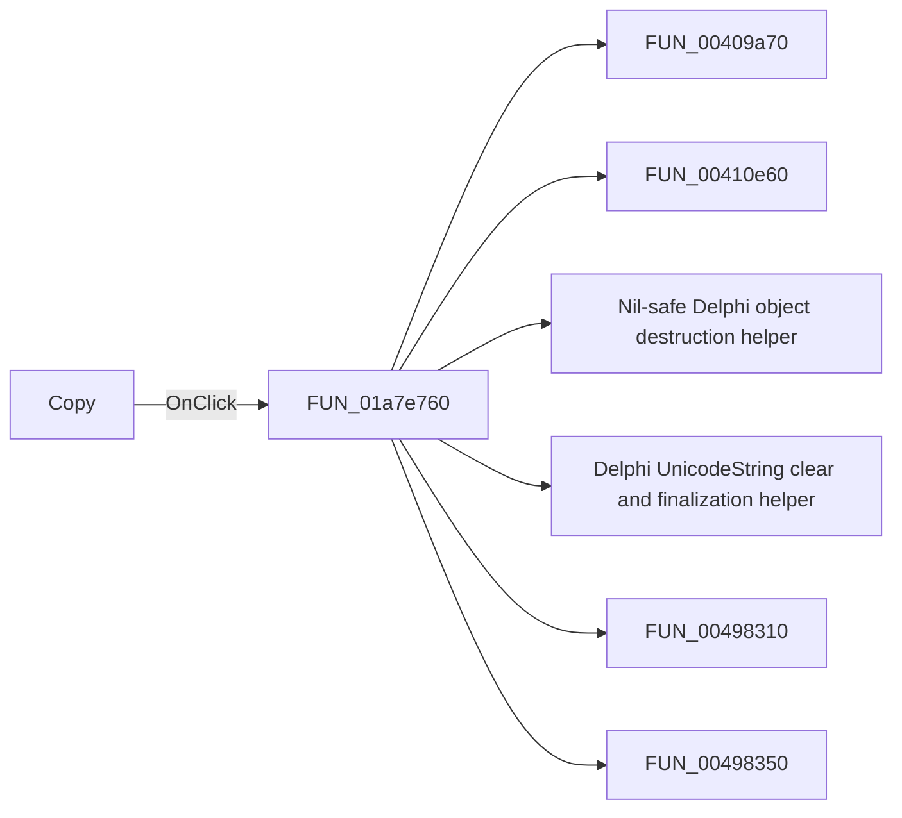

# Copy

> Analysis status: Pending individual source review.

## Control

| Property | Recovered value |
| --- | --- |
| Form | DFWindow |
| Component path | DFWindow.DFToolPanel.ToolNoteBook.Diagram.DFCopyBtn |
| Control class | TSpeedButton |
| Caption | Not present in the recovered resource. |
| Hint | Copy |
| Text | Not present in the recovered resource. |
| Handler name | DFCopyMnuClick |
| Handler address | 01a7e760 |
| Graph node | `resource:dfm:DFWindow/DFWindow.DFToolPanel.ToolNoteBook.Diagram.DFCopyBtn` |
| Handler node | `function:01a7e760` |
| Graph layer | UI |

## What happens when clicked

Pending individual analysis. An agent must read the recovered handler source and its relevant callees before it replaces this text.

## Click flow

## Handler evidence

- Source: [DecompiledSources/Tina16/functions/0000000001A7E760__FUN_01a7e760.c](../../../DecompiledSources/Tina16/functions/0000000001A7E760__FUN_01a7e760.c)
- Recovered role: Not present in the recovered resource.
- Current graph summary: Handles 2 Delphi UI events: DFWindow.DFToolPanel.ToolNoteBook.Diagram.DFCopyBtn.OnClick, DFWindow.DFMainMenu.DFEditMnu.DFCopyMnu.OnClick.
- Current graph behavior: Not present in the recovered resource.
- Current graph evidence: Not present in the recovered resource.
- Complexity: complex
- Distinct outgoing calls: 26

## Direct calls

- `function:00409a70` — FUN_00409a70
- `function:00410e60` — FUN_00410e60
- `function:00410f20` — Nil-safe Delphi object destruction helper
- `function:00414480` — Delphi UnicodeString clear and finalization helper
- `function:00498310` — FUN_00498310
- `function:00498350` — FUN_00498350
- `function:005fc860` — FUN_005fc860
- `function:006056e0` — FUN_006056e0
- `function:00605cc0` — FUN_00605cc0
- `function:006a5e10` — FUN_006a5e10
- `function:006a6030` — FUN_006a6030
- `function:0082a6c0` — FUN_0082a6c0
- `function:01a782f0` — FUN_01a782f0
- `function:01a794b0` — Handles 1 Delphi UI event: DFWindow.DFToolPanel.ToolNoteBook.Diagram.DFSelectBtn.OnClick.
- `function:01ace140` — FUN_01ace140
- `function:01aceb90` — FUN_01aceb90
- `function:01acf9e0` — FUN_01acf9e0
- `function:01acfa60` — FUN_01acfa60
- `function:01acfc60` — FUN_01acfc60
- `function:01acff30` — FUN_01acff30
- `function:01aed550` — FUN_01aed550
- `function:01aee720` — FUN_01aee720
- `function:01b23050` — FUN_01b23050
- `function:01cedda0` — FUN_01cedda0
- `function:01d30b30` — FUN_01d30b30
- `function:01d31180` — FUN_01d31180

## Resource evidence

- Kind: Not present in the recovered resource.
- Modal result: Not present in the recovered resource.
- Checked state: Not present in the recovered resource.
- List items: Not present in the recovered resource.
- Image reference: Not present in the recovered resource.
- Extracted glyph: [`0083_DFWindow_DFWindow_DFToolPanel_ToolNoteBook_Diagram_DFCopyBtn_Glyph_Data.png`](../../../glyph/0083_DFWindow_DFWindow_DFToolPanel_ToolNoteBook_Diagram_DFCopyBtn_Glyph_Data.png)

## Nearby label candidates

Nearby labels are layout candidates only. They are not proof of behavior.

- No same-parent label candidate is available.

## Analysis limits

- Do not infer behavior from the control class, caption, hint, glyph, or nearby label alone.
- Do not replace the pending status until the handler source and relevant call path provide enough evidence.
