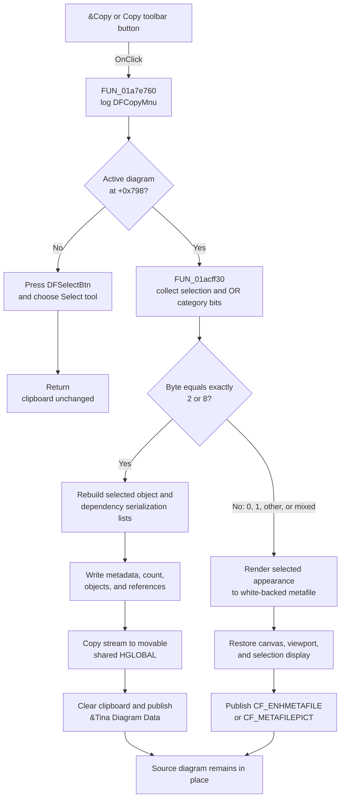

# &Copy

> Analysis status: Complete. Copy chooses either editable TINA diagram data or a rendered metafile from the exact selection-class byte. It does not remove the source objects.

## Control

| Property | Recovered value |
| --- | --- |
| Form | DFWindow |
| Component path | DFWindow.DFMainMenu.DFEditMnu.DFCopyMnu |
| Control class | TMenuItem |
| Caption | &Copy |
| Shortcut | Ctrl+C (`16451`) |
| Handler name | DFCopyMnuClick |
| Handler address | 01a7e760 |
| Graph node | `resource:dfm:DFWindow/DFWindow.DFMainMenu.DFEditMnu.DFCopyMnu` |
| Handler node | `function:01a7e760` |
| Graph layer | UI |

The same handler is bound to `DFWindow.DFToolPanel.ToolNoteBook.Diagram.DFCopyBtn.OnClick`. The toolbar button has the hint `Copy`, a 522-byte embedded image, and `NumGlyphs = 2`. The menu item has no hint or image.

## What happens when clicked

`DFCopyMnuClick` first records the command name `DFCopyMnu` through the form's command log path. It then reads the active-diagram pointer at `form + 0x798`.

If that pointer is null, the handler presses `DFSelectBtn`, invokes the Select-tool handler, and returns. This path does not open, clear, or write the clipboard. In normal menu use, the common Edit-menu refresh disables Copy when this pointer is null. That state preparation belongs to [`FUN_01a7fc90`](../../../DecompiledSources/Tina16/functions/0000000001A7FC90__FUN_01a7fc90.c); the Copy handler still contains the null fallback for direct or stale-state invocation.

With an active diagram, [`FUN_01acff30`](../../../DecompiledSources/Tina16/functions/0000000001ACFF30__FUN_01acff30.c) clears a temporary list, collects selected diagram members, and ORs their category bits. Copy tests the final byte for exact equality:

| Selection result | Evidence-backed meaning | Clipboard result |
| --- | --- | --- |
| `2` exactly | Selected curve category. The axis-creation and delete paths independently resolve this category to curves and their axes. | Editable serialized TINA diagram data. |
| `8` exactly | Selected members of one recovered editable diagram-object class. The class's business name is not recovered. | Editable serialized TINA diagram data. |
| `1` exactly | Selected axis category. The delete-axis path independently resolves this value to an axis and its owning plot. | Rendered metafile, not an editable axis record. |
| `0` | No selected member found. | Metafile path; there is no empty-selection guard or message. |
| Any other bit or bit combination | Other selected categories, or a mixed selection such as curve plus axis. | Rendered metafile. The tests are equality tests, so `2 | 1` does not use the TINA-data path. |

### Editable TINA data branch

For an exact `2` or `8`, the handler creates a memory stream and a write-mode serializer. It writes three values obtained from virtual methods of the diagram-data container at `form + 0x7A0`. It then calls [`FUN_01cedda0`](../../../DecompiledSources/Tina16/functions/0000000001CEDDA0__FUN_01cedda0.c).

That routine rebuilds two serialization lists before it writes them. The first preparation path gathers dependency objects referenced by selected curve members. The second gathers selected members from the diagram's curve, axis, and other object collections. A normalization pass assigns transient object identifiers and prepares references. The serializer writes the combined object count, then invokes each listed object's virtual serialization method. Thus the custom payload contains the selected editable objects and the dependency records needed by that object graph; it is not the temporary classifier list itself.

The handler copies the stream bytes to movable shared global memory allocated with flags `0x2002`. [`FUN_006a5e10`](../../../DecompiledSources/Tina16/functions/00000000006A5E10__FUN_006a5e10.c) opens the shared VCL clipboard wrapper, clears the previous clipboard contents, calls the recovered `SetClipboardData` thunk, and closes the clipboard. The registered format is `&Tina Diagram Data`, created by [`FUN_01a8b880`](../../../DecompiledSources/Tina16/functions/0000000001A8B880__FUN_01a8b880.c) through the recovered `RegisterClipboardFormatW` thunk.

On a successful `SetClipboardData`, Windows owns the global-memory handle. The code unlocks the handle after publication and deliberately does not free it. The helper does not check the `SetClipboardData` return value, so the recovered code cannot prove ownership transfer when publication fails.

### Metafile branch

For every other category byte, the handler computes the active diagram's width and height and converts them with the configured screen-DPI path. It creates a `TMetafile` and `TMetafileCanvas`, sets a white background, and renders with a 10-pixel inset.

During the render, the handler saves the form's canvas pointer at `form + 0x780`, substitutes the metafile canvas, sets the global selection-render flag, applies an off-screen rectangle, and draws the active diagram. It then clears the flag, restores the original canvas, recalculates the screen viewport, and redraws the original display. The VCL clipboard assignment publishes the metafile. The graphics registry maps this class to `CF_METAFILEPICT` (`3`) and `CF_ENHMETAFILE` (`14`). The temporary canvas and metafile objects are destroyed after assignment.

An axis-only selection therefore copies its rendered appearance. It does not place an editable axis object in `&Tina Diagram Data`. The same is true for mixed and other selection categories.

## Source state and later Paste behavior

Copy has no delete call and does not remove curves, axes, samples, or other diagram objects. It does not change their plotted values or selection flags. The custom branch does change serialization bookkeeping: it clears and repopulates the container's two staging lists, and its normalization pass assigns transient object identifiers and reference identifiers on participating source objects. The recovered path does not restore those bookkeeping fields after publication. The metafile branch temporarily changes drawing state, then restores the form canvas and screen viewport and redraws the selection. The command log is also updated.

[`FUN_01a7ee10`](../../../DecompiledSources/Tina16/functions/0000000001A7EE10__FUN_01a7ee10.c), the separate Paste handler, checks clipboard formats in this order: another application format, `CF_TEXT`, `&Tina Diagram Data`, `CF_ENHMETAFILE`, and `CF_METAFILEPICT`.

- For `&Tina Diagram Data`, Paste obtains and locks the native handle, copies its bytes into a stream, creates a read-mode serializer, and calls the diagram-data container's import method. It then refreshes the active diagram. This is the editable round trip for pure curve and pure category-8 copies.
- For either metafile format, Paste creates an image/metafile diagram object and enters its placement path. It does not recreate the original curve, axis, or mixed object graph.

Cut uses Copy and then invokes its separate removal path. Copy by itself does not cross that command boundary.

## No-selection and error behavior

- No active diagram: the handler chooses the Select tool and returns without changing the clipboard.
- Active diagram but no selected member: category `0` enters the metafile branch. The Copy handler has no explicit no-op or message. The recovered renderer decides whether the resulting white-backed metafile is empty or contains selection-render output.
- Repeated Copy calls replace the prior clipboard contents because the native-handle helper clears the clipboard before publication.
- The custom allocation, lock, copy, and `SetClipboardData` calls have no local result check, message, rollback, or exception handler. A failed publication can leave the clipboard cleared. The source does not establish ownership of the allocated handle on that failure path.
- The metafile allocation, render, and assignment path also has no local exception handler. Delphi's outer UI exception mechanism receives an exception. If rendering is interrupted before the restore statements, the source does not guarantee that the temporary canvas and render flag have already been restored.

## Copy flow

## Recovered evidence

- [`FUN_01a7e760`](../../../DecompiledSources/Tina16/functions/0000000001A7E760__FUN_01a7e760.c) is bound by the DFM to both Copy controls. It contains the active-diagram fallback, exact category tests, serializer branch, metafile branch, clipboard publication, and display restoration.
- [`FUN_01acff30`](../../../DecompiledSources/Tina16/functions/0000000001ACFF30__FUN_01acff30.c) collects selected members and ORs category bits `0x10`, virtual category results, `8`, and `4`.
- [`FUN_01ad6c70`](../../../DecompiledSources/Tina16/functions/0000000001AD6C70__FUN_01ad6c70.c) accepts classifier result `1`, resolves the selected item as an axis, moves curves away from it, and removes it. This supplies the independent axis meaning used in the branch table.
- [`FUN_01ad1090`](../../../DecompiledSources/Tina16/functions/0000000001AD1090__FUN_01ad1090.c) is used by the Edit-menu axis actions to resolve classifier result `2` to its owning curve. This supplies the independent curve meaning used in the branch table.
- [`FUN_01cedda0`](../../../DecompiledSources/Tina16/functions/0000000001CEDDA0__FUN_01cedda0.c) prepares the selected object graph, writes the combined count of two lists, and dispatches each object's serializer.
- [`FUN_006a6030`](../../../DecompiledSources/Tina16/functions/00000000006A6030__FUN_006a6030.c) lazily creates and returns the process-wide clipboard wrapper.
- [`FUN_006a5e10`](../../../DecompiledSources/Tina16/functions/00000000006A5E10__FUN_006a5e10.c), [`FUN_006a5da0`](../../../DecompiledSources/Tina16/functions/00000000006A5DA0__FUN_006a5da0.c), and [`FUN_006a5ff0`](../../../DecompiledSources/Tina16/functions/00000000006A5FF0__FUN_006a5ff0.c) publish, retrieve, and test native clipboard formats.
- [`FUN_01a8b880`](../../../DecompiledSources/Tina16/functions/0000000001A8B880__FUN_01a8b880.c) registers `&Tina Diagram Data` once during initialization.
- [`FUN_01a7ee10`](../../../DecompiledSources/Tina16/functions/0000000001A7EE10__FUN_01a7ee10.c) proves the corresponding custom-data and metafile Paste branches.
- UI resource evidence: [`ui-evidence.json`](../../../DecompiledSources/Tina16/resources/dfm/ui-evidence.json).

## Analysis limits

- The selected category-8 class and several other classifier bits have no recovered business names. They are not labeled from address names alone.
- The custom stream is an application-private binary object graph. The recovered source establishes its metadata, object-count, object-dispatch, dependency preparation, and read-back path, but not a public byte-level file specification.
- The exact metafile variant selected by the VCL at publication time is not explicit. Paste accepts both registered metafile formats.
- No live clipboard or UI test was performed. The conclusions use the DFM bindings, resource properties, read-only graph, native API thunks, graphics registration, serializer flow, and Paste consumer.
