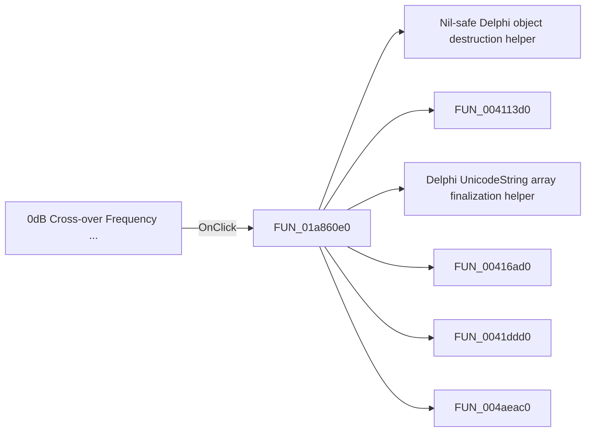

# 0dB Cross-over Frequency ...

> Analysis status: Pending individual source review.

## Control

| Property | Recovered value |
| --- | --- |
| Form | DFWindow |
| Component path | DFWindow.DFMainMenu.DFProcessingMnu.DFCrossoverFrequencyMnu |
| Control class | TMenuItem |
| Caption | 0dB Cross-over Frequency ... |
| Hint | Not present in the recovered resource. |
| Text | Not present in the recovered resource. |
| Handler name | DFCrossoverFrequencyMnuClick |
| Handler address | 01a860e0 |
| Graph node | `resource:dfm:DFWindow/DFWindow.DFMainMenu.DFProcessingMnu.DFCrossoverFrequencyMnu` |
| Handler node | `function:01a860e0` |
| Graph layer | UI |

## What happens when clicked

Pending individual analysis. An agent must read the recovered handler source and its relevant callees before it replaces this text.

## Click flow

## Handler evidence

- Source: [DecompiledSources/Tina16/functions/0000000001A860E0__FUN_01a860e0.c](../../../DecompiledSources/Tina16/functions/0000000001A860E0__FUN_01a860e0.c)
- Recovered role: Not present in the recovered resource.
- Current graph summary: Handles 2 Delphi UI events: DFWindow.DFMainMenu.DFProcessingMnu.DFCrossoverFrequencyMnu.OnClick, DFWindow.DFPopupMnu.N0dBCrossoverFrequencyPuMnu.OnClick.
- Current graph behavior: Not present in the recovered resource.
- Current graph evidence: Not present in the recovered resource.
- Complexity: complex
- Distinct outgoing calls: 14

## Direct calls

- `function:00410f20` — Nil-safe Delphi object destruction helper
- `function:004113d0` — FUN_004113d0
- `function:00414560` — Delphi UnicodeString array finalization helper
- `function:00416ad0` — FUN_00416ad0
- `function:0041ddd0` — FUN_0041ddd0
- `function:004aeac0` — FUN_004aeac0
- `function:004b6930` — FUN_004b6930
- `function:0072d440` — FUN_0072d440
- `function:00b89270` — FUN_00b89270
- `function:00b8e650` — FUN_00b8e650
- `function:00f05f60` — FUN_00f05f60
- `function:01a8a3c0` — FUN_01a8a3c0
- `function:01acff30` — FUN_01acff30
- `function:01ae69f0` — FUN_01ae69f0

## Resource evidence

- Kind: Not present in the recovered resource.
- Modal result: Not present in the recovered resource.
- Checked state: Not present in the recovered resource.
- List items: Not present in the recovered resource.
- Image reference: Not present in the recovered resource.
- Extracted glyph: None.

## Nearby label candidates

Nearby labels are layout candidates only. They are not proof of behavior.

- No same-parent label candidate is available.

## Analysis limits

- Do not infer behavior from the control class, caption, hint, glyph, or nearby label alone.
- Do not replace the pending status until the handler source and relevant call path provide enough evidence.
