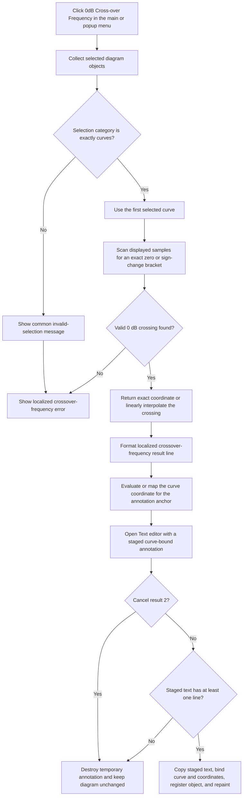

# Add a 0 dB crossover-frequency annotation

> Analysis status: Evidence-backed source review complete.

## Control

| Property | Recovered value |
| --- | --- |
| Form | DFWindow |
| Component path | DFWindow.DFMainMenu.DFProcessingMnu.DFCrossoverFrequencyMnu |
| Control class | TMenuItem |
| Caption | 0dB Cross-over Frequency ... |
| Hint | Not present in the recovered resource. |
| Handler name | DFCrossoverFrequencyMnuClick |
| Handler address | 01a860e0 |
| Graph node | `resource:dfm:DFWindow/DFWindow.DFMainMenu.DFProcessingMnu.DFCrossoverFrequencyMnu` |
| Handler node | `function:01a860e0` |
| Graph layer | UI |

## What happens when clicked

`FUN_01a860e0` asks the active diagram for its selected objects, calculates a 0 dB crossing from the first selected curve, formats the resulting frequency, and prepares a curve-bound text annotation. It then opens the common **Text** editor so the user can edit the generated line before the annotation enters the diagram.

The command does not create a result curve or change the selected curve data. Its output is a diagram text object that refers to the selected curve and its crossover point.

`DFWindow.DFPopupMnu.N0dBCrossoverFrequencyPuMnu` has the same caption and uses the same handler. The main-menu and popup-menu entries therefore have the same behavior.

## Selection and calculation guards

The common selection classifier must return exactly category `2`. Other DFWindow callers establish that category `2` is the curve category. A mixed selection does not pass because the classifier ORs the category bits of all selected objects.

Category `2` does not prove a single selected curve. If several curves are selected and all have this category, the handler uses list index zero and ignores the other curves for the calculation and annotation.

`FUN_01ae69f0` also checks that this first object has the recovered curve class. It passes the curve's two data references at offsets `+0xd0` and `+0xe0` to the crossover calculator. A non-curve first object or a failed calculation returns false.

When the selection category is not exactly `2`, `FUN_01ae69f0` first shows the common invalid-selection message. The click handler then also shows the localized `DrawWind.CrossOverFrequencyError` message because the helper returned false. When a curve is selected but has no usable 0 dB crossing, only the crossover-specific error path is proven.

## Zero-crossing and interpolation behavior

`FUN_01abe920` creates a temporary data adapter for the selected curve references and asks `FUN_01abe710` to find target value `0.0`. The scanner reads the adapter's scalar value from each data sample and compares it with zero.

- An exact zero returns that sample's horizontal coordinate.
- Otherwise, the scanner looks for adjacent samples whose values are on opposite sides of zero.
- It checks that the bracket is within the data provider's recovered lower and upper domain bounds.
- It uses linear interpolation between the two sample coordinates and values to calculate the crossing coordinate.
- If no exact or bracketed crossing passes these checks, the calculation fails.

The function returns one crossing only. The scan stops at the first accepted exact or bracketed result in provider order. The source does not present a list when a curve crosses 0 dB more than once.

The handler formats the crossing coordinate with the application's numeric formatter and appends it to localized text key `DrawWind.CrossOverFrequency`. The exact translated prefix is not present in the recovered source, but the menu caption and the zero-target calculation establish that the displayed value is the 0 dB crossover frequency.

## Text dialog and annotation anchor

The handler recalculates the selected curve's data provider before it chooses the annotation anchor. For the normal provider branch, it uses the crossover frequency as the horizontal coordinate and evaluates the curve at that frequency for the vertical coordinate. The special provider branch calls its coordinate-mapping method, which returns both anchor coordinates.

`FUN_01a8a3c0` creates a temporary system-text object, loads the generated result line, and binds the object to the selected curve and calculated data coordinates. It opens `CSysTextDlg`, the common **Text** editor, with a private staged copy of this object. This dialog can change the generated text, font, border, background, and related system-text options.

The commit checks are specific:

- Modal result `2`, the `bkCancel` result, destroys the temporary annotation.
- A non-Cancel result still requires at least one text line. Empty staged text also destroys the temporary annotation.
- A non-Cancel result with non-empty text copies the staged values into the new object, keeps the selected curve and anchor coordinates, registers the text with the diagram, calculates its dimensions, and repaints its area.

The commit helper stores the new object in DFWindow's current-object field while the dialog is open. On rejection it destroys that object, clears the field, and resets the recovered tool-state byte to `0`. On success it finalizes the object, changes the recovered DFWindow tool state to `6`, and leaves the new annotation in the live diagram.

## Click flow

## Handler and helper evidence

- Click handler and result formatting: [FUN_01a860e0](../../../DecompiledSources/Tina16/functions/0000000001A860E0__FUN_01a860e0.c)
- Curve-selection and crossover guard: [FUN_01ae69f0](../../../DecompiledSources/Tina16/functions/0000000001AE69F0__FUN_01ae69f0.c)
- Selected-curve data-reference wrapper: [FUN_01ab5660](../../../DecompiledSources/Tina16/functions/0000000001AB5660__FUN_01ab5660.c)
- Data-adapter setup: [FUN_01abe920](../../../DecompiledSources/Tina16/functions/0000000001ABE920__FUN_01abe920.c)
- Exact crossing and linear interpolation: [FUN_01abe710](../../../DecompiledSources/Tina16/functions/0000000001ABE710__FUN_01abe710.c)
- Result-annotation editor and commit: [FUN_01a8a3c0](../../../DecompiledSources/Tina16/functions/0000000001A8A3C0__FUN_01a8a3c0.c)
- Shared selection classifier: [FUN_01acff30](../../../DecompiledSources/Tina16/functions/0000000001ACFF30__FUN_01acff30.c)
- System-text dialog loader: [FUN_0146a9a0](../../../DecompiledSources/Tina16/functions/000000000146A9A0__FUN_0146a9a0.c)
- System-text dialog OK handler and close synchronization: [FUN_0146c5d0](../../../DecompiledSources/Tina16/functions/000000000146C5D0__FUN_0146c5d0.c) and [FUN_0146ab60](../../../DecompiledSources/Tina16/functions/000000000146AB60__FUN_0146ab60.c)
- Recovered form and control resource evidence: [ui-evidence.json](../../../DecompiledSources/Tina16/resources/dfm/ui-evidence.json)

## Resource and glyph evidence

- Both menu entries have caption `0dB Cross-over Frequency ...`. The ellipsis agrees with the proven text-editor dialog, but the source establishes the dialog behavior.
- Neither entry has a hint, action, image-list reference, embedded glyph, or same-parent label candidate.
- The result dialog is the recovered `CSysTextDlg` form with caption `Text`. Its OK button is `bkOK`, and its Cancel button is `bkCancel`.

## Persistence and error limits

- A successful result changes the live diagram by adding one text annotation. The handler has no file-save, INI-write, database-write, or explicit undo-stack call. Normal diagram serialization can preserve the object later, but this click path does not save the document.
- Invalid selection and missing-crossing paths create no annotation. Cancel and empty text also create no annotation.
- The recovered handler and helpers have no local exception handler or rollback. An exception after the temporary object is allocated or during diagram registration can leave partial in-memory state until higher-level Delphi cleanup runs.
- The decompiler declares `FUN_01ab5660` as `void`, although its caller tests the return register and its direct callee returns the crossing-success Boolean. This article relies on the complete caller-to-callee data flow and does not assign an original Delphi signature to that wrapper.
- The source proves interpolation between adapter sample values. It does not recover the original curve variable names, the translated result text, or a user-selectable choice among multiple crossings.
