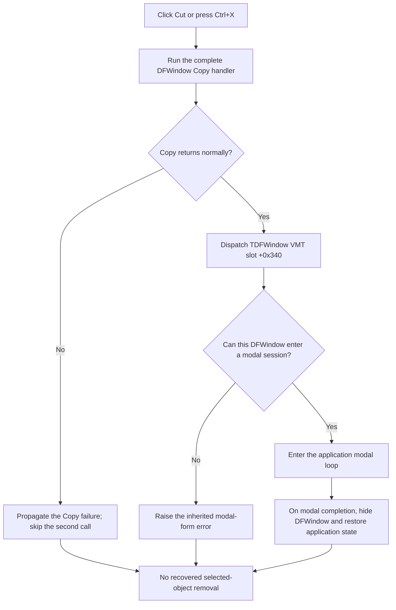

# Copy, then invoke inherited modal-form handling

> Analysis status: Reviewed from the recovered Cut and Copy handlers, the selection classifier, clipboard paths, paste consumer, TDFWindow and TRootForm VMT entries, inherited modal-form implementation, menu-state updater, and DFM resource evidence.

## Control

| Property | Recovered value |
| --- | --- |
| Form | DFWindow |
| Component path | DFWindow.DFMainMenu.DFEditMnu.DFCutMnu |
| Control class | TMenuItem |
| Caption | `Cu&t` |
| Shortcut | Ctrl+X (`16472`) |
| Hint | Not present in the recovered resource. |
| Handler name | DFCutMnuClick |
| Handler address | 01a87da0 |
| Graph node | `resource:dfm:DFWindow/DFWindow.DFMainMenu.DFEditMnu.DFCutMnu` |
| Handler node | `function:01a87da0` |
| Graph layer | UI |

## What happens when clicked

The recovered handler does not implement a conventional cut. It performs exactly two operations:

1. It calls the complete DFWindow Copy handler with the same form and sender arguments.
2. If Copy returns normally, it calls virtual slot `+0x340` on the DFWindow form.

The second call resolves through the recovered `TDFWindow` VMT to inherited [FUN_00805b00](../../../DecompiledSources/Tina16/functions/0000000000805B00__FUN_00805b00.c). That function is modal-form handling: it validates whether the form can become modal, enters the application modal loop, hides the form when the loop finishes, restores application state, and returns the modal result. The parent `TRootForm` VMT contains the same function in this slot.

No recovered instruction after Copy deletes, removes, detaches, clears, or hides a selected curve, axis, cursor, figure, or other diagram object. The modal function can hide the complete DFWindow after a successful modal session, but that is form visibility, not removal of copied diagram content. The reason a menu command named `Cut` invokes inherited modal-form handling is unresolved in this runtime image.

## Recovered click flow

## What the Copy phase puts on the clipboard

[FUN_01a7e760](../../../DecompiledSources/Tina16/functions/0000000001A7E760__FUN_01a7e760.c) is also the handler for the `Copy` menu item and toolbar button. Cut calls this shared handler directly and does not request a distinct cut format.

When an active diagram exists, Copy calls [FUN_01acff30](../../../DecompiledSources/Tina16/functions/0000000001ACFF30__FUN_01acff30.c). This helper rebuilds a collection of selected diagram children and returns a selection-kind bit mask:

- selected axis objects at diagram fields `+0xb8`, `+0xc0`, `+0xc8`, and `+0xd0` add bit `0x10`;
- selected cursor A or B at `+0xf0` and `+0xf8` add bit `0x04`;
- selected figure objects from the `+0xe0` collection add bit `0x08`;
- selected plot children in the `+0xd8` collection contribute their own virtual selection-kind bits.

Copy chooses its output from the complete combined mask:

- If the mask is exactly `0x02` or exactly `0x08`, it serializes the DFWindow document/container at form field `+0x7a0` into an application-specific clipboard format. The gathered selection collection is not passed directly to the serializer in the recovered call, so this article does not claim an unrecovered per-record filter inside that serializer.
- For every other mask, including zero, axis bit `0x10`, cursor bit `0x04`, and mixed selections, it creates a bitmap sized from the diagram rectangle, renders the diagram through a temporary off-screen canvas, assigns that bitmap to the VCL clipboard object, restores the normal canvas, and redraws the live diagram.

The custom-format branch writes a stream-backed memory block to the clipboard. The bitmap branch gives the clipboard an independent bitmap and then destroys its temporary bitmap and canvas objects. Neither branch transfers ownership of the live diagram objects to the clipboard.

The Paste handler [FUN_01a7ee10](../../../DecompiledSources/Tina16/functions/0000000001A7EE10__FUN_01a7ee10.c) checks the same application-specific clipboard format and can reconstruct content from it. This proves that the format is intended for application object exchange. It does not prove that Cut removes the source objects.

## No diagram and no selection

The common menu-state updater [FUN_01a7fc90](../../../DecompiledSources/Tina16/functions/0000000001A7FC90__FUN_01a7fc90.c) enables Cut when an active diagram exists. It does not require a nonempty selection and does not inspect clipboard data.

- With an active diagram but no selected object, the selection mask is zero. Copy takes its bitmap branch rather than doing nothing. The second modal-form call still follows if Copy returns.
- With no active diagram, Copy does not write clipboard data. It switches DFWindow to selection mode through [FUN_01a794b0](../../../DecompiledSources/Tina16/functions/0000000001A794B0__FUN_01a794b0.c) and returns. Cut still invokes the inherited modal-form method because it does not test the diagram pointer or a Copy result.

The normal menu updater disables Cut without an active diagram. The handler itself has no matching guard, so programmatic invocation can still reach the no-diagram path.

## Form visibility and the unexpected modal call

The inherited modal-form function rejects a form that is already visible or otherwise cannot become modal. A click on a menu owned by the displayed DFWindow normally occurs while that form is visible, so the recovered check is important. The exact runtime outcome is not reproduced here, but the function body proves that an invalid modal transition raises instead of removing a selection.

If the form passes the checks, the function enters a nested application message loop. When a modal result ends that loop, it hides DFWindow, restores focus and application modal state, and returns the result. DFCutMnuClick ignores that result.

The recovered Cut handler has no branch that converts this form-level action into selected-object deletion. It also has no confirmation dialog of its own.

## Ordering, redraw, and ownership

Copy always runs before the modal dispatch. The Cut handler has no success flag, return-value check, transaction, or rollback between them.

- The application-specific clipboard branch does not request a diagram redraw.
- The bitmap branch temporarily replaces the form drawing target, renders to the bitmap, restores the original drawing target, and redraws the live diagram. These drawing operations do not prove a model change.
- The selected-object collection built for classification is temporary. It is destroyed after Copy.
- Live curves, axes, cursors, figures, and document collections remain owned by the diagram/document objects in the recovered path.
- A successful modal session can change DFWindow visibility and focus ownership. It does not change diagram-object ownership.

## Errors and partial effects

DFCutMnuClick has no local exception handler, cleanup block, retry, or rollback.

- If Copy raises, the inherited modal call is skipped. Clipboard clearing or allocation that happened before the failure can leave the previous clipboard content replaced or unavailable.
- In the bitmap branch, an exception while the temporary canvas is installed can occur before the recovered normal-path restoration statements. The Cut handler does not repair that partial Copy state.
- If Copy succeeds and the modal-form check then raises, the clipboard remains updated even though no modal session starts and no selected object is removed.
- If the modal loop starts, the command remains in it until a modal result or application termination ends the loop. The final form hide occurs after the clipboard write.
- No source operation restores the prior clipboard content when the second call fails.

The recovered code does not show how the application presents clipboard, rendering, or modal-transition errors to the user.

## Persistence and undo boundary

The click path does not call a document writer, settings writer, dirty-state setter, delete command, undo recorder, or redo recorder. It does not create a recoverable cut entry.

Clipboard data persists according to the Windows/VCL clipboard lifetime. A successful modal session changes only live form and application-modal state in this path. There is no proven document persistence change.

## Handler and source evidence

- Cut handler: [FUN_01a87da0](../../../DecompiledSources/Tina16/functions/0000000001A87DA0__FUN_01a87da0.c) calls Copy, reloads the form VMT, and invokes slot `+0x340`. It contains no other work.
- Copy handler: [FUN_01a7e760](../../../DecompiledSources/Tina16/functions/0000000001A7E760__FUN_01a7e760.c) classifies the selection, writes either the application-specific serialized format or a rendered bitmap, and restores the live drawing target on its normal bitmap path.
- Selection classifier: [FUN_01acff30](../../../DecompiledSources/Tina16/functions/0000000001ACFF30__FUN_01acff30.c) rebuilds the selected-child collection and returns the combined selection-kind bits.
- Document serializer: [FUN_01cedda0](../../../DecompiledSources/Tina16/functions/0000000001CEDDA0__FUN_01cedda0.c) writes the document/container child records to the supplied stream when that stream is at its initial position.
- Clipboard format setter: [FUN_006a5e10](../../../DecompiledSources/Tina16/functions/00000000006A5E10__FUN_006a5e10.c) opens and clears the clipboard, transfers the supplied native handle under the requested format, and closes the clipboard.
- Paste consumer: [FUN_01a7ee10](../../../DecompiledSources/Tina16/functions/0000000001A7EE10__FUN_01a7ee10.c) checks and reads the same application-specific format.
- Modal-form implementation: [FUN_00805b00](../../../DecompiledSources/Tina16/functions/0000000000805B00__FUN_00805b00.c) validates modal entry, runs the modal message loop, hides the form, restores application state, and returns the modal result.
- Command-state updater: [FUN_01a7fc90](../../../DecompiledSources/Tina16/functions/0000000001A7FC90__FUN_01a7fc90.c) sets `DFCutMnu.Enabled` from active-diagram presence, not selection presence.

The recovered TDFWindow class metadata places its method VMT base at `01a69d38`. Entry `01a69d38 + 0x340 = 01a6a078` contains `00805b00`. The parent TRootForm VMT has the same inherited entry. The machine code for `FUN_01a87da0` independently shows `CALL [RBX+0x340]` after the direct Copy call.

## Resource evidence

- The menu caption is `Cu&t`; the ampersand marks `t` as its menu access key.
- The recovered shortcut value is `16472`, the VCL encoding for Ctrl+X.
- The control has no hint, action binding, image, glyph, image-list index, checked state, or explicit disabled state in the DFM.
- Its siblings are `&Copy` with Ctrl+C and `&Paste` with Ctrl+V. Their handlers are separate from the inherited modal-form call made by Cut.

## Analysis limits

- The runtime image and VMT establish the unexpected inherited modal call. They do not explain why the compiled Cut handler uses it.
- The exact semantic name of each virtual selection bit returned by plot children is not recovered. This article reports the proven mask tests and does not rename an unknown bit from proximity.
- The custom serializer receives the DFWindow document/container, not the temporary selection list directly. Any internal selected-record filtering beyond the visible call path remains unproven.
- The ordinary visible-form state strongly affects the modal call, but this analysis did not execute the proprietary UI to reproduce the error or modal loop.
- No deletion, model mutation, undo entry, or persistence write is present in the recovered click path. This article does not infer one from the `Cut` caption.
