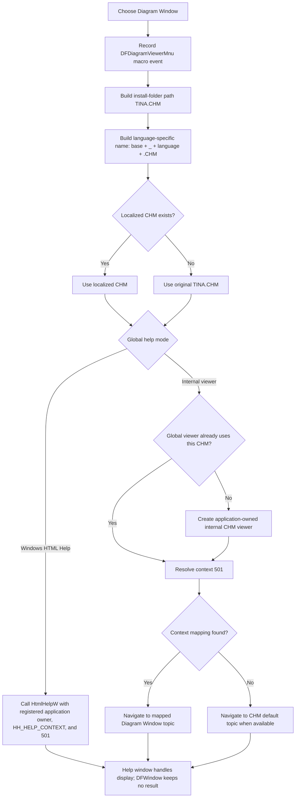

# Open Diagram Window help

> Analysis status: Reviewed from recovered source, component-resource, CHM resolution, and help-viewer evidence.

## Control

| Property | Recovered value |
| --- | --- |
| Form | DFWindow |
| Component path | DFWindow.DFMainMenu.DFHelpMnu.DFDiagramViewerMnu |
| Control class | TMenuItem |
| Caption | &Diagram Window |
| Hint | Not present in the recovered resource. |
| Handler name | DFDiagramViewerMnuClick |
| Handler address | 01a7f990 |
| Graph node | `resource:dfm:DFWindow/DFWindow.DFMainMenu.DFHelpMnu.DFDiagramViewerMnu` |
| Handler node | `function:01a7f990` |
| Graph layer | UI |

## What happens when clicked

`TDFWindow.DFDiagramViewerMnuClick` records the command for the application's macro stream. It then builds this base help-file path:

`<TINA installation folder>\TINA.CHM`

The handler passes that path through the shared localized-help resolver and asks the application's global help system to show numeric help context `501` (`0x1f5`) from the resolved CHM file.

This command does not open a web URL. It does not start a Diagram Viewer document window or a diagram renderer. It requests the Diagram Window topic from TINA's compiled HTML Help file.

## Localized CHM selection

`FUN_01b1def0` constructs a language-specific candidate with this formula:

`ChangeFileExt(original, "") + "_" + current-language-marker + ExtractFileExt(original)`

For `TINA.CHM`, this keeps the file in the same installation directory and inserts an underscore plus the current language marker before `.CHM`. The resolver checks that candidate with the recovered file-existence helper:

- if the localized candidate exists, it returns that path;
- otherwise, it returns the original `<TINA installation folder>\TINA.CHM` path.

It does not report that the localized file is absent. This absence is an expected fallback, not an error.

## External and internal viewer modes

The global help-context dispatcher selects one of two viewer paths from an application-wide mode flag.

### Windows HTML Help mode

The dispatcher initializes `hhctrl.ocx`, resolves `HtmlHelpW`, and supplies a registered application help-window handle as the owner. It first associates or opens the resolved CHM, then calls `HtmlHelpW` with command `0x0f` (`HH_HELP_CONTEXT`) and data value `501`.

If `HtmlHelpW` returns a help-window handle, the dispatcher requests that returned window be shown. The DFWindow handler does not pass its own window handle and does not keep the returned help-window handle.

### Internal CHM viewer mode

The dispatcher reuses the process-global internal viewer when it already represents the same CHM. If no viewer exists, or the stored CHM path differs, it creates a viewer for the resolved file and stores it in the global viewer slot.

The internal viewer creates its display form through the global VCL `Application` object and shows it when necessary. The form is therefore application-owned, not a child form owned by this DFWindow.

For context `501`, the viewer searches the CHM context map. If it finds a matching entry, it navigates to that topic. If no mapping exists, `FUN_00b04480` leaves the CHM's recovered default topic as the navigation target. The handler does not select a table-of-contents item from the menu caption alone.

## Click flow

## Guards, missing files, and no-op paths

- The handler has no current-diagram, selection, license, or network guard. It always builds the help request after recording the macro event.
- A missing localized CHM is not an error. The resolver falls back to the original `TINA.CHM` path.
- In Windows HTML Help mode, failure to load `hhctrl.ocx`, resolve `HtmlHelpW`, open the CHM, or find the context produces a zero result in the recovered dispatcher. This handler does not display a control-specific error or try another help file.
- In internal-viewer mode, viewer construction checks the resolved CHM path. If the file does not exist, it raises an error whose recovered text ends with ` does not exist.`; the viewer is not opened.
- If the internal CHM has no mapping for context `501`, the resolver keeps the CHM default topic. If that topic file is also unavailable after path resolution, the navigation helper does not load a new page.
- Repeated clicks reuse the global internal viewer when its CHM path matches. Windows HTML Help owns its own reuse behavior.

## Window ownership and state

The click handler delegates all window work to the global help system. It does not allocate a DFWindow-owned form, store a help-window field, disable the diagram, or wait for a modal result.

In external mode, the help manager supplies its registered application help-window handle to `HtmlHelpW`. In internal mode, the viewer form is created through the global `Application` and retained by the process-global internal viewer object. Both paths are modeless from this handler's point of view.

The click does not change diagram content, selection, zoom, analysis results, project data, or application preferences. Its durable side effects are limited to the macro record when macro recording is active and possible creation or reuse of global help-viewer state. No project or settings writer is called.

## Error and partial-state behavior

- The handler has no local exception handler, return-value test, retry, status message, or rollback branch.
- The macro event is recorded before path resolution and viewer dispatch. A later failure can therefore leave a recorded command even though no help topic appears.
- The localized resolver only proves that its preferred candidate existed when checked. File removal or access failure after that check is handled by the selected viewer path, not by the menu handler.
- Internal-viewer construction performs extraction and parsing work for the CHM. A construction or extraction error can prevent the global viewer from becoming usable; the menu handler has no cleanup or alternate-viewer branch.
- External dispatcher failure is silent at this level because the handler discards the help-system result.

## Handler evidence

- Primary handler: [FUN_01a7f990](../../../DecompiledSources/Tina16/functions/0000000001A7F990__FUN_01a7f990.c) records `DFDiagramViewerMnu`, concatenates the installation folder, backslash, and `TINA.CHM`, resolves the help path, and invokes context `0x1f5` on the global help system.
- Localized-help resolver: [FUN_01b1def0](../../../DecompiledSources/Tina16/functions/0000000001B1DEF0__FUN_01b1def0.c) splits the original base name and extension, inserts `_` plus the current language marker, checks the candidate, and falls back to the original path.
- Help-context dispatcher: [FUN_01d46890](../../../DecompiledSources/Tina16/functions/0000000001D46890__FUN_01d46890.c) selects external `HtmlHelpW` or the global internal viewer and carries the numeric context and explicit CHM path through either branch.
- Windows HTML Help loader: [FUN_0042a4a0](../../../DecompiledSources/Tina16/functions/000000000042A4A0__FUN_0042a4a0.c) loads `hhctrl.ocx` and resolves `HtmlHelpA` and `HtmlHelpW`.
- `HtmlHelpW` wrapper: [FUN_0042a560](../../../DecompiledSources/Tina16/functions/000000000042A560__FUN_0042a560.c) calls the dynamically resolved Unicode HTML Help entry point and returns its window handle or zero.
- Internal viewer constructor: [FUN_00b02f00](../../../DecompiledSources/Tina16/functions/0000000000B02F00__FUN_00b02f00.c) verifies the CHM, extracts its internal resources when necessary, and builds the context and topic indexes.
- Internal context navigation: [FUN_00b046f0](../../../DecompiledSources/Tina16/functions/0000000000B046F0__FUN_00b046f0.c) ensures that the viewer form is visible, resolves a numeric context, and navigates to the resulting topic.
- Context-to-topic resolver: [FUN_00b04480](../../../DecompiledSources/Tina16/functions/0000000000B04480__FUN_00b04480.c) starts with the CHM default topic and replaces it when the requested numeric context has a mapped local page.
- Internal viewer form creation: [FUN_00b02670](../../../DecompiledSources/Tina16/functions/0000000000B02670__FUN_00b02670.c) creates the viewer form through the global application and shows it when hidden.
- Macro text builder and sink: [FUN_01aee720](../../../DecompiledSources/Tina16/functions/0000000001AEE720__FUN_01aee720.c) builds the localized command record, and [FUN_01aed550](../../../DecompiledSources/Tina16/functions/0000000001AED550__FUN_01aed550.c) sends it to the macro recorder when recording is active.
- Recovered component tree: [ui-evidence.json](../../../DecompiledSources/Tina16/resources/dfm/ui-evidence.json) supplies the `&Diagram Window` caption and the `DFDiagramViewerMnuClick` event binding.
- Complexity: complex; the graph records five distinct outgoing calls from `FUN_01a7f990`.

## Resource evidence

- `DFDiagramViewerMnu` is a `TMenuItem` under the DFWindow Help menu.
- Its caption is `&Diagram Window`.
- It has no hint, text, action, image reference, or glyph.
- The caption identifies the requested topic only when combined with context ID `501` and the `TINA.CHM` call path.

## Analysis limits

- The source proves the CHM file, localized-name algorithm, and context ID. It does not recover the final topic title or internal HTML file name for context `501` from the CHM content.
- The global help-mode flag's Delphi field name is not recovered. The two branches themselves are explicit in the dispatcher.
- The registered owner handle used by external HTML Help comes from the global help manager. The recovered handler does not prove which visible application form supplied that registration at this moment.
- The handler does not receive success or failure details from either viewer path.
