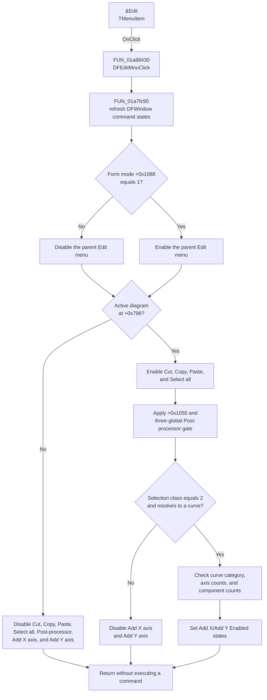

# &Edit

> Analysis status: Complete. Opening this menu refreshes command availability from the current diagram and selection. It does not execute an edit command.

## Control

| Property | Recovered value |
| --- | --- |
| Form | DFWindow |
| Component path | DFWindow.DFMainMenu.DFEditMnu |
| Control class | TMenuItem |
| Caption | &Edit |
| Group index | 9 |
| Handler name | DFEditMnuClick |
| Handler address | 01a88430 |
| Graph node | `resource:dfm:DFWindow/DFWindow.DFMainMenu.DFEditMnu` |
| Handler node | `function:01a88430` |
| Graph layer | UI |

## What happens when opened

`DFEditMnuClick` at `01a88430` delegates to `FUN_01a7fc90`. This is the common `DFWindow` command-state refresh routine. The routine updates the whole form's menus and tool buttons. The changes below are the subset for `DFEditMnu` and its direct children.

The routine first sets the parent `DFEditMnu.Enabled` state from the form-mode byte at `form + 0x1088`: the parent is enabled only when this byte equals `1`. The source does not recover the Delphi field name. When the parent is disabled, its children cannot be invoked through this menu even if an individual child still has its own `Enabled` byte set.

The recovered `TDFWindow` published-field table maps the direct children to the exact offsets used by `FUN_01a7fc90`. The final states are:

| Child command | Caption and shortcut | State prepared when the menu opens |
| --- | --- | --- |
| `DFCutMnu` at `+0x8C0` | `Cu&t`, Ctrl+X | Enabled when `form + 0x798` contains an active diagram; disabled when it is null. No separate curve-selection test is made. |
| `DFCopyMnu` at `+0x8B8` | `&Copy`, Ctrl+C | Enabled when an active diagram exists; disabled when it does not. No separate curve-selection test is made. |
| `DFPasteMnu` at `+0x8B0` | `&Paste`, Ctrl+V | Enabled when an active diagram exists; disabled when it does not. The refresh does not inspect clipboard ownership, formats, or content. The separate Paste handler performs those checks after invocation. |
| `DFSelectAllCurvesMnu` at `+0x940` | `&Select all curves`, Ctrl+A | Enabled when an active diagram exists; disabled when it does not. The refresh does not select a curve. |
| `AddmorecurvesMnu` at `+0xA10` | `&Post-processor...` | Disabled without a diagram. With a diagram, it follows form flag `+0x1050`, except that the recovered three-global condition at `020027C0`, `020037B0`, and `020017C0` can force it disabled. The semantic names of that condition and flag are not recovered. |
| `AddXaxisMnu` at `+0xA48` | `Add new X axis` | Disabled unless the diagram selection classifier returns exactly `2`, the selected object resolves to a curve, that curve has fewer than three X axes, and its applicable source-component collection has more than one entry. |
| `AddYAxisMnu` at `+0xA50` | `Add new Y axis` | Available only for the selected curve category that supports independent X and Y component collections. It also requires fewer than three Y axes and more than one applicable Y component. Other recovered curve categories force it disabled. |

The two `-` separator items have no event handlers and receive no state write from this click path.

## Selection, clipboard, and property boundaries

- `FUN_01acff30` builds a temporary list of selected diagram objects and returns a selection-classification byte. `FUN_01a7fc90` uses the exact value `2` for the axis-command branch and resolves the selected object to its containing curve through `FUN_01ad1090`.
- `Cut`, `Copy`, `Paste`, and `Select all curves` do not use that selection classifier. Their direct `Enabled` state follows only the active-diagram pointer. The disabled parent menu still supplies the form-mode gate.
- No clipboard API is called while this menu opens. Clipboard format checks belong to `DFPasteMnuClick`, not to `DFEditMnuClick`.
- The direct children receive only `Enabled` writes through `FUN_007e2da0`. Their `Checked` and `Visible` properties are not changed. The resource also defines no checked, radio, auto-check, or explicit visibility value for these items.
- The handler does not call `DFCutMnuClick`, `DFCopyMnuClick`, `DFPasteMnuClick`, `DFSelectAllCurvesMnuClick`, either axis handler, or the Post-processor handler. It does not change diagram data, selection, clipboard data, or persistent settings.

## Repeated opens and errors

Opening the menu again recalculates the same states. `FUN_007e2da0` compares the requested value with the current `TMenuItem.Enabled` byte and returns without a VCL update when they match. The target menu states therefore stay unchanged while the form context stays unchanged.

The handler and refresh routine have no explicit validation message, error result, local exception handler, or rollback. If a diagram query, setting read, or VCL setter raises an exception, it propagates to the caller. Because the refresh writes items in sequence, earlier state changes can remain when a later operation fails. No model or persistent-data rollback is required because this path does not execute a command.

## Menu-open flow

## Resource evidence

The resource gives this top-level menu the caption `&Edit`. Its children are `Cu&t`, `&Copy`, `&Paste`, `&Select all curves`, `&Post-processor...`, `Add new X axis`, and `Add new Y axis`, with two separators. Cut, Copy, Paste, and Select all curves have the standard Ctrl+X, Ctrl+C, Ctrl+V, and Ctrl+A shortcuts. None of these menu items has a glyph, hint, action binding, or embedded image.

- UI resource evidence: [`ui-evidence.json`](../../../DecompiledSources/Tina16/resources/dfm/ui-evidence.json)

## Recovered evidence

- [`FUN_01a88430`](../../../DecompiledSources/Tina16/functions/0000000001A88430__FUN_01a88430.c) is the DFM-bound `DFEditMnuClick` handler and only calls `FUN_01a7fc90`.
- [`FUN_01a7fc90`](../../../DecompiledSources/Tina16/functions/0000000001A7FC90__FUN_01a7fc90.c) reads the form mode, active diagram, diagram selection, curve structure, feature flags, and runtime globals before writing menu and toolbar states. It does not call a child command handler.
- [`FUN_007e2da0`](../../../DecompiledSources/Tina16/functions/00000000007E2DA0__FUN_007e2da0.c) is the change-aware `TMenuItem.Enabled` setter used for the direct Edit-menu children. It writes the menu-item byte at `+0x81` and invalidates the menu only when the requested value differs.
- [`FUN_01acff30`](../../../DecompiledSources/Tina16/functions/0000000001ACFF30__FUN_01acff30.c) collects selected diagram objects and returns the bitwise selection classification used by the axis-command branch.
- [`FUN_01ad1090`](../../../DecompiledSources/Tina16/functions/0000000001AD1090__FUN_01ad1090.c) resolves a selected diagram object to the curve that owns or contains it.
- [`FUN_01a7ee10`](../../../DecompiledSources/Tina16/functions/0000000001A7EE10__FUN_01a7ee10.c) is the separate Paste handler. Its source performs the clipboard-format tests that are absent from the menu-open handler.
- [`FUN_01a80d70`](../../../DecompiledSources/Tina16/functions/0000000001A80D70__FUN_01a80d70.c) writes form mode byte `+0x1088` and immediately invokes the same command-state refresh.
- The published `TDFWindow` RTTI field table maps `DFEditMnu`, `DFPasteMnu`, `DFCopyMnu`, `DFCutMnu`, `DFSelectAllCurvesMnu`, `AddmorecurvesMnu`, `AddXaxisMnu`, and `AddYAxisMnu` to offsets `+0x8A8`, `+0x8B0`, `+0x8B8`, `+0x8C0`, `+0x940`, `+0xA10`, `+0xA48`, and `+0xA50`.

## Analysis limits

- The field names for `+0x798`, `+0x1050`, and `+0x1088` are not published in `TDFWindow` RTTI. Their roles are described only to the level established by the callers and state writes.
- The three-global Post-processor blocking condition is reproduced by address. Its business meaning is not named because the recovered code does not establish it.
- This article covers preparation when `&Edit` opens. The child handlers own the later copy, cut, paste, selection, post-processing, and axis-creation behavior.
- A live UI test was not performed. The DFM binding, published-field offsets, graph neighborhood, and recovered handler path agree on the menu-state result.
