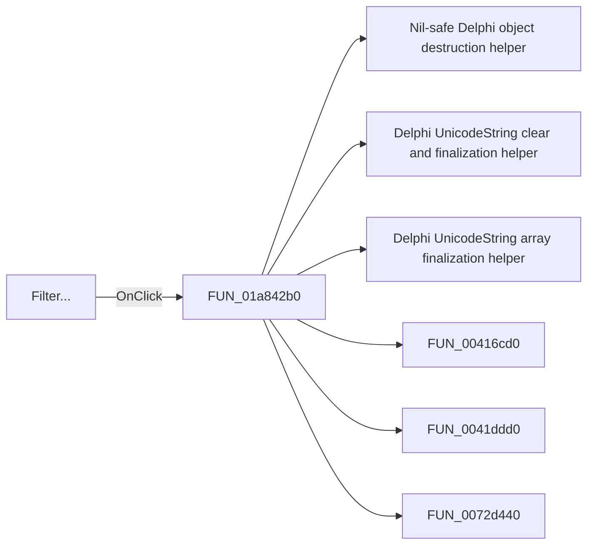

# Filter...

> Analysis status: Pending individual source review.

## Control

| Property | Recovered value |
| --- | --- |
| Form | DFWindow |
| Component path | DFWindow.DFMainMenu.DFProcessingMnu.DFFilterMnu |
| Control class | TMenuItem |
| Caption | Filter... |
| Hint | Not present in the recovered resource. |
| Text | Not present in the recovered resource. |
| Handler name | DFFilterMnuClick |
| Handler address | 01a842b0 |
| Graph node | `resource:dfm:DFWindow/DFWindow.DFMainMenu.DFProcessingMnu.DFFilterMnu` |
| Handler node | `function:01a842b0` |
| Graph layer | UI |

## What happens when clicked

Pending individual analysis. An agent must read the recovered handler source and its relevant callees before it replaces this text.

## Click flow

## Handler evidence

- Source: [DecompiledSources/Tina16/functions/0000000001A842B0__FUN_01a842b0.c](../../../DecompiledSources/Tina16/functions/0000000001A842B0__FUN_01a842b0.c)
- Recovered role: Not present in the recovered resource.
- Current graph summary: Handles 1 Delphi UI event: DFWindow.DFMainMenu.DFProcessingMnu.DFFilterMnu.OnClick.
- Current graph behavior: Not present in the recovered resource.
- Current graph evidence: Not present in the recovered resource.
- Complexity: complex
- Distinct outgoing calls: 14

## Direct calls

- `function:00410f20` — Nil-safe Delphi object destruction helper
- `function:00414480` — Delphi UnicodeString clear and finalization helper
- `function:00414560` — Delphi UnicodeString array finalization helper
- `function:00416cd0` — FUN_00416cd0
- `function:0041ddd0` — FUN_0041ddd0
- `function:0072d440` — FUN_0072d440
- `function:007fc180` — FUN_007fc180
- `function:015fca00` — FUN_015fca00
- `function:01a67160` — FUN_01a67160
- `function:01a68960` — FUN_01a68960
- `function:01a68fa0` — FUN_01a68fa0
- `function:01a83910` — FUN_01a83910
- `function:01a844b0` — FUN_01a844b0
- `function:01acff30` — FUN_01acff30

## Resource evidence

- Kind: Not present in the recovered resource.
- Modal result: Not present in the recovered resource.
- Checked state: Not present in the recovered resource.
- List items: Not present in the recovered resource.
- Image reference: Not present in the recovered resource.
- Extracted glyph: None.

## Nearby label candidates

Nearby labels are layout candidates only. They are not proof of behavior.

- No same-parent label candidate is available.

## Analysis limits

- Do not infer behavior from the control class, caption, hint, glyph, or nearby label alone.
- Do not replace the pending status until the handler source and relevant call path provide enough evidence.
