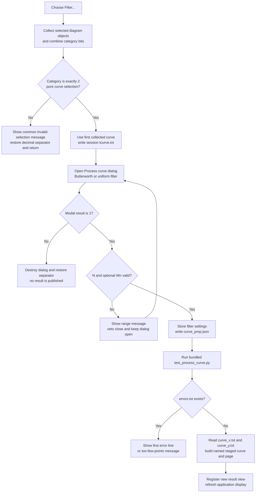

# Filter the first selected curve with the bundled Python processor

> Analysis status: Complete. The recovered menu handler accepts a pure curve selection, exports its first curve to a session file, opens the Process curve dialog, and publishes a new result only after valid parameters and a Python run without an `errors.txt` file.

## Control

| Property | Recovered value |
| --- | --- |
| Form | DFWindow |
| Component path | DFWindow.DFMainMenu.DFProcessingMnu.DFFilterMnu |
| Control class | TMenuItem |
| Caption | `Filter...` |
| Hint | Not present in the recovered resource. |
| Handler name | DFFilterMnuClick |
| Handler address | 01a842b0 |
| Graph node | `resource:dfm:DFWindow/DFWindow.DFMainMenu.DFProcessingMnu.DFFilterMnu` |
| Handler node | `function:01a842b0` |
| Graph layer | UI |

The DFM supplies no action, shortcut, image, glyph, or explicit enabled state for this item.

## Selection and dialog opening

[`FUN_01a842b0`](../../../DecompiledSources/Tina16/functions/0000000001A842B0__FUN_01a842b0.c) temporarily changes the shared decimal separator to `.` and calls the common diagram-selection collector. It continues only when the combined selection category is exactly `2`, which other DFWindow paths establish as the curve category.

This test does not require exactly one curve. A curve-only selection that contains several curves still has category `2`. [`FUN_01a83910`](../../../DecompiledSources/Tina16/functions/0000000001A83910__FUN_01a83910.c) uses item zero from the collected list, exports that curve to `tcurve.txt`, and returns that same source curve to the dialog. The remaining selected curves are ignored. An empty, axis-only, mixed, or other-category selection shows the common invalid-selection message and does not open the filter dialog.

The handler builds a private application-session working path. It does not show an Open or Save dialog and does not ask for a source or destination path. It then creates `TPyProcessForm`, whose recovered caption is **Process curve**, and passes it:

- the session working path;
- the first selected source curve;
- the DFWindow filter-settings record at form offset `+0x1080`.

Before the modal dialog opens, the handler removes stale `curve_prop.json`, `curve_desc.txt`, `curve_x.txt`, `curve_y.txt`, and `errors.txt` files from that working path. It does not remove the newly written `tcurve.txt`.

## Filter types and parameters

The Process curve form creates these two entries at run time. Its combo box is a non-editable drop-down list.

| Display entry | Internal filter name | Parameters | Validation | Stored type |
| --- | --- | --- | --- | --- |
| `Filter butterworth` | `butterworth` | `N`, default `3`; `Wn`, default `0.03` | `N` must be from `1` through `100`; `Wn` must be greater than `0` and less than `1` | `0` |
| `Filter uniform` | `uniform_filter1d` | `N`, default `100` | `N` must be from `1` through `1000000` | `1` |

The dialog restores its selected filter and parameter values from the passed settings record. Changing the filter rebuilds the two parameter labels and editors from the exact definitions above. The form also contains **Curve name** and **Page name** editors. A new dialog starts with `NewCurve` followed by a process-global increasing number, and the DFM supplies `Filters` as the initial page name.

The OK handler parses integer parameters with the Delphi integer parser and floating parameters with the shared format settings. Invalid text therefore becomes a value that fails the same range check. On failure, it shows one of the recovered range messages and sets a close-veto flag. The form's `OnCloseQuery` rejects that close once and clears the flag, so the user remains in the dialog. No recovered instruction selects the bad text or moves focus to its editor.

On a valid OK click, the dialog writes the selected filter type and values to the passed DFWindow settings record and creates a Python argument object containing the internal `filter` name plus `N` and, for Butterworth, `Wn`. This update occurs before the external processor runs. The Curve name and Page name fields are not range-checked or checked for uniqueness by the OK handler.

## Processing and output insertion

Only modal result `1` starts processing. The handler shows a temporary **Working... please wait** form, serializes the Python argument object to `curve_prop.json`, and loads the fixed script:

`<runtime root>\Lib\site-packages\tpack_t\runner\test_process_curve.py`

The runner consumes the session files. After its execution completes, the application checks `errors.txt`. If that file exists, its first line becomes the error message. When that line contains all three words `padlen`, `input`, and `vector`, the application replaces it with `The input curve contains too few points!`. The message is shown and no output is published.

When `errors.txt` does not exist, [`FUN_01a69610`](../../../DecompiledSources/Tina16/functions/0000000001A69610__FUN_01a69610.c) creates a staged result from `curve_x.txt` and `curve_y.txt`:

1. It copies the **Curve name** and **Page name** text and derives the result type from the selected source curve.
2. It finds an existing staged page with that page name or creates one. An empty Page name uses the Curve name as the page key.
3. If an existing page has a different result type, it shows `Curve type mismatch: old page type: %d, new page type: %d`. The recovered code does not abort after this message.
4. It creates the named output curve, clears its sample storage, reads every X row from `curve_x.txt`, reads the Y row with the same index from `curve_y.txt`, and appends the pair.
5. It passes the staged result to one of two application result-integration paths according to the recovered result-type byte. Those paths create the corresponding diagram/result objects, register them with the application result manager, and refresh the application view.

The selected source curve is read and exported; this path does not overwrite its samples. The visible output is a new application result view that uses the user-entered curve and page names.

## Click flow

## Cancel, no-op, and error behavior

- A non-curve or mixed selection stops before dialog creation. No source data or filter settings change.
- Canceling **Process curve** skips `curve_prop.json` creation, Python execution, result construction, and publication. The earlier `tcurve.txt` export and stale-output deletion have already occurred. Form creation also consumes one `NewCurve` sequence number.
- Invalid filter parameters keep the dialog open. They do not replace the last valid settings record or start Python.
- A valid OK click updates the settings record before processing. A later Python or import failure does not roll those values back.
- `errors.txt` is the only explicit runner-failure gate recovered in this path. The import code has no separate existence check for `curve_x.txt` or `curve_y.txt`, no explicit X/Y row-count equality check, and no numeric parse-status branch.
- The X-file row count controls the import loop. Each iteration indexes the same position in the Y list. A missing, short, or malformed output can therefore fail in a list access or numeric conversion, or can leave a staged result with no or partial sample data before publication is reached.
- Result construction occurs in a dialog-owned staging list. Publication starts only after the sample loop. The two downstream publication paths have no transaction or rollback in this caller; a failure after application registration starts can leave a partial live result.
- The handler has no local exception handler or retry. Its normal cleanup destroys temporary objects, hides the working form, releases the Python execution objects, and restores the decimal separator.

## State and persistence boundary

The command changes three kinds of state at different times:

| State | Timing and lifetime |
| --- | --- |
| Filter type and numeric parameters | Written to the DFWindow-owned settings record on a valid dialog OK, before Python runs. No settings serializer or document-save call is present in this click path. |
| Generated result | Added to the live application result manager only after runner success and X/Y import. It is an in-memory result until another command saves it. |
| Runner files | `tcurve.txt`, `curve_prop.json`, `curve_desc.txt`, `curve_x.txt`, `curve_y.txt`, and `errors.txt` use the private session working path. Five output files are deleted before the next dialog; this handler does not delete all files after the run. |

There is no undo record, source-curve mutation, automatic project save, or destination-file dialog in the recovered click path.

## Recovered evidence

- Main handler: [`FUN_01a842b0`](../../../DecompiledSources/Tina16/functions/0000000001A842B0__FUN_01a842b0.c) performs selection gating, session-path creation, source export, dialog setup, stale-file cleanup, modal-result gating, processing dispatch, object cleanup, and decimal-separator restoration.
- Selection collector: [`FUN_01acff30`](../../../DecompiledSources/Tina16/functions/0000000001ACFF30__FUN_01acff30.c) returns the combined category byte and collected objects. Other recovered DFWindow handlers establish exact value `2` as curves.
- Source-curve export: [`FUN_01a83910`](../../../DecompiledSources/Tina16/functions/0000000001A83910__FUN_01a83910.c) rechecks category `2`, uses selection item zero, and writes the selected curve data to the supplied `tcurve.txt` path.
- Dialog setup and cleanup: [`FUN_01a67160`](../../../DecompiledSources/Tina16/functions/0000000001A67160__FUN_01a67160.c) stores the working path, source curve, and settings record; [`FUN_01a68960`](../../../DecompiledSources/Tina16/functions/0000000001A68960__FUN_01a68960.c) deletes the five stale output files when present.
- Dialog definitions and validation: [`FUN_01a68330`](../../../DecompiledSources/Tina16/functions/0000000001A68330__FUN_01a68330.c) defines the filters, documentation links, and default curve name; [`FUN_01a67a80`](../../../DecompiledSources/Tina16/functions/0000000001A67A80__FUN_01a67a80.c) populates parameter controls; [`FUN_01a67250`](../../../DecompiledSources/Tina16/functions/0000000001A67250__FUN_01a67250.c) validates values, updates settings, and builds the Python argument object; [`FUN_01a68310`](../../../DecompiledSources/Tina16/functions/0000000001A68310__FUN_01a68310.c) implements the one-shot close veto.
- Runner coordinator: [`FUN_01a68fa0`](../../../DecompiledSources/Tina16/functions/0000000001A68FA0__FUN_01a68fa0.c) writes `curve_prop.json`, prepares and runs the script, gates import on the error result, publishes successful output, and performs normal cleanup. [`FUN_01a68760`](../../../DecompiledSources/Tina16/functions/0000000001A68760__FUN_01a68760.c) resolves and loads the fixed script. [`FUN_01a68bd0`](../../../DecompiledSources/Tina16/functions/0000000001A68BD0__FUN_01a68bd0.c) executes the prepared runner and maps `errors.txt` to a user message.
- Output import and publication: [`FUN_01a69610`](../../../DecompiledSources/Tina16/functions/0000000001A69610__FUN_01a69610.c) builds the named staged output and imports paired samples; [`FUN_01a69350`](../../../DecompiledSources/Tina16/functions/0000000001A69350__FUN_01a69350.c) finds or creates its page and checks the type; [`FUN_01a69570`](../../../DecompiledSources/Tina16/functions/0000000001A69570__FUN_01a69570.c) sends the staged result through the application result-integration path.
- UI resource evidence: [`ui-evidence.json`](../../../DecompiledSources/Tina16/resources/dfm/ui-evidence.json) binds `DFFilterMnuClick`, identifies the Process curve controls, and supplies the `Filters` page-name default.

## Analysis limits

- The bundled `test_process_curve.py` file is referenced by the recovered executable but is not present in `DecompiledSources`. The source proves the selected SciPy-oriented filter names, parameters, session-file protocol, and error mapping. It does not prove the script's exact convolution, edge-padding, or phase behavior.
- The private session directory is assembled from runtime installation and session values. Its final absolute path is not fixed in the recovered handler.
- The original Delphi field names for the settings record and staged result list are not recovered. Their responsibilities come from their writers, readers, UI labels, and downstream model calls.
- No proprietary UI action or Python filter was executed. The findings use the DFM binding, read-only graph, recovered source, and repeated data flow across the handler and its callees.
