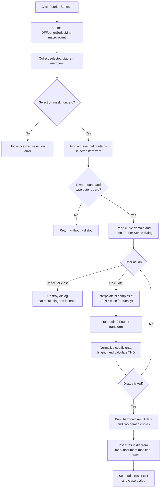

# Fourier Series...

> Analysis status: Complete. This command opens the Fourier Series dialog for the first supported selected curve member. Calculation fills the coefficient table; only **Draw** inserts a new result diagram.

## Control

| Property | Recovered value |
| --- | --- |
| Form | DFWindow |
| Component path | DFWindow.DFMainMenu.DFProcessingMnu.DFFourierSeriesMnu |
| Control class | TMenuItem |
| Caption | Fourier Series... |
| Hint | Not present in the recovered resource. |
| Handler name | DFFourierSeriesMnuClick |
| Handler address | 01a84540 |
| Graph node | `resource:dfm:DFWindow/DFWindow.DFMainMenu.DFProcessingMnu.DFFourierSeriesMnu` |
| Handler node | `function:01a84540` |
| Graph layer | UI |

The recovered menu item has no image or glyph property. The caption is therefore the only visible resource cue. The handler and dialog code supply the behavioral evidence.

## Selection and domain prerequisites

[`FUN_01a84540`](../../../DecompiledSources/Tina16/functions/0000000001A84540__FUN_01a84540.c) first submits the macro action `DFFourierSeriesMnu`. It then passes the current diagram at `form + 0x798` to [`FUN_01ad6030`](../../../DecompiledSources/Tina16/functions/0000000001AD6030__FUN_01ad6030.c) with mode `1`. Mode `1` selects Fourier Series; the sibling Fourier Spectrum handlers call the same dispatcher with mode `0`.

The dispatcher uses the shared selection classifier [`FUN_01acff30`](../../../DecompiledSources/Tina16/functions/0000000001ACFF30__FUN_01acff30.c). Its result must be nonzero. The dispatcher then uses only selection-list item zero and scans the diagram's curve collection until it finds a curve whose member collection contains that item. The owning curve must also have type byte `+0x58` equal to zero. This is more specific than “any selected object,” but the recovered type byte has no symbolic enum name.

The guard outcomes are:

- Empty selection: load the common localized selection-error resource and show a message box. The recovered source does not expose the final localized text.
- The first selected member is not in a curve collection: return without opening a dialog.
- The owning curve has an unsupported nonzero type byte: return without opening a dialog.
- Supported curve member: pass its two data references at `+0xE0` and `+0xC8` to the Fourier Series wrapper.

[`FUN_011439c0`](../../../DecompiledSources/Tina16/functions/00000000011439C0__FUN_011439c0.c) obtains the selected data's lower and upper independent-variable limits through [`FUN_0113f830`](../../../DecompiledSources/Tina16/functions/000000000113F830__FUN_0113f830.c). [`FUN_0113f440`](../../../DecompiledSources/Tina16/functions/000000000113F440__FUN_0113f440.c) uses that domain to initialize or constrain the sampling start and base frequency. The wrapper constructs `THarmonicDistorsionDlg`, shows it modally, ignores the returned modal code, and destroys it after the dialog closes.

## Fourier Series dialog and calculation

The recovered DFM names the dialog `HarmonicDistorsionDlg` and captions it `Fourier Series`. It provides these inputs:

- sampling start time;
- base frequency;
- sample counts from 128 through 65,536, each a power of two;
- number of harmonics;
- output selector;
- transient initial-condition choice; and
- five coefficient formats: `D * cos(kwt + fi)`, `C * exp(j * (kwt + fi))`, `A * cos(kwt) + B * sin(kwt)`, `RMS, fi`, and `Aeff, Beff`.

For this selected-curve command, [`FUN_01140aa0`](../../../DecompiledSources/Tina16/functions/0000000001140AA0__FUN_01140aa0.c) populates the output selector from the supplied curve data, selects item zero, and disables both the output selector and the transient initial-condition radio group. The user can change the sampling and coefficient controls, but cannot redirect this dialog instance to another output.

The default button is **Calculate**. Its handler, [`FUN_01140e30`](../../../DecompiledSources/Tina16/functions/0000000001140E30__FUN_01140e30.c), reads the controls and stores the current start time, base frequency, sample-size exponent, harmonic count, output selection, format, and initial-condition choice in the shared Fourier settings. These values become the defaults for a later dialog instance. This update is not a document save.

For this selected-curve entry path, [`FUN_01142a60`](../../../DecompiledSources/Tina16/functions/0000000001142A60__FUN_01142a60.c) performs the calculation from the supplied curve data. [`FUN_0113eac0`](../../../DecompiledSources/Tina16/functions/000000000113EAC0__FUN_0113eac0.c) linearly interpolates the curve onto `N` equally spaced samples, where `N = 2^sampleExponent` and the sample step is `1 / (N * baseFrequency)`. [`FUN_0113edb0`](../../../DecompiledSources/Tina16/functions/000000000113EDB0__FUN_0113edb0.c) then performs the in-place radix-2 complex Fourier transform.

[`FUN_011423a0`](../../../DecompiledSources/Tina16/functions/00000000011423A0__FUN_011423a0.c) divides the complex coefficients by `N`, writes the DC row and requested harmonic rows to the grid, converts the two value columns according to the chosen format, and updates the harmonic-distortion label. The distortion value is `100 * sqrt(sum(amplitude[k]^2, k >= 2)) / amplitude[1]`. When the fundamental amplitude is zero, the function writes a recovered resource placeholder instead of dividing by zero.

**Calculate** leaves the dialog open and enables **Draw**. It does not yet add a diagram or curve to the document.

## Draw output, naming, and document state

[`FUN_01142fd0`](../../../DecompiledSources/Tina16/functions/0000000001142FD0__FUN_01142fd0.c) handles **Draw**. It calls [`FUN_01143830`](../../../DecompiledSources/Tina16/functions/0000000001143830__FUN_01143830.c) to build a result data set whose independent values are harmonic numbers `0` through the requested count and whose dependent values are the normalized complex coefficients.

The Draw handler formats the base frequency for the result axis and passes the data set, frequency text, and selected format to [`FUN_013db650`](../../../DecompiledSources/Tina16/functions/00000000013DB650__FUN_013db650.c). That function creates a new Fourier result diagram and two result curves. It selects these title and curve-name pairs:

| Format index | Diagram title base | Curve names |
| --- | --- | --- |
| 0 | `FourierTHD - Amplitude (D)/Phase` | `Analysis Result 1`, `Analysis Result 2` |
| 1 | `FourierTHD - Amplitude (C)/Phase` | `Analysis Result 3`, `Analysis Result 4` |
| 2 | `FourierTHD - Real/Imaginary` | `Analysis Result 5`, `Analysis Result 6` |
| 3 | `FourierTHD - Amplitude (rms)/Phase` | `Analysis Result 7`, `Analysis Result 8` |
| 4 | `FourierTHD - Real (rms)/Imaginary (rms)` | `Analysis Result 9`, `Analysis Result 10` |

An incrementing counter is appended to the title base. The horizontal-axis text contains the formatted base frequency and `[Hz]`. Phase output uses degrees; amplitude branches use the recovered value-unit text.

The insertion path attaches the new diagram to the active document, registers both curves, updates diagram layout, and refreshes the view. [`FUN_01cec150`](../../../DecompiledSources/Tina16/functions/0000000001CEC150__FUN_01cec150.c) sets the document modified byte to one when it inserts the diagram. Draw then sets the dialog's modal result to `1`, which closes the modal dialog. No file writer is called: the new result remains an unsaved document change until a separate Save operation persists it.

## Cancel and error boundaries

- `CancelBtn` has recovered VCL kind `bkCancel`. In this selected-data mode, its explicit handler has no additional action. Closing without Draw inserts no result diagram.
- Calculate can still update the shared Fourier defaults before a later Cancel. Cancel does not roll those defaults back.
- Start-time and base-frequency validation handlers constrain the values to the selected data domain. Their error callback records the edit-control validation error through the common form helper. The exact displayed localized wording is not recovered.
- The traced selection, calculation, and Draw functions have no local exception handler, retry, transaction, or rollback path. The source does not establish the final user-facing handling of an unexpected calculation or insertion exception, or whether a partly built result is removed.

## Click flow

## Recovered evidence

- Menu handler and shared mode dispatcher: [`FUN_01a84540`](../../../DecompiledSources/Tina16/functions/0000000001A84540__FUN_01a84540.c) and [`FUN_01ad6030`](../../../DecompiledSources/Tina16/functions/0000000001AD6030__FUN_01ad6030.c)
- Selection classifier: [`FUN_01acff30`](../../../DecompiledSources/Tina16/functions/0000000001ACFF30__FUN_01acff30.c)
- Series dialog wrapper and initialization: [`FUN_011439c0`](../../../DecompiledSources/Tina16/functions/00000000011439C0__FUN_011439c0.c), [`FUN_0113f830`](../../../DecompiledSources/Tina16/functions/000000000113F830__FUN_0113f830.c), [`FUN_0113f440`](../../../DecompiledSources/Tina16/functions/000000000113F440__FUN_0113f440.c), and [`FUN_01140aa0`](../../../DecompiledSources/Tina16/functions/0000000001140AA0__FUN_01140aa0.c)
- Calculate, interpolation, transform, and table update: [`FUN_01140e30`](../../../DecompiledSources/Tina16/functions/0000000001140E30__FUN_01140e30.c), [`FUN_0113eac0`](../../../DecompiledSources/Tina16/functions/000000000113EAC0__FUN_0113eac0.c), [`FUN_0113edb0`](../../../DecompiledSources/Tina16/functions/000000000113EDB0__FUN_0113edb0.c), and [`FUN_011423a0`](../../../DecompiledSources/Tina16/functions/00000000011423A0__FUN_011423a0.c)
- Draw and result insertion: [`FUN_01142fd0`](../../../DecompiledSources/Tina16/functions/0000000001142FD0__FUN_01142fd0.c), [`FUN_01143830`](../../../DecompiledSources/Tina16/functions/0000000001143830__FUN_01143830.c), [`FUN_013db650`](../../../DecompiledSources/Tina16/functions/00000000013DB650__FUN_013db650.c), and [`FUN_01cec150`](../../../DecompiledSources/Tina16/functions/0000000001CEC150__FUN_01cec150.c)
- Resource evidence: [`ui-evidence.json`](../../../DecompiledSources/Tina16/resources/dfm/ui-evidence.json)

## Analysis limits

- The curve type byte at `+0x58` and the two selected-member data fields at `+0xE0` and `+0xC8` have no recovered symbolic names. Their roles are described from their data flow into domain access, interpolation, and Fourier calculation.
- The localized empty-selection and validation-error strings are referenced through resource identifiers. Their final text is not present in the decompiled functions.
- No live UI test was performed. The conclusions use the DFM binding, read-only graph, and recovered selection, dialog, calculation, insertion, and modified-state paths.
