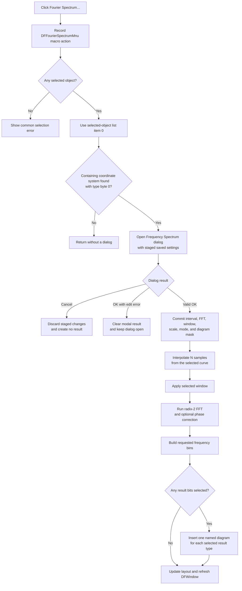

# Create a Fourier spectrum from the first selected time-domain curve

> Analysis status: Evidence-backed from the recovered DFM, handler, dialog, FFT, and result-insertion paths.

## Control

| Property | Recovered value |
| --- | --- |
| Form | DFWindow |
| Component path | DFWindow.DFMainMenu.DFProcessingMnu.DFFourierSpectrumMnu |
| Control class | TMenuItem |
| Caption | Fourier Spectrum... |
| Hint | Not present in the recovered resource. |
| Handler name | DFFourierSpectrumMnuClick |
| Handler address | `01a84600` |
| Graph node | `resource:dfm:DFWindow/DFWindow.DFMainMenu.DFProcessingMnu.DFFourierSpectrumMnu` |
| Handler node | `function:01a84600` |
| Graph layer | UI |

## What happens when clicked

[`FUN_01a84600`](../../../DecompiledSources/Tina16/functions/0000000001A84600__FUN_01a84600.c) records the `DFFourierSpectrumMnu` macro action when macro recording is active. It then passes DFWindow's diagram model at form offset `+0x798` and mode value `0` to the common Fourier dispatcher, [`FUN_01ad6030`](../../../DecompiledSources/Tina16/functions/0000000001AD6030__FUN_01ad6030.c). Mode `0` selects the Frequency Spectrum path. The adjacent Fourier Series handler passes `1` to the same dispatcher.

### Selected-curve and domain checks

The dispatcher rebuilds the current selected-object list with [`FUN_01acff30`](../../../DecompiledSources/Tina16/functions/0000000001ACFF30__FUN_01acff30.c). Other DFWindow call sites establish exact selection category `2` as curves. This path is less strict: it continues for any nonzero combined category, but always reads only list item zero. It then scans the model's coordinate-system collection until it finds one whose curve collection contains that first selected object.

The dispatcher opens the spectrum dialog only when the containing coordinate system has type byte `0` at offset `+0x58`. The later code samples the curve over an X interval and treats X as time, which identifies this as the accepted time-domain path. It passes the selected curve's data reference at `+0xE0` and data provider at `+0xC8` to the dialog. More selected curves are ignored.

The no-op boundaries are explicit:

- With no selected objects, the dispatcher shows the common localized selection error and returns.
- If no coordinate system contains the first selected object, it returns without a dialog.
- If the containing coordinate system does not have type `0`, it returns without a dialog.

### Frequency Spectrum dialog

[`FUN_0114e6b0`](../../../DecompiledSources/Tina16/functions/000000000114E6B0__FUN_0114e6b0.c) reads the selected curve's available X limits and adjusts the saved spectrum interval before it creates `TFrequencySpectrumDlg`. [`FUN_0114c7f0`](../../../DecompiledSources/Tina16/functions/000000000114C7F0__FUN_0114c7f0.c), the form's `OnCreate` handler, copies the saved settings to private form fields and initializes these recovered controls:

| Setting | Recovered choices or use |
| --- | --- |
| Sampling start and end time | The interval used to sample the selected curve. |
| Number of samples | `128` through `65536`, stored as exponent `7` through `16`. |
| Minimum and maximum frequency | The FFT-bin interval included in the result. |
| Window function | Uniform, Hanning, Flattop, Blackman, Hamming, or Bartlet. |
| Output | Fixed to the selected curve for this call path. |
| Phase correction | Enables the recovered post-FFT phase-correction step. |
| Scale | Linear, Linear-dB, or Logarithmic. |
| Mode | Spectral density or Spectrum. |
| Diagrams | Complex Amplitude, Phase, Real part, Imaginary part, Energy spectrum, and Amplitude. |
| Transient initial condition | Calculate operating point, use initial conditions, or zero initial values. This control is disabled for the selected-curve call path. |

There is no recovered harmonic-count control in `TFrequencySpectrumDlg`. The sample count fixes the FFT size. The minimum and maximum frequency fields choose its output bins. Harmonic-number controls belong to the separate Fourier Series workflow and are not read by this command.

The dialog stages its edits. The built-in `bkCancel` button closes with Cancel and does not copy the private settings back or run the transform. The `OKBtnClick` handler, [`FUN_0114cc80`](../../../DecompiledSources/Tina16/functions/000000000114CC80__FUN_0114cc80.c), reads every control into the private settings. Only an error-free OK copies that block to the shared Fourier settings and starts the calculation. Therefore, accepted settings persist for later spectrum sessions before result generation starts; they are not written to a file by this path.

### Sampling, windowing, and FFT

[`FUN_0114d810`](../../../DecompiledSources/Tina16/functions/000000000114D810__FUN_0114d810.c) creates a progress form, allocates `2^exponent` complex samples, and calls [`FUN_0113eac0`](../../../DecompiledSources/Tina16/functions/000000000113EAC0__FUN_0113eac0.c) to linearly interpolate the selected curve at equally spaced times. It applies the selected window directly to the real sample values:

- Uniform leaves each sample unchanged.
- Hanning uses `0.5 - 0.5 cos(2 pi i / N)`.
- Flattop uses the recovered five-term cosine expression.
- Blackman uses `0.42 - 0.5 cos(2 pi i / N) + 0.08 cos(4 pi i / N)`.
- Hamming uses `0.54 - 0.46 cos(2 pi i / N)`.
- Bartlet uses the recovered triangular expression.

[`FUN_0113edb0`](../../../DecompiledSources/Tina16/functions/000000000113EDB0__FUN_0113edb0.c) performs the in-place radix-2 complex FFT and bit-reversal permutation. When phase correction is enabled, [`FUN_0113e930`](../../../DecompiledSources/Tina16/functions/000000000113E930__FUN_0113e930.c) adjusts the transformed values. [`FUN_0114d430`](../../../DecompiledSources/Tina16/functions/000000000114D430__FUN_0114d430.c) then converts the requested frequency bins to the chosen spectral-density or spectrum normalization. The later result-diagram helper applies the selected scale.

### Result diagrams and refresh

On OK, `FUN_0114e6b0` passes the computed spectrum and the six-bit diagram mask to [`FUN_013d99f0`](../../../DecompiledSources/Tina16/functions/00000000013D99F0__FUN_013d99f0.c). Each set bit creates one diagram with an incrementing recovered name:

- `Fourier - Complex AmplitudeN`
- `Fourier - PhaseN`
- `Fourier - Real partN`
- `Fourier - Imaginary partN`
- `Fourier - PowerN`
- `Fourier - AmplitudeN`

Each created diagram receives an `Analysis Result 1` curve, the current DFWindow display attributes, axis data, and the generated spectrum provider. [`FUN_01cec150`](../../../DecompiledSources/Tina16/functions/0000000001CEC150__FUN_01cec150.c) inserts each diagram and sets the document modified byte to `1`. After all requested diagrams are inserted, the helper updates the page layout and requests a full DFWindow refresh. This path changes the in-memory analysis-result document. It does not call a document or file serializer; a later Save command is required for file persistence.

If all six diagram check boxes are clear, the transform can complete but the result helper creates no diagram. A valid OK still commits the dialog settings. Repeated clicks can create more diagrams and advance the name counters.

## Cancel, validation, and failure behavior

- Cancel does not calculate a spectrum, insert a diagram, or commit staged dialog settings.
- The float-edit validation path requires a nonnegative start, an end after the start, bounds within the selected curve's available interval, and an ordered nonnegative frequency range within the FFT limit. The maximum frequency is clamped to the calculated limit when it is above that limit.
- A float-edit error shows only the first recovered error message and sets a dialog error flag. An OK with that flag clears the modal result, does not commit settings, and does not start the FFT. The dialog remains open.
- No recovered local exception handler rolls back an allocation, a partially created result diagram, or committed settings if calculation or result insertion raises an exception. The exact exception presentation is outside this recovered path.

## Click flow

## Recovered function roles

- [`FUN_01a84600`](../../../DecompiledSources/Tina16/functions/0000000001A84600__FUN_01a84600.c) is the DFWindow main-menu click handler. It records the macro action and selects Spectrum mode in the shared dispatcher.
- [`FUN_01ad6030`](../../../DecompiledSources/Tina16/functions/0000000001AD6030__FUN_01ad6030.c) is the shared Fourier Series/Spectrum selection and domain dispatcher. Bead `.295` owns its canonical annotation.
- [`FUN_0114e6b0`](../../../DecompiledSources/Tina16/functions/000000000114E6B0__FUN_0114e6b0.c) coordinates spectrum bounds, the modal dialog, accepted-only result creation, and dialog lifetime.
- [`FUN_0114c7f0`](../../../DecompiledSources/Tina16/functions/000000000114C7F0__FUN_0114c7f0.c) loads saved settings and configures the Frequency Spectrum form for the selected curve.
- [`FUN_0114cc80`](../../../DecompiledSources/Tina16/functions/000000000114CC80__FUN_0114cc80.c) collects valid OK values, commits them, and starts the transform only when validation has not latched an error.
- [`FUN_0114d810`](../../../DecompiledSources/Tina16/functions/000000000114D810__FUN_0114d810.c) runs the sampling, window, FFT, and result-building pipeline.
- [`FUN_0114d430`](../../../DecompiledSources/Tina16/functions/000000000114D430__FUN_0114d430.c) converts the requested FFT-bin interval to the spectrum result provider.

## Resource evidence

- The DFWindow DFM binds `DFFourierSpectrumMnu.OnClick` to `DFFourierSpectrumMnuClick` at `01a84600`.
- The `FrequencySpectrumDlg` DFM supplies the control captions and choices listed above. Its only direct button handler is `OKBtnClick` at `0114cc80`; Cancel is a built-in `bkCancel` button.
- The menu item has no hint, glyph, image reference, or same-parent label candidate. The recovered handler and dialog call path, not the caption alone, establish the behavior.

## Analysis limits

- Recovered field and enum names are unavailable. The article uses offsets and observed data flow when the Delphi name is not proven.
- The coordinate-system type `0` is identified as the accepted time-domain path from its sampled-X use. The original Delphi enum member name is not recovered.
- The exact localized no-selection and float-edit error text is not recovered from the C export.
- The shared result helper supports callers other than this menu item. Only the arguments and result branches used by this click path are described here.
