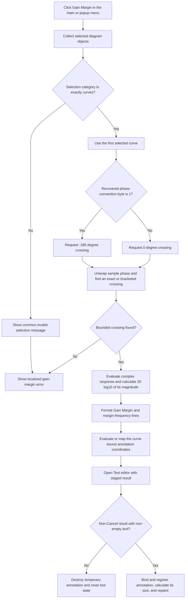

# Calculate and annotate gain margin

> Analysis status: Evidence-backed source review complete.

## Control

| Property | Recovered value |
| --- | --- |
| Form | DFWindow |
| Component path | DFWindow.DFMainMenu.DFProcessingMnu.DFGainMarginMnu |
| Control class | TMenuItem |
| Caption | Gain Margin ... |
| Hint | Not present in the recovered resource. |
| Handler name | DFGainMarginMnuClick |
| Handler address | 01a86430 |
| Graph node | `resource:dfm:DFWindow/DFWindow.DFMainMenu.DFProcessingMnu.DFGainMarginMnu` |
| Handler node | `function:01a86430` |
| Graph layer | UI |

## What happens when clicked

`FUN_01a86430` calculates a phase-crossing result for the first selected curve. It formats the response magnitude at that crossing as a localized **Gain Margin** line and formats the crossing coordinate as a localized margin-frequency line. It then opens the common **Text** editor with these two lines. An accepted, non-empty result becomes a text annotation that is bound to the selected curve and crossing coordinates.

The popup item `DFWindow.DFPopupMnu.GainmarginPuMnu` uses the same handler. Its recovered caption is `Gain  margin ...`, with two spaces and different capitalization. The main-menu and popup-menu commands therefore run the same code.

## Curve-selection guards

The common selection classifier must return exactly category `2`. Other DFWindow call sites establish that category `2` is the curve category. A mixed selection does not pass because the classifier ORs the category values of all selected objects.

Category `2` can contain more than one selected curve. `FUN_01ae6af0` reads only list index zero, verifies that this object has the recovered curve class, and ignores any other selected curves. It initializes the frequency and gain outputs to zero and returns success only when the calculation for the first curve succeeds.

If the selection category is not exactly `2`, the selection wrapper shows the common invalid-selection message. The click handler then also shows localized resource `DrawWind.GainMarginError` because the wrapper returned false. A category-`2` selection with a wrong first-object class, or a curve without a usable phase crossing, skips the common selection message but still reaches the gain-margin-specific error. None of these failure paths creates an annotation.

## Phase crossing and interpolation

The handler selects the requested phase from a recovered application-wide convention byte. Byte value `1` requests `-180` degrees; every other value requests `0` degrees. The recovered source does not name this setting, so this article does not assign a more specific option name to it.

`FUN_01abe9a0` creates a temporary curve-data adapter. `FUN_01abe490` scans its complex samples in provider order and calculates each sample phase in degrees.

- It unwraps a phase jump greater than 180 degrees by subtracting a multiple of 360 degrees.
- An exact target-phase match returns that sample's horizontal coordinate.
- Otherwise, it looks for adjacent phases on opposite sides of the target.
- It checks the candidate bracket against the provider's recovered lower and upper domain bounds.
- It linearly interpolates the crossing coordinate between the adjacent samples.
- It returns the first accepted crossing in provider order. It does not present a choice when the curve has more than one crossing.

The calculation fails when no exact or bounded bracketed crossing is found.

## Gain value and units

At the crossing coordinate, `FUN_01abe9a0` evaluates the selected curve's complex response. It calculates the magnitude as `sqrt(real^2 + imaginary^2)` and then calculates `20 * log10(magnitude)` when the magnitude is positive. A non-positive magnitude takes the recovered zero fallback.

The handler labels this returned decibel value with localized resource `DrawWind.GainMargin`. It does not negate the value or calculate a reciprocal reserve in this call path. Therefore, the proven displayed number is the response magnitude in decibels at the requested phase crossing, even though the UI calls it gain margin.

The crossing coordinate is formatted after localized resource `DrawWind.MFreqTxt`. No explicit `Hz` suffix, frequency conversion, or other unit conversion appears in the handler. The value stays in the selected curve provider's horizontal-axis units.

## Result annotation and commit boundary

The handler recalculates the first selected curve's provider and derives an annotation anchor at the crossing. In the normal provider branch, it keeps the crossing as the horizontal coordinate and evaluates the provider for the vertical coordinate. In the special recovered provider-class branch, it asks the provider to map the crossing to both coordinates.

Shared helper `FUN_01a8a3c0` creates a temporary system-text object with the two generated lines and opens `CSysTextDlg`, the common **Text** editor. The editor works on staged text and style values.

- Modal result `2`, the recovered Cancel result, destroys the temporary object and resets the DFWindow tool-state byte to `0`.
- A non-Cancel result with no text lines also destroys the object and resets that state.
- A non-Cancel result with text copies the staged values, binds the object to the selected curve and calculated coordinates, registers and finalizes it in the active diagram, calculates its display size, repaints its rectangle, and changes the tool-state byte to `6`.

Each successful click creates a new annotation object. The handler does not search for or replace an existing gain-margin annotation, so repeated use can add duplicate results.

## Click flow

## Handler and helper evidence

- Click handler, phase target, result formatting, and annotation anchoring: [FUN_01a86430](../../../DecompiledSources/Tina16/functions/0000000001A86430__FUN_01a86430.c)
- Curve-only selection and first-curve guard: [FUN_01ae6af0](../../../DecompiledSources/Tina16/functions/0000000001AE6AF0__FUN_01ae6af0.c)
- Selected-curve data-reference wrapper: [FUN_01ab56b0](../../../DecompiledSources/Tina16/functions/0000000001AB56B0__FUN_01ab56b0.c)
- Phase-crossing response calculation: [FUN_01abe9a0](../../../DecompiledSources/Tina16/functions/0000000001ABE9A0__FUN_01abe9a0.c)
- Phase scan, unwrapping, bounds checks, and interpolation: [FUN_01abe490](../../../DecompiledSources/Tina16/functions/0000000001ABE490__FUN_01abe490.c)
- Complex magnitude calculation: [FUN_00c44590](../../../DecompiledSources/Tina16/functions/0000000000C44590__FUN_00c44590.c)
- Decibel conversion: [FUN_00c44470](../../../DecompiledSources/Tina16/functions/0000000000C44470__FUN_00c44470.c)
- Result-annotation editor and commit: [FUN_01a8a3c0](../../../DecompiledSources/Tina16/functions/0000000001A8A3C0__FUN_01a8a3c0.c)
- Shared selection classifier: [FUN_01acff30](../../../DecompiledSources/Tina16/functions/0000000001ACFF30__FUN_01acff30.c)
- Recovered form and menu resources: [ui-evidence.json](../../../DecompiledSources/Tina16/resources/dfm/ui-evidence.json)

## Resource and glyph evidence

- The main-menu caption is `Gain Margin ...`; the popup caption is `Gain  margin ...`. The ellipsis is consistent with the proven text-editor step, but the handler source is the evidence for that dialog.
- Neither menu item has a hint, action, image-list reference, embedded glyph, or same-parent label candidate.
- The handler loads localized result keys `DrawWind.GainMargin` and `DrawWind.MFreqTxt`, and error key `DrawWind.GainMarginError`. The translated text is not present in the recovered source.

## Persistence and error limits

- A successful result changes the live diagram by adding one curve-bound text annotation. The handler has no file-save, INI-write, database-write, or explicit undo-stack call. Normal diagram serialization can preserve the object later, but this click path does not save the document.
- Invalid selection, wrong first-object class, and a missing crossing create no annotation. Cancel and empty staged text also create no annotation.
- The handler has no explicit active-diagram guard before it calls the selection wrapper. Normal menu-state code can restrict command availability, but this source does not prove the complete enable rule.
- The recovered handler and calculation helpers have no local exception handler or transactional rollback. An exception during allocation, calculation, editing, or registration can propagate to higher-level Delphi handling and can leave partial in-memory state.
- The source does not recover the original names of the curve data fields, phase-convention setting, translated result text, or horizontal-axis unit.
