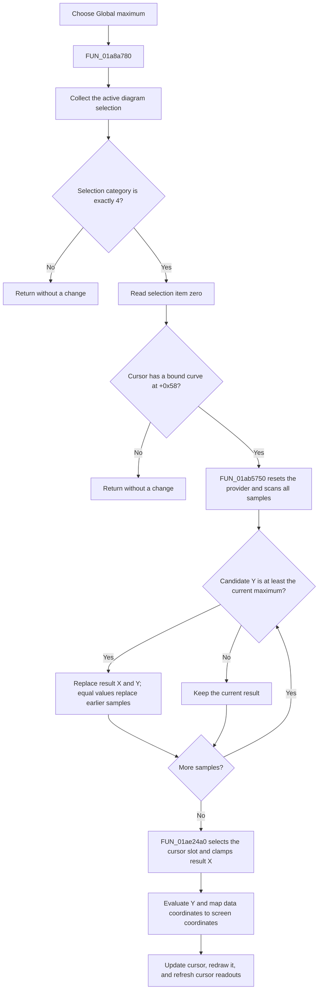

# Move the selected cursor to a curve's global maximum

## Control

| Property | Recovered value |
| --- | --- |
| Form | DFWindow |
| Component path | DFWindow.DFPopupMnu.SetpositionMnu.DFGlobalmaximumMnu |
| Control class | TMenuItem |
| Caption | Global maximum |
| Hint | Not present in the recovered resource. |
| Text | Not present in the recovered resource. |
| Handler name | DFGlobalmaximumMnuClick |
| Handler address | 01a8a780 |
| Graph node | `resource:dfm:DFWindow/DFWindow.DFPopupMnu.SetpositionMnu.DFGlobalmaximumMnu` |
| Handler node | `function:01a8a780` |
| Graph layer | UI |

## What happens when clicked

The command moves a selected diagram cursor to the global maximum sample of the curve that is bound to that cursor. It does not add a maximum annotation and it does not open a dialog.

[`FUN_01a8a780`](../../../DecompiledSources/Tina16/functions/0000000001A8A780__FUN_01a8a780.c) collects the current diagram selection and continues only when the selection category is exactly `4`, the category used for the two diagram cursor objects. It reads selection item zero and requires that cursor's curve field at offset `+0x58` to be non-null. If both cursors are selected, the selection collector adds the diagram's `+0xf0` cursor before the `+0xf8` cursor, so only the `+0xf0` cursor is processed.

The handler does not use the menu item's `Sender` value or the popup location. The operation applies to the existing selected cursor and its existing curve binding.

## Global-maximum search

[`FUN_01ab5750`](../../../DecompiledSources/Tina16/functions/0000000001AB5750__FUN_01ab5750.c) resets or recalculates the bound curve's provider and enumerates its complete sample sequence. The first sample initializes the result. Each later sample replaces the current result when [`FUN_01abde80`](../../../DecompiledSources/Tina16/functions/0000000001ABDE80__FUN_01abde80.c) reports `candidate Y >= current Y`.

Consequently:

- The search uses the provider's full iteration domain. It is not limited to the visible axis range or to samples near the current cursor.
- The returned X and Y are from an enumerated sample. This path does not interpolate between samples.
- If several samples have the same maximum Y, the last such sample in provider iteration order wins.
- The handler passes only the returned X coordinate to the cursor-position helper. That helper evaluates the cursor's Y value again at the final X coordinate.

The scanner's first provider read has no checked success result, and the scanner always returns `1`. The handler also does not test that return value. The recovered code therefore does not establish safe behavior when the provider has no sample.

## Cursor update and visible result

[`FUN_01ae24a0`](../../../DecompiledSources/Tina16/functions/0000000001AE24A0__FUN_01ae24a0.c) uses the selected cursor's byte at `+0x90` to select the corresponding diagram cursor slot: byte zero selects the cursor at diagram offset `+0xf8`; a nonzero byte selects the cursor at `+0xf0`.

For the normal curve-provider path, the helper:

1. Erases or invalidates the cursor at its old position.
2. Clamps the maximum's X coordinate to the curve provider's lower and upper domain bounds.
3. Stores the cursor X coordinate and evaluates its Y coordinate from the provider.
4. Maps the data coordinates to screen coordinates.
5. Updates and redraws the cursor.
6. Refreshes diagram cursor readouts and the relationship between the two cursors.

A separate provider-class branch performs the equivalent update through that provider's coordinate-conversion methods. The handler's non-null curve guard means that this click path does not use the helper's axis-only fallback.

This is a live cursor-position change. The traced handler and helpers do not call a diagram serializer, Save command, document dirty-state setter, undo registrar, or settings writer. No persistence across document reload is proven.

## No-op and failure boundaries

- A selection category other than exactly `4` causes a silent no-op. Mixed selections are rejected by this exact category test.
- A selected cursor without a bound curve causes a silent no-op.
- Only selection item zero is processed; there is no loop over several selected cursors.
- There is no confirmation, modal dialog, Cancel branch, or error message.
- The handler assumes that the active diagram field at form offset `+0x798` is valid. A stale direct invocation has no local null guard.
- The erase, coordinate update, mapping, and redraw calls have no local exception handler or rollback. The recovered code does not guarantee restoration if a later update step fails after the old cursor was erased.
- An empty provider is not safely distinguished from a provider with samples in the recovered scanner.

## Click flow

## Handler evidence

- Handler source: [FUN_01a8a780](../../../DecompiledSources/Tina16/functions/0000000001A8A780__FUN_01a8a780.c)
- Selection classifier: [FUN_01acff30](../../../DecompiledSources/Tina16/functions/0000000001ACFF30__FUN_01acff30.c)
- Global sample scanner: [FUN_01ab5750](../../../DecompiledSources/Tina16/functions/0000000001AB5750__FUN_01ab5750.c)
- Maximum comparator: [FUN_01abde80](../../../DecompiledSources/Tina16/functions/0000000001ABDE80__FUN_01abde80.c)
- Cursor-position helper: [FUN_01ae24a0](../../../DecompiledSources/Tina16/functions/0000000001AE24A0__FUN_01ae24a0.c)
- Complexity: complex
- Distinct outgoing calls from the handler: 6

## Resource evidence

- The recovered caption is `Global maximum`.
- No hint, text, list item, image reference, or extracted glyph is available.
- The caption identifies the requested extremum. The handler and its comparator establish the actual cursor-movement and maximum-search behavior.

## Analysis limits

- Recovered field names are not available. Offsets identify the active diagram, cursor binding, cursor selector, and coordinate fields.
- Provider virtual methods establish ordered sample enumeration and coordinate evaluation, but their original Delphi method names are not recovered.
- This analysis does not infer document persistence, undo support, or an annotation object where the traced path has no such call.
