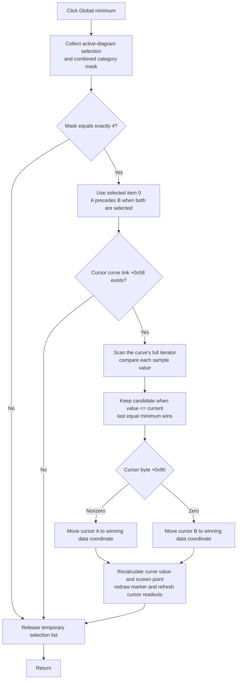

# Move the selected cursor to the global minimum

> Analysis status: Complete from recovered resource, selection, curve scan, cursor-position, readout, repaint, and persistence-boundary evidence.

## Control

| Property | Recovered value |
| --- | --- |
| Form | DFWindow |
| Component path | DFWindow.DFPopupMnu.SetpositionMnu.DFGlobalminimumMnu |
| Control class | TMenuItem |
| Caption | Global minimum |
| Hint | Not present in the recovered resource. |
| Handler name | DFGlobalminimumMnuClick |
| Handler address | 01a8a820 |
| Graph node | `resource:dfm:DFWindow/DFWindow.DFPopupMnu.SetpositionMnu.DFGlobalminimumMnu` |
| Handler node | `function:01a8a820` |
| Graph layer | UI |

## What happens when clicked

The command moves the selected diagram cursor to the global minimum of the curve that owns that cursor. It does not select a curve by itself. It does not create an annotation and does not open a dialog.

The handler collects the active diagram selection and requires the combined selection mask to equal `4`. The shared selection classifier assigns bit `4` to selected cursor A or cursor B. Exact equality rejects an empty selection, another object type, and a mixed selection. If both cursors are selected, the handler uses only list item zero. The classifier adds cursor A before cursor B, so cursor A wins in this case.

The first selected cursor must have a non-null curve link at offset `+0x58`. The handler passes that curve to the global-extremum scanner. It supplies `FUN_01abde70` as the comparison callback. This callback accepts a candidate when its value is less than or equal to the current value.

## Minimum domain and equal values

The global scanner resets the linked curve's data iterator and requests its first coordinate and value. It then reads every remaining sample from the same iterator. It does not pass the current cursor coordinate, a visible-axis range, or page bounds to the iterator. Thus the recovered path scans the full sample sequence exposed by the selected cursor's linked curve, not only the visible plot interval.

The first sample is the initial result. Each later sample replaces it when `candidate value <= current value`. A strictly lower value therefore becomes the new minimum. When several samples have the same minimum value, the later sample replaces the earlier sample. The final coordinate is therefore the last equal minimum in iterator order. The search returns an enumerated sample coordinate and value; it does not interpolate between samples. It compares the recovered values directly, not screen pixels or formatted text.

## Cursor update and readouts

The handler passes the winning data coordinate to the shared cursor-position helper. The selected object's byte at `+0x90` selects the same diagram cursor: nonzero selects cursor A at diagram offset `+0xF0`, and zero selects cursor B at `+0xF8`.

The shared helper verifies that this cursor and its linked curve still exist. It maps the requested data coordinate through the curve's supported coordinate path, clamps it to the curve's recovered lower and upper coordinate limits where that path applies, and updates the cursor's curve-local coordinate. It then asks the curve for the value at the new coordinate, updates the cursor's screen position, erases the old marker, draws the new marker, and refreshes the cursor displays. The final refresh recalculates the A/B difference fields when both cursors are active and rebuilds the all-curves cursor grid.

This command moves only the selected cursor. It does not change the curve samples, axis range, or the other cursor.

## No-op and error behavior

- A selection mask other than exactly `4` returns without a scan or cursor move.
- A selected cursor with a null curve link returns without a scan or cursor move.
- The handler uses only the first selected cursor. It does not move both cursors during one click.
- Repeated clicks scan the curve again. If the data is unchanged, they request the same last equal minimum and normally leave the cursor at the same data coordinate, although the shared helper still runs its update and refresh path.
- The global scanner does not test the success result of its first sample request. The recovered path therefore has no explicit empty-curve no-op branch. The source does not establish a safe result for an iterator that supplies no first sample.
- The handler assumes that the active diagram at form offset `+0x798` is valid. A stale direct call has no local null guard before selection collection.
- The handler and shared helpers have no local exception handler, error dialog, retry, or rollback. An error during the scan or cursor refresh can leave the old position, or a partly updated cursor and display state, depending on where it occurs.

## Dialog, document, and persistence boundary

No function in this click path constructs a dialog, tests a modal result, or creates a text or figure object. There is therefore no OK or Cancel branch and no analysis annotation to accept or reject.

The successful path changes the live cursor and repaints the diagram-related cursor displays. It does not call a diagram serializer, file writer, settings writer, recovered undo-registration helper, or recovered document-modified helper. The source does not prove that the cursor position is saved with the document, that an undo entry is created, or that the document is marked as changed.

## Click flow

## Evidence

- [DFGlobalminimumMnuClick](../../../DecompiledSources/Tina16/functions/0000000001A8A820__FUN_01a8a820.c) creates the temporary selection list, requires mask `4`, reads item zero, checks its curve link, calls the global scanner with the minimum comparator, and passes the result coordinate and cursor selector to the shared cursor-position helper.
- [The selection classifier](../../../DecompiledSources/Tina16/functions/0000000001ACFF30__FUN_01acff30.c) adds selected cursor A and cursor B from diagram offsets `+0xF0` and `+0xF8`, in that order, and ORs category bit `4`.
- [The global-extremum scanner](../../../DecompiledSources/Tina16/functions/0000000001AB5750__FUN_01ab5750.c) resets the curve iterator, takes the first coordinate and value, then reads all remaining samples and replaces the result whenever its callback returns true.
- [The minimum comparator](../../../DecompiledSources/Tina16/functions/0000000001ABDE70__FUN_01abde70.c) returns `candidate <= current`. The parallel [maximum comparator](../../../DecompiledSources/Tina16/functions/0000000001ABDE80__FUN_01abde80.c) reverses this comparison, which confirms the callback's minimum role.
- [The shared cursor-position helper](../../../DecompiledSources/Tina16/functions/0000000001AE24A0__FUN_01ae24a0.c) selects A or B, updates the cursor coordinate and curve value, recalculates its screen point, performs erase and draw calls, and invokes the selected-readout and all-curves-grid refresh paths.
- [The cursor coordinate reader](../../../DecompiledSources/Tina16/functions/0000000001ABFB00__FUN_01abfb00.c) and [writer](../../../DecompiledSources/Tina16/functions/0000000001ABFB40__FUN_01abfb40.c) show how a supported curve shift is removed from or added to the stored local cursor coordinate.
- [The recovered form evidence](../../../DecompiledSources/Tina16/resources/dfm/ui-evidence.json) identifies the `Set position` popup item, its `Global minimum` caption, and `DFGlobalminimumMnuClick` binding. It contains no hint, glyph, image, action, shortcut, checked state, or modal property for this item.

## Analysis limits

- The iterator methods are recovered as virtual calls. Their private Delphi type and symbolic method names are not available.
- The scan domain is the complete sequence exposed by that iterator. The source does not prove whether an upstream data provider has already filtered that sequence.
- The coordinate helper supports more than one recovered curve/data type. Its type-specific transforms are clear in the source, but their private Delphi class names are not recovered.
- The click path proves live cursor and display updates. It does not prove saved-document or undo behavior.
