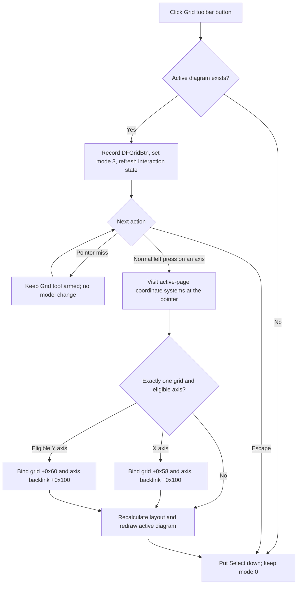

# Rebind the active diagram grid to a clicked axis

> Analysis status: Evidence-backed source review complete.

## Control

| Property | Recovered value |
| --- | --- |
| Form | DFWindow |
| Component path | DFWindow.DFToolPanel.ToolNoteBook.Diagram.DFGridBtn |
| Control class | TSpeedButton |
| Caption | Not present in the recovered resource. |
| Hint | Grid |
| Text | Not present in the recovered resource. |
| Handler name | DFGridBtnClick |
| Handler address | 01a79660 |
| Graph node | `resource:dfm:DFWindow/DFWindow.DFToolPanel.ToolNoteBook.Diagram.DFGridBtn` |
| Handler node | `function:01a79660` |
| Graph layer | UI |

## What happens when clicked

`DFGridBtn` arms a one-shot axis-binding tool. It does not switch grid visibility on or off, create a grid, or remove a grid.

`FUN_01a79660` first records command name `DFGridBtn`. If DFWindow has no active diagram at form offset `+0x798`, it puts the Select speed button down and calls the Select handler. The form remains in interaction mode `0`, and no grid or axis state changes.

With an active diagram, the handler writes interaction mode `3` to form field `+0x7a8`. It then calls `FUN_01ad0970`, which visits the active diagram's coordinate systems, diagram objects, and optional cursor objects to refresh their interaction state against the drawing context. The button click does not yet change a grid-to-axis reference or redraw the complete diagram.

## Click target and scope

The next normal left-button press with the recovered Shift-state bit clear enters the mode-`3` path. `FUN_01ace900` first requires the point to be inside the active diagram and tests the X and Y axes of every coordinate system in that diagram. The current selected object is not read. The pointer target, not a pre-existing selection, chooses the candidate axis.

If no axis hit test succeeds, the mouse-down handler makes no model change and leaves mode `3` active. The Grid speed button can therefore remain the active tool for another attempt.

When an axis hit succeeds, the mouse handler calls `FUN_01acf0c0` with mode `3`. That dispatcher visits every coordinate system in the active diagram and passes the pointer to `FUN_01ce5440`. It does not traverse the document's other pages. The lower helper applies these rules:

- The coordinate system must contain exactly one grid in collection `+0x88`.
- A hit X axis is assigned to that grid through `FUN_01cd9880`.
- A hit Y axis is assigned through `FUN_01cd98a0` only when the coordinate system's recovered Y-axis-position or separation-state result is `0`.
- Each setter writes the axis pointer into the grid at `+0x58` for X or `+0x60` for Y and writes the grid backlink into the axis at `+0x100`.

The helper does not stop after one coordinate system. If axis hit regions overlap, each qualifying coordinate system can process its own hit. In the usual non-overlapping layout, one clicked axis supplies one binding.

## No create, remove, or visibility toggle

The grid collection count is tested but never changed. No constructor, collection insertion, collection removal, destructor, or visibility-field write occurs in the mode-`3` path. The grid object remains the same object; only its X- or Y-axis reference can change.

This differs from the recovered axis-structure commands. **Separate curves** and **Collect curves** destroy and rebuild grid collections, while **Delete axis** can remove a linked grid or rebind a surviving one. `DFGridBtn` does none of that structural work.

The binding setters assign the new axis and its backlink. They do not explicitly clear the old axis's `+0x100` backlink before the assignment. Later layout or ownership code can reconcile related state, but this call path does not expose such a clear operation. This article therefore describes the proven new binding and does not claim a symmetric old-axis detach.

## Button state, layout, and redraw

The DFM defines `DFGridBtn` as a `TSpeedButton` in group `1`, the same group as Select and the other diagram tools. Its design-time `Enabled` property is false. Runtime command-state code can enable it for valid diagram contexts; the handler itself does not check the button's enabled state.

After any axis hit, including an axis that fails the one-grid or Y-state binding guards, the mouse handler recalculates the active diagram through `FUN_01acfa60` or `FUN_01acfc60`, according to the diagram's recovered layout mode. These paths update the diagram rectangle, axes, coordinate systems, grids, figures, and cursor layouts. `FUN_01aceb90(..., 1)` then clears and redraws the active diagram.

The handler finally puts Select down and resets the form to mode `0`. Thus an axis hit consumes the one-shot Grid tool even when no grid reference changed. Escape also returns to Select mode, resets the cursor, and refreshes the active diagram. A pointer miss leaves Grid mode armed.

Repeated use on the same eligible axis writes the same grid and backlink pointers again, recalculates layout, and redraws. It does not add another grid. Repeated use on a different eligible axis reassigns the grid pointer to that axis.

## Persistence and document state

The direct toolbar handler and its mode-`3` mouse path do not call the diagram-options serializer, a project-save routine, a file writer, an undo helper, or an explicit document-modified setter. The binding becomes live model state before layout and redraw, but this path does not prove whether an internal collection or property notification marks the document modified.

The Grid class is registered as archive type `0x409`. `FUN_01cdd090` writes the owning coordinate-system identifier and the bound X- and Y-axis identifiers. `FUN_01cdcf90` resolves those references during loading, uses the same two binding setters, and adds the grid to the coordinate system's grid collection. A later normal diagram serialization can therefore preserve the new axis association. This control does not invoke that serializer immediately.

## No-op and error boundaries

- No active diagram returns to Select without a message or model change.
- A pointer outside the active diagram or away from every axis leaves the tool armed and changes nothing.
- An axis hit in a coordinate system whose grid count is not exactly one performs no binding. A Y-axis hit with a nonzero recovered separation state also performs no binding. The outer handler still recalculates, redraws, and returns to Select.
- A Shift-modified left press does not enter the mode-`3` grid-binding branch. A right press follows the form's separate right-button path and is not a grid commit.
- The handler does not display confirmation, success, no-selection, or invalid-layout messages.
- The activation, hit-test, binding, layout, and redraw paths have no local exception handler, transaction, or rollback. A failure after a pointer assignment can leave the live grid rebound without completing layout or redraw.
- The direct handler has no local enabled-state guard. A normal disabled `TSpeedButton` does not emit a click, but a programmatic call can bypass that UI boundary.

## Grid axis-binding flow

## Handler and model evidence

- Grid-tool activation and active-diagram guard: [FUN_01a79660](../../../DecompiledSources/Tina16/functions/0000000001A79660__FUN_01a79660.c)
- Mode-`3` mouse dispatch, layout, redraw, and return to Select: [FUN_01a730e0](../../../DecompiledSources/Tina16/functions/0000000001A730E0__FUN_01a730e0.c)
- Axis hit-test gate: [FUN_01ace900](../../../DecompiledSources/Tina16/functions/0000000001ACE900__FUN_01ace900.c)
- Mode-specific coordinate-system dispatcher: [FUN_01acf0c0](../../../DecompiledSources/Tina16/functions/0000000001ACF0C0__FUN_01acf0c0.c)
- One-grid and X/Y-axis binding guards: [FUN_01ce5440](../../../DecompiledSources/Tina16/functions/0000000001CE5440__FUN_01ce5440.c)
- Grid X-axis and Y-axis setters: [FUN_01cd9880](../../../DecompiledSources/Tina16/functions/0000000001CD9880__FUN_01cd9880.c) and [FUN_01cd98a0](../../../DecompiledSources/Tina16/functions/0000000001CD98A0__FUN_01cd98a0.c)
- Active-diagram interaction refresh: [FUN_01ad0970](../../../DecompiledSources/Tina16/functions/0000000001AD0970__FUN_01ad0970.c)
- Mode-specific layout: [FUN_01acfa60](../../../DecompiledSources/Tina16/functions/0000000001ACFA60__FUN_01acfa60.c) and [FUN_01acfc60](../../../DecompiledSources/Tina16/functions/0000000001ACFC60__FUN_01acfc60.c)
- Full active-diagram redraw: [FUN_01aceb90](../../../DecompiledSources/Tina16/functions/0000000001ACEB90__FUN_01aceb90.c)
- Escape cleanup: [FUN_01a7d1a0](../../../DecompiledSources/Tina16/functions/0000000001A7D1A0__FUN_01a7d1a0.c)
- Grid loading and serialization: [FUN_01cdcf90](../../../DecompiledSources/Tina16/functions/0000000001CDCF90__FUN_01cdcf90.c) and [FUN_01cdd090](../../../DecompiledSources/Tina16/functions/0000000001CDD090__FUN_01cdd090.c)
- [Delete axis](deleteaxismnu-03286191f1.md) documents the shared grid setters in the structural axis-removal path.
- [Separate curves](separatecurvesmnu-d0343ef0c9.md) and [Collect curves](collectcurvesmnu-2684405b08.md) document commands that rebuild grid collections.
- Recovered control resources: [ui-evidence.json](../../../DecompiledSources/Tina16/resources/dfm/ui-evidence.json)

## Resource and annotation limits

- `DFGridBtn` has hint **Grid**, radio group `1`, and design-time `Enabled = false`. It has no recovered caption, action, checked state, or same-parent label candidate.
- [The extracted 17 by 14 pixel glyph](../../../glyph/0097_DFWindow_DFWindow_DFToolPanel_ToolNoteBook_Diagram_DFGridBtn_Glyph_Data.png) is a dotted grid. It supports the grid-tool identity. The mode-`3` source, not the image alone, proves axis rebinding.
- The source does not recover the Delphi enum names for interaction mode `3` or the coordinate-system state returned by `FUN_01ce33d0`. The repeated axis/grid consumers establish their roles without requiring invented enum names.
- This Bead owns only the direct `FUN_01a79660` handler annotation. Shared hit-test, coordinate-system, grid-binding, layout, redraw, and serializer helpers remain evidence and retain their earlier axis/grid documentation ownership.
