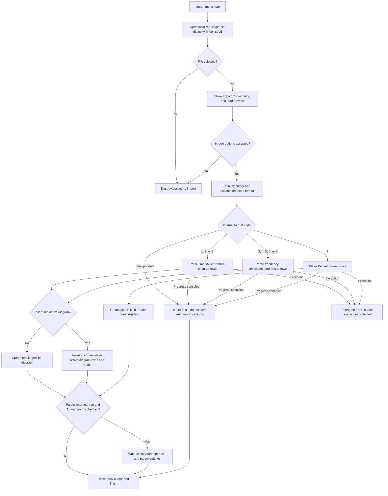

# Import delimited curve data

> Analysis status: Source reviewed through file selection, format preview,
> parsing, diagram insertion, auto-import persistence, cancellation, and error
> boundaries.

## Control

| Property | Recovered value |
| --- | --- |
| Form | DFWindow |
| Component path | DFWindow.DFMainMenu.DFFileMnu.DFImportMnu |
| Control class | TMenuItem |
| Caption | Import... |
| Hint | Not present in the recovered resource. |
| Text | Not present in the recovered resource. |
| Handler name | DFImportMnuClick |
| Handler address | 01a894f0 |
| Graph node | `resource:dfm:DFWindow/DFWindow.DFMainMenu.DFFileMnu.DFImportMnu` |
| Handler node | `function:01a894f0` |
| Graph layer | UI |

## What happens when clicked

The command selects one text file, shows a second dialog that previews and
classifies its rows, and imports accepted numeric data into a new imported
result. Depending on the chosen format and **Insert into active diagram**
option, the parser either creates result diagrams or adds the imported curves
to compatible axes in the active diagram.

The first dialog has a localized import title and file filter. The handler
seeds its file name with `*.txt` and sets Open-dialog options that include a
required existing path and file. It does not enable multi-selection. If the
user cancels this dialog, the handler destroys it and changes no imported
result or circuit setting.

After file selection, the handler creates a modal `TImportCurveDialog`, copies
the selected path to its file-name field at offset `0x748`, and waits for modal
result `1`. The dialog loads the file into a Delphi string list during
`OnShow`. The recovered load call does not supply an encoding parameter, so
this analysis cannot name one fixed input encoding.

If the user cancels the second dialog, the loaded preview and form are
destroyed. Parsing, diagram updates, and persistence do not run.

## Formats and preview

The Import Curve dialog exposes these recovered inputs:

- **Curves type:** `Auto-detect`, `Transient`, `AC`, or `Discret`;
- **Field separator:** `Space`, `Tab`, `Comma (,)`, or `Semicolon (;)`;
- **Skip rows:** the first row index that the parser and preview use;
- **AC amplitude:** `dB` or `Volts`, with `dB` checked in the resource;
- **Display format:** `D * cos(kwt + fi)`, `C * exp(j * (kwt + fi))`,
  `A * cos(kwt) + B * sin(kwt)`, `RMS, fi`, or `Aeff, Beff`;
- **Insert into active diagram**; and
- **Auto-import for active circuit**.

The type-change handler enables the amplitude controls for AC and Discret
data. It enables the Display format controls for Discret data. The
Insert-into-diagram click handler enables or disables the Auto-import check box
from the Insert state.

The preview logic tokenizes the selected lines with the separator. It shows at
most ten rows after **Skip rows**. Auto-detect uses the selected row's token
count and recognizes special first-line markers such as `Digilent` and
`Network Analyzer`. It maps the result to one of nine internal format codes.
The preview labels the columns as time, frequency, channel, value, voltage,
voltage in dB, or phase where the detected format establishes that meaning.

Changing the curve type, separator, skip count, or dB/Volts choice rebuilds the
preview. The preview does not modify the imported-result object.

## Parsing and replacement behavior

On **OK**, `FUN_01a894f0` reads the detected format code, display-format index,
skip count, separator string, dB/Volts state, and Insert state. It sets the
DFWindow cursor to the recovered busy cursor value, calls `FUN_013e26f0`, and
then resets the cursor on the normal return path.

`FUN_013e26f0` dispatches the internal format codes as follows:

- codes `1`, `2`, and `7` use `FUN_013e2850` for transient or other
  time/value and multi-channel rows;
- codes `3`, `4`, `5`, `6`, and `8` use `FUN_013e34c0` for AC and other
  frequency, amplitude, and phase rows; and
- code `9` uses `FUN_013e4610` for the Discret Fourier format.

Code `0` and unsupported codes return false without selecting a parser. The
outer handler shows no recovered error message for this case.

Each selected parser releases the prior object in the global imported-result
slot `02003118`, creates a new result object, and then reads the new file rows.
It does not append rows to the old imported data set. The old result is not
restored if this import later fails or is canceled.

The parsers split each physical line by the selected separator and convert the
required fields to numbers. Time-series rows store the first value as the
independent value and the remaining accepted values as one or more channels.
The AC parser handles recognized frequency/amplitude/phase layouts. It can
convert dB amplitude to a linear value and converts phase from degrees to
radians before storage. Rows whose field count does not match some recognized
AC layouts are skipped. Numeric conversion failures are not caught in these
functions.

The Discret parser stores frequency with magnitude/phase pairs. It applies the
dB conversion when selected and converts phase to radians. It then delegates
to the specialized Fourier diagram builder with the selected Display format.
This parser has no Insert-into-active-diagram parameter. Therefore, the
recovered Discret path does not use the normal active-diagram insertion route.

No parser has an explicit nonempty-data validation before its normal completion
path. A skip count at or beyond the row count can therefore reach completion
without parsed samples. Later result or diagram helpers decide what can be
created from that result.

## Diagram merge, axes, and redraw

For Transient and AC data, **Insert into active diagram** controls the diagram
route:

- When it is clear, the parser calls a result-specific builder that creates a
  new transient or AC diagram and its result curves.
- When it is checked, the parser collects the new result's curve objects and
  calls `FUN_013e2500`. That helper first tries a stored-diagram route. If that
  route does not apply, it inserts curves into compatible coordinate systems
  and axes in the active diagram.

The active-diagram route adds imported curves to the existing diagram. It does
not replace the diagram's complete curve list. Its lower insertion function
reuses or updates a matching plotted curve when one exists; otherwise it
creates a new plotted curve and selects a compatible axis. The menu handler
does not expose a separate axis picker.

After active-diagram insertion, the lower helper recalculates diagram layout
and curve state and calls the diagram repaint path. A new-diagram route builds
and activates its result view through the result-specific helpers. The import
handler does not call the general diagram-option persistence function.

If no compatible coordinate system accepts a nonempty curve list, the lower
path can show **curves cannot be inserted into this coordinate system! Please
select another diagram!** and return false. The imported result object can
remain populated even when active-diagram insertion fails.

## Auto-import persistence

The handler stores an auto-import configuration only when the parser returns
true and **Auto-import for active circuit** is checked. It writes these keys in
the active circuit's `AutoImport` section:

- file name;
- internal file type;
- skip-row count;
- separator name (`space`, `tab`, `comma`, or `semicolon`); and
- amplitude-in-dB state.

It then clears and reloads the circuit-owned settings collection. It does not
store the preview rows or Display-format index in this block.

`FUN_013e4fd0` is a later consumer of these settings. It checks the saved file,
loads it, restores the saved parser inputs, and runs the same dispatcher with
active-diagram insertion enabled. The settings written by this click apply to
a later auto-import. They are not needed to complete the current manual import.

If parsing or insertion returns false, the handler does not write or replace
the AutoImport settings.

## Cancellation, rollback, and errors

The import parsers show a progress form and process UI messages between rows.
The progress cancel callback sets a shared cancel flag. A parser that observes
the flag destroys the new imported result, clears global slot `02003118`, and
returns false. Diagram insertion occurs only after row parsing, so this cancel
path does not insert a partially parsed curve into the active diagram. It also
does not restore the old imported-result object.

There is no transaction around the complete command:

- a parser exception can leave the new global imported result partly filled;
- a conversion, file-load, list, diagram, or settings exception propagates;
- the busy cursor reset and later cleanup are not protected by a recovered
  handler-local `finally` block;
- active-diagram insertion can update some curves before a later target or
  compatibility operation fails; and
- auto-import settings are written only after a successful parser return, but
  an exception during the settings writes can leave a partial key set.

The recovered code does not show a replacement confirmation, a backup of the
old imported result, or a rollback for these cases.

## Click flow

## Handler evidence

- Source: [DecompiledSources/Tina16/functions/0000000001A894F0__FUN_01a894f0.c](../../../DecompiledSources/Tina16/functions/0000000001A894F0__FUN_01a894f0.c)
- Recovered role: Selects and imports delimited curve data, with optional
  active-diagram insertion and circuit auto-import persistence.
- Input evidence: The two dialogs supply the path, detected or selected type,
  display index, skip count, separator, amplitude mode, Insert state, and
  Auto-import state.
- State evidence: The parsers replace global imported-result slot `02003118`.
  Accepted data can create new diagrams or update the active diagram. The
  handler can write the circuit's `AutoImport` settings.
- No-op evidence: Cancellation of either dialog prevents parsing and
  persistence. Unsupported format code `0` returns false.
- Complexity: complex
- Distinct outgoing calls: 27

## Relevant calls

- [`FUN_013e26f0`](../../../DecompiledSources/Tina16/functions/00000000013E26F0__FUN_013e26f0.c)
  dispatches the detected or selected file-type code.
- [`FUN_013e2850`](../../../DecompiledSources/Tina16/functions/00000000013E2850__FUN_013e2850.c)
  imports time-series and multi-channel rows.
- [`FUN_013e34c0`](../../../DecompiledSources/Tina16/functions/00000000013E34C0__FUN_013e34c0.c)
  imports AC and other frequency/amplitude/phase rows.
- [`FUN_013e4610`](../../../DecompiledSources/Tina16/functions/00000000013E4610__FUN_013e4610.c)
  imports the Discret Fourier layout and selects its display builder.
- [`FUN_00f09f30`](../../../DecompiledSources/Tina16/functions/0000000000F09F30__FUN_00f09f30.c)
  tokenizes preview rows, detects the layout, and rebuilds preview-grid labels
  and cells.
- [`FUN_013e2500`](../../../DecompiledSources/Tina16/functions/00000000013E2500__FUN_013e2500.c)
  routes accepted imported curves to a stored diagram or compatible active
  coordinate systems.
- [`FUN_01adb8e0`](../../../DecompiledSources/Tina16/functions/0000000001ADB8E0__FUN_01adb8e0.c)
  validates coordinate-system compatibility and inserts or updates curves.
- [`FUN_01ad9580`](../../../DecompiledSources/Tina16/functions/0000000001AD9580__FUN_01ad9580.c)
  recalculates inserted curve state and calls the diagram repaint path.
- [`FUN_013e4fd0`](../../../DecompiledSources/Tina16/functions/00000000013E4FD0__FUN_013e4fd0.c)
  consumes saved circuit AutoImport settings on a later automatic load.

## Resource evidence

- The menu caption is **Import...**. It has no recovered hint, action, image
  reference, or embedded glyph.
- The first dialog uses localized keys `DrawWind.ImportCurveTitle` and
  `DrawWind.ImportCurveFilter` and a `*.txt` file-name seed.
- The second form caption is **Import** and its main group caption is **Import
  Curve**. Its **OK** and **Cancel** controls use `bkOK` and `bkCancel`.
- The recovered form text and list items identify the curve types, separators,
  display formats, amplitude modes, insertion option, and active-circuit
  auto-import option described above.

## Analysis limits

- The localized file-filter fallback and the default-extension literal are not
  resolved in the recovered source. This article does not invent their text.
- The parser's internal format codes have no recovered Delphi enumeration
  names. The format groups and field meanings come from their control inputs,
  preview labels, token counts, and parser data flow.
- The default `TStrings` file-load call does not prove one fixed input encoding.
- Several application and form fields have only recovered offsets. Their roles
  are established from the DFM controls and repeated producer/consumer paths.
