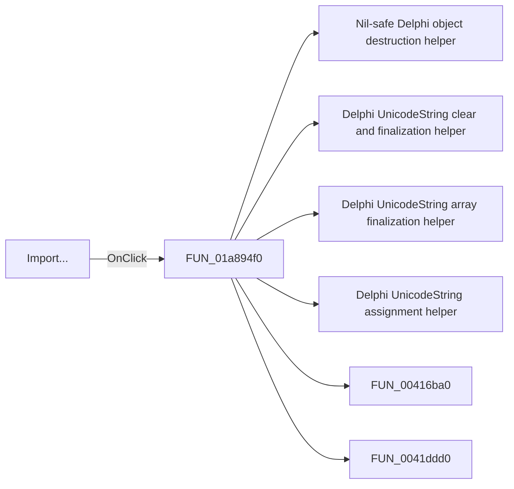

# Import...

> Analysis status: Pending individual source review.

## Control

| Property | Recovered value |
| --- | --- |
| Form | DFWindow |
| Component path | DFWindow.DFMainMenu.DFFileMnu.DFImportMnu |
| Control class | TMenuItem |
| Caption | Import... |
| Hint | Not present in the recovered resource. |
| Text | Not present in the recovered resource. |
| Handler name | DFImportMnuClick |
| Handler address | 01a894f0 |
| Graph node | `resource:dfm:DFWindow/DFWindow.DFMainMenu.DFFileMnu.DFImportMnu` |
| Handler node | `function:01a894f0` |
| Graph layer | UI |

## What happens when clicked

Pending individual analysis. An agent must read the recovered handler source and its relevant callees before it replaces this text.

## Click flow

## Handler evidence

- Source: [DecompiledSources/Tina16/functions/0000000001A894F0__FUN_01a894f0.c](../../../DecompiledSources/Tina16/functions/0000000001A894F0__FUN_01a894f0.c)
- Recovered role: Not present in the recovered resource.
- Current graph summary: Handles 1 Delphi UI event: DFWindow.DFMainMenu.DFFileMnu.DFImportMnu.OnClick.
- Current graph behavior: Not present in the recovered resource.
- Current graph evidence: Not present in the recovered resource.
- Complexity: complex
- Distinct outgoing calls: 27

## Direct calls

- `function:00410f20` — Nil-safe Delphi object destruction helper
- `function:00414480` — Delphi UnicodeString clear and finalization helper
- `function:00414560` — Delphi UnicodeString array finalization helper
- `function:00414ad0` — Delphi UnicodeString assignment helper
- `function:00416ba0` — FUN_00416ba0
- `function:0041ddd0` — FUN_0041ddd0
- `function:004b6930` — FUN_004b6930
- `function:005894c0` — FUN_005894c0
- `function:005dc9d0` — FUN_005dc9d0
- `function:005dcf20` — FUN_005dcf20
- `function:005dd980` — FUN_005dd980
- `function:0064e140` — FUN_0064e140
- `function:00723990` — FUN_00723990
- `function:00724270` — FUN_00724270
- `function:00724380` — FUN_00724380
- `function:007fc180` — FUN_007fc180
- `function:00b89270` — FUN_00b89270
- `function:00b8e650` — FUN_00b8e650
- `function:00c5a450` — FUN_00c5a450
- `function:00f09e70` — FUN_00f09e70
- `function:00f09e90` — FUN_00f09e90
- `function:00f09ef0` — FUN_00f09ef0
- `function:00f09f10` — FUN_00f09f10
- `function:00f0b4f0` — FUN_00f0b4f0
- `function:013e26f0` — FUN_013e26f0
- `function:01c8a450` — FUN_01c8a450
- `function:01cdf690` — FUN_01cdf690

## Resource evidence

- Kind: Not present in the recovered resource.
- Modal result: Not present in the recovered resource.
- Checked state: Not present in the recovered resource.
- List items: Not present in the recovered resource.
- Image reference: Not present in the recovered resource.
- Extracted glyph: None.

## Nearby label candidates

Nearby labels are layout candidates only. They are not proof of behavior.

- No same-parent label candidate is available.

## Analysis limits

- Do not infer behavior from the control class, caption, hint, glyph, or nearby label alone.
- Do not replace the pending status until the handler source and relevant call path provide enough evidence.
