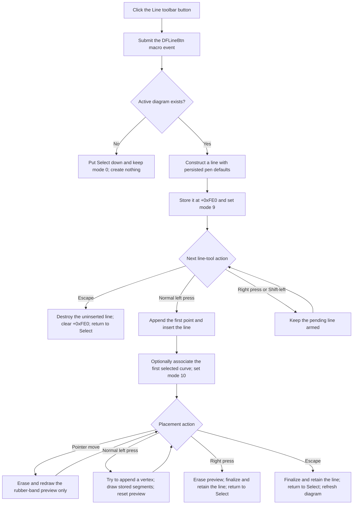

# Arm the Line drawing tool from the toolbar

> Analysis status: Complete. The button creates a pending diagram-line object and arms a click-defined polyline placement mode. The first normal left click inserts the line; later clicks add vertices.

## Control

| Property | Recovered value |
| --- | --- |
| Form | DFWindow |
| Component path | DFWindow.DFToolPanel.ToolNoteBook.Diagram.DFLineBtn |
| Control class | TSpeedButton |
| Caption | Not present in the recovered resource. |
| Hint | Line |
| Group index | 1 |
| Size | 25 by 25 |
| Glyph | 20 by 20 diagonal-line image recovered from a 362-byte Delphi bitmap resource |
| Handler name | DFLineBtnClick |
| Handler address | 01a7b4f0 |
| Graph node | `resource:dfm:DFWindow/DFWindow.DFToolPanel.ToolNoteBook.Diagram.DFLineBtn` |
| Handler node | `function:01a7b4f0` |
| Graph layer | UI |

The `Line` hint and diagonal-line glyph identify the control as a line tool. The source establishes that it creates a vertex-based diagram annotation that can accept multiple points, rather than a curve-data processor.

The popup-menu `Line` command is a wrapper around this toolbar route. It puts this speed button down and then calls the same handler. That wrapper is documented by [`TIARA-diz.6.7.340`](linemnu-7b09ded16a.md). A direct toolbar click starts at `FUN_01a7b4f0`; it does not pass through the popup wrapper.

## Activation

[`FUN_01a7b4f0`](../../../DecompiledSources/Tina16/functions/0000000001A7B4F0__FUN_01a7b4f0.c) first submits the macro action `DFLineBtn` through the conditional recorder. It then checks the active diagram at form offset `+0x798`.

- With no active diagram, it puts the Select speed button down and invokes `DFSelectBtnClick`. That handler returns the form to interaction mode `0`. No line is allocated, inserted, or reported as an error.
- With an active diagram, it constructs a line object through `FUN_00f10f20`, stores the object at form offset `+0xFE0`, and sets interaction mode byte `+0x7A8` to `9`.

Mode `9` means that the line tool is armed but the object is not yet in the diagram. The button click does not inspect selection, append a point, insert an object, draw a preview, or open a Properties dialog.

## Constructed line and style defaults

[`FUN_00f10f20`](../../../DecompiledSources/Tina16/functions/0000000000F10F20__FUN_00f10f20.c) initializes the recovered line class and clears its optional secondary-coordinate pointer at `+0x68`, secondary-coordinate flag at `+0x70`, active-diagram owner at `+0x78`, and associated-curve pointer at `+0x80`.

It applies three persisted application settings to the line's pen object at `+0x60`:

| Setting | Recovered fallback |
| --- | --- |
| `Line width` | `2` |
| `Line color` | `0xFF0000` |
| `Line style` | `0` |

The source does not recover symbolic names for the numeric color and style values. This activation uses the stored defaults without showing a dialog.

## First point, insertion, and selected-curve association

The common DFWindow mouse-down handler consumes mode `9` only on its normal left-button path when the recovered Shift-state bit is clear. It appends the pointer coordinate as the first stored point and calls the shared insertion helper.

The insertion helper sets the line's diagram owner at `+0x78` and adds it to the active diagram collection at `+0xE0` under the name `Circle/Line`. It also collects the existing diagram selection:

- When the combined selection category is exactly `2`, the helper associates the line with the first selected curve at line field `+0x80` and registers the line with that curve.
- Empty, mixed, and other selection categories leave the association empty. They do not block insertion.

The pointer does not select the associated curve. The association comes from the selection that existed before the first point.

After insertion, the mouse handler initializes a zero-length rubber-band segment at the clicked coordinate and changes the form to mode `10`. The line is now part of the live model even though placement is still active.

## More vertices and preview

In mode `10`, every further normal left-button press tries to append the clicked coordinate. The handler erases the old rubber-band segment, draws the stored line through its virtual draw method, and starts a new preview from the newest vertex.

Pointer movement in mode `10` does not add points. It erases the prior preview segment and draws a new segment from the last clicked vertex to the current pointer. Mouse release has no mode-`9` or mode-`10` commit branch.

The point helper grows the coordinate array in blocks of 50. It permits repeated coordinates among the first three stored points. After that, it ignores a coordinate that exactly matches the current final point. The placement path enforces no minimum of two distinct points, so a one-point line or repeated early points can be finalized.

## Finish and cancel behavior

- A right-button press in mode `10` erases the preview, invokes the line's finalization method, clears pending-object field `+0xFE0`, puts Select down, and returns to mode `0`. The already inserted line remains in the diagram.
- Escape in mode `10` performs the same line finalization and tool reset, then calls the active-diagram interaction refresh. It also retains the inserted line.
- Escape in mode `9` destroys the uninserted object at `+0xFE0`, clears the field, restores Select and mode `0`, resets the cursor, and refreshes the active diagram. This is the true no-model-change cancellation path.
- A right-button press in mode `9` does not insert, finalize, or destroy the pending line in the recovered line branches. The tool remains armed unless another common interaction changes the mode.
- A Shift-modified left press does not enter the mode-`9` or mode-`10` line branch.

## Drawing flow

## Errors, redraw, and persistence

- If coordinate-array growth exceeds the recovered allocation limit, the point helper restores the prior point count and capacity and returns without a message. Its caller does not test success, so placement continues with the existing points.
- If the activation handler runs again while mode `9` is already armed, it allocates another line and overwrites `+0xFE0` without an explicit cleanup call. The radio-group behavior can prevent a normal repeated event, so user reachability is not proven.
- The activation, insertion, mouse, drawing, and completion paths have no local exception handler, rollback transaction, or explicit undo entry. A failure after the first-point insertion can leave a partial line in the live diagram.
- The preview is drawn directly on the diagram canvas. Right-click completion does not request a broad refresh; Escape completion and cancellation call the common diagram interaction refresh.
- No direct document-modified flag write, Save call, or file write is visible in this path. Collection notifications can exist outside the recovered direct calls, so the source does not establish whether insertion marks the document modified.
- The line class is registered as archive type `0x407`. Its writer preserves point capacity and count, coordinates, line flags, pen data, optional secondary coordinates, diagram-owner ID, and associated-curve ID. Its loader restores those fields, re-registers the curve association, and adds the object to the diagram as `Line`. A later normal document save can therefore preserve the line; this control does not invoke that serializer.

## Recovered evidence

- Toolbar activation: [FUN_01a7b4f0](../../../DecompiledSources/Tina16/functions/0000000001A7B4F0__FUN_01a7b4f0.c)
- Line construction and style defaults: [FUN_00f10f20](../../../DecompiledSources/Tina16/functions/0000000000F10F20__FUN_00f10f20.c)
- Popup wrapper and coordinated analysis: [FUN_01a7b920](../../../DecompiledSources/Tina16/functions/0000000001A7B920__FUN_01a7b920.c) and [TIARA-diz.6.7.340](linemnu-7b09ded16a.md)
- First point, further vertices, and right-click completion: [FUN_01a730e0](../../../DecompiledSources/Tina16/functions/0000000001A730E0__FUN_01a730e0.c)
- Diagram insertion and selected-curve association: [FUN_01ae4b90](../../../DecompiledSources/Tina16/functions/0000000001AE4B90__FUN_01ae4b90.c)
- Point append and allocation-limit handling: [FUN_01d2c460](../../../DecompiledSources/Tina16/functions/0000000001D2C460__FUN_01d2c460.c)
- Rubber-band pointer preview: [FUN_01a74a50](../../../DecompiledSources/Tina16/functions/0000000001A74A50__FUN_01a74a50.c)
- Escape dispatch and cleanup: [FUN_01a7d460](../../../DecompiledSources/Tina16/functions/0000000001A7D460__FUN_01a7d460.c) and [FUN_01a7d1a0](../../../DecompiledSources/Tina16/functions/0000000001A7D1A0__FUN_01a7d1a0.c)
- Selection collector: [FUN_01acff30](../../../DecompiledSources/Tina16/functions/0000000001ACFF30__FUN_01acff30.c)
- Line archive registration: [FUN_011569a0](../../../DecompiledSources/Tina16/functions/00000000011569A0__FUN_011569a0.c)
- Line loader and writer: [FUN_00f11cf0](../../../DecompiledSources/Tina16/functions/0000000000F11CF0__FUN_00f11cf0.c) and [FUN_00f11ef0](../../../DecompiledSources/Tina16/functions/0000000000F11EF0__FUN_00f11ef0.c)
- Extracted toolbar glyph: [0102_DFWindow_DFWindow_DFToolPanel_ToolNoteBook_Diagram_DFLineBtn_Glyph_Data.png](../../../glyph/0102_DFWindow_DFWindow_DFToolPanel_ToolNoteBook_Diagram_DFLineBtn_Glyph_Data.png)
- Recovered form evidence: [ui-evidence.json](../../../DecompiledSources/Tina16/resources/dfm/ui-evidence.json)

## Analysis limits

- The recovered source does not provide symbolic names for modes `9` and `10`, the line class, or its numeric pen style and color.
- The popup wrapper and all shared selection, insertion, point, mouse, drawing, redraw, Properties, and serialization helpers are evidence only here. This Bead owns canonical annotations only for `FUN_01a7b4f0` and `FUN_00f10f20`.
- No live pointer interaction or save-and-reload test was performed.
