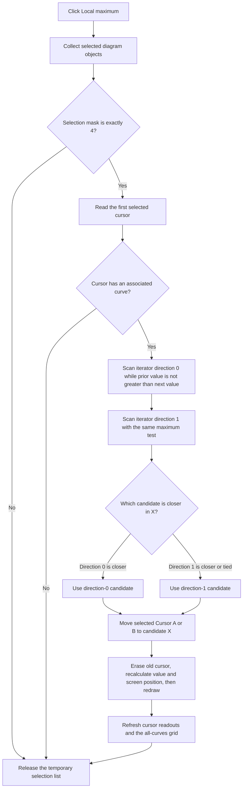

# Local maximum

> Analysis status: Evidence-backed source review complete.

## Control

| Property | Recovered value |
| --- | --- |
| Form | DFWindow |
| Component path | DFWindow.DFPopupMnu.SetpositionMnu.DFLocalmaximumMnu |
| Control class | TMenuItem |
| Caption | Local maximum |
| Hint | Not present in the recovered resource. |
| Text | Not present in the recovered resource. |
| Handler name | DFLocalmaximumMnuClick |
| Handler address | 01a8a8c0 |
| Graph node | `resource:dfm:DFWindow/DFWindow.DFPopupMnu.SetpositionMnu.DFLocalmaximumMnu` |
| Handler node | `function:01a8a8c0` |
| Graph layer | UI |

## What happens when clicked

This menu item moves one selected diagram cursor to a sampled local maximum on its associated curve. It does not create a text annotation or change curve samples.

The handler first asks the diagram manager at form offset `+0x798` to collect selected objects. It continues only when the returned selection mask is exactly `4`. The selection collector uses bit `4` for selected Cursor A and Cursor B objects. Therefore, a selection with no cursor, or a mixed selection that sets another bit, is a no-op. The collector adds Cursor A before Cursor B. If both cursors are selected, the handler uses list item zero and therefore processes Cursor A.

The selected cursor must have an associated curve at cursor offset `+0x58`. The handler passes that curve, the cursor X coordinate at `+0x78`, and the maximum comparator `FUN_01abde80` to `FUN_01ab5810`. The comparator accepts the next sample when the prior value is less than or equal to the next value. Equal values are accepted, so the scan continues across a flat maximum instead of stopping on the first equal sample.

`FUN_01ab5810` initializes the curve's sample iterator at the cursor X coordinate. It scans in iterator direction `0` and direction `1`. In each direction it keeps the last accepted sample before the iterator ends or the comparator rejects the next value. It then compares the absolute X distance from the current cursor to the two candidates. The closer candidate wins. An equal-distance tie selects the direction-`1` candidate because the source tests `direction1Distance <= direction0Distance`.

The recovered helper has no explicit wrap operation. Each scan stops when the virtual iterator reports that it has no next sample. The implementation of that virtual iterator is not named in the recovered source, so the curve's exact endpoint and domain rules are not proven here. The candidate coordinates are sample-domain X values; this is a sampled search, not a continuous optimization.

The handler passes the chosen X coordinate and the selected cursor's A-or-B flag at `+0x90` to `FUN_01ae24a0`. That shared movement helper selects Cursor A or Cursor B, erases its old drawing, applies the curve-type coordinate conversion, recalculates its value and screen position, and draws it again. It then refreshes the cursor readouts and the cursor-dependent all-curves grid. The movement path does not save the diagram, register an undo action, or change curve data.

## Boundary and failure behavior

- A selection mask other than exactly `4` causes no state change.
- A selected cursor without an associated curve causes no state change.
- The local-extrema scanner initializes each directional candidate X to `1e+30`. If a direction cannot accept a sample, that sentinel remains its candidate. The helper prefers the other direction when that candidate is closer. If neither direction accepts a sample, the source has no validity guard before it returns a candidate.
- The command is not a toggle. A repeated click runs the scan and movement path again. There is no same-coordinate short circuit.
- The movement helper skips the coordinate change if the requested cursor or its curve is missing, but it still runs the cursor readout and grid refresh calls.
- The handler, scanner, and movement helper have no local exception handler or rollback. A failure after the old cursor drawing is erased can leave partial display state until a later redraw.

## Click flow

## Handler evidence

- Handler source: [FUN_01a8a8c0](../../../DecompiledSources/Tina16/functions/0000000001A8A8C0__FUN_01a8a8c0.c)
- Local-extrema scanner: [FUN_01ab5810](../../../DecompiledSources/Tina16/functions/0000000001AB5810__FUN_01ab5810.c)
- Maximum comparator: [FUN_01abde80](../../../DecompiledSources/Tina16/functions/0000000001ABDE80__FUN_01abde80.c)
- Selection collector: [FUN_01acff30](../../../DecompiledSources/Tina16/functions/0000000001ACFF30__FUN_01acff30.c)
- Cursor movement and readout refresh: [FUN_01ae24a0](../../../DecompiledSources/Tina16/functions/0000000001AE24A0__FUN_01ae24a0.c)
- Recovered role: Positions the first selected diagram cursor at the nearest comparator-defined sampled local maximum.
- Current graph summary: Handles `DFWindow.DFPopupMnu.SetpositionMnu.DFLocalmaximumMnu.OnClick`.
- Complexity: complex
- Distinct outgoing calls: 6

## Direct calls

- `function:00410e60` — Creates the temporary Delphi list used for selected objects.
- `function:00410f20` — Destroys the temporary list through the nil-safe Delphi object destruction path.
- `function:004aeac0` — Reads item zero from the selected-object list.
- `function:01ab5810` — Finds the nearest comparator-defined local extremum in two sample directions.
- `function:01acff30` — Collects selected diagram objects and returns their type mask.
- `function:01ae24a0` — Moves Cursor A or Cursor B and refreshes cursor-dependent UI state.

## Resource evidence

- Caption: `Local maximum`.
- Parent menu caption: `Jump to`.
- Kind, modal result, checked state, hint, text, action, image reference, and glyph: Not present in the recovered resource.
- The source path, not the caption alone, proves that this is a selected-cursor positioning command.

## Analysis limits

- The virtual sample iterator's concrete class and endpoint rules are not named in the recovered source.
- The source does not expose user-facing curve units in this path. It operates on the selected curve's sample coordinates and values.
- The source contains no user-facing error message, confirmation dialog, persistence call, or undo call in this command path.
