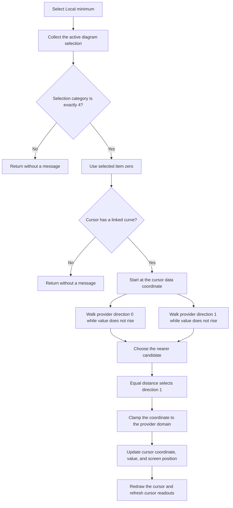

# Move the selected cursor to a local minimum

> Analysis status: Evidence-backed source review complete.

## Control

| Property | Recovered value |
| --- | --- |
| Form | DFWindow |
| Popup path | DFPopupMnu > Jump to > Local minimum |
| Component path | DFWindow.DFPopupMnu.SetpositionMnu.DFLocalminimumMnu |
| Control class | TMenuItem |
| Caption | Local minimum |
| Hint | Not present in the recovered resource. |
| Handler name | DFLocalminimumMnuClick |
| Handler address | 01a8a960 |
| Graph node | `resource:dfm:DFWindow/DFWindow.DFPopupMnu.SetpositionMnu.DFLocalminimumMnu` |
| Handler node | `function:01a8a960` |
| Graph layer | UI |

## What happens when clicked

`DFLocalminimumMnuClick` collects the current selection from the active diagram. It continues only when the selection classifier returns exactly `4`. The classifier assigns bit `4` to selected diagram cursors, so a cursor must be selected and no object from another selection category can be selected at the same time. If both diagram cursors are selected, the handler uses only item zero from the collected selection list.

The selected cursor must have a linked curve at field `+0x58`. The handler gives that curve, the cursor's current data coordinate at `+0x78`, and the minimum comparator `FUN_01abde70` to the shared local-extremum search `FUN_01ab5810`.

The search positions the curve provider at the current cursor coordinate and walks its two iterator directions. In each direction, it continues while the next value is less than or equal to the previous value. It therefore follows a descent through equal-value samples and stops before the first rise or when that iterator direction ends. It then compares the absolute coordinate distance from the original cursor position to the two candidates and returns the nearer candidate. If the distances are equal, direction `1` wins because the comparison is `distance1 <= distance0`.

The handler passes the returned coordinate and the selected cursor's selector byte at `+0x90` to `FUN_01ae24a0`. That shared cursor-position function selects one of the diagram's two cursors, hides its old display, clamps the requested coordinate to the curve provider's domain, updates the cursor coordinate and evaluated curve value, remaps its screen position, and draws it again. It then refreshes the fields that show the two cursors and their differences.

This action changes live cursor state only. The recovered path does not create an annotation, set a document-modified flag, add an undo item, or write a file or configuration value.

## Click flow

## Selection and boundary behavior

- Selection category `4` is required. A mixed selection has a different bit mask and causes a silent return.
- The handler uses only the first entry in the collected cursor list. It does not move every selected cursor.
- A selected cursor without a linked curve causes a silent return.
- The two searches terminate at their provider boundaries. No explicit wrap from one end of the curve to the other is present.
- Equal values are accepted by the minimum comparator. A flat minimum can therefore advance to the far end of the plateau in each iterator direction.
- Equal coordinate distances select the direction-`1` candidate.
- The shared search returns `1`, but the handler does not check that result and has no separate no-candidate branch. The recovered code does not establish a user-visible error for an empty or malformed provider.
- The cursor mover clamps the returned coordinate before it applies it. Provider-specific branches can transform the coordinate before evaluation and display mapping.

## Cancellation, errors, and persistence

There is no dialog and no Cancel path. Guard failures are silent. The handler has no local exception handler, rollback block, error message, or status result. If a lower-level provider or drawing operation raises an exception, the recovered handler does not show how the surrounding Delphi application reports it.

The cursor coordinate, evaluated value, screen position, and readouts are live diagram state. No call in this traced path proves persistence to a diagram file, INI file, database, or another durable store. A later save operation is outside this handler.

## Function evidence

- [`FUN_01a8a960`](../../../DecompiledSources/Tina16/functions/0000000001A8A960__FUN_01a8a960.c) is the `DFLocalminimumMnuClick` handler. It enforces the selection and linked-curve guards, requests the local-minimum coordinate, and moves the selected cursor.
- [`FUN_01acff30`](../../../DecompiledSources/Tina16/functions/0000000001ACFF30__FUN_01acff30.c) builds the selected-object list and assigns bit `4` to selected diagram cursors.
- [`FUN_01ab5810`](../../../DecompiledSources/Tina16/functions/0000000001AB5810__FUN_01ab5810.c) performs the shared two-direction local-extremum search. Its canonical graph annotation belongs to `TIARA-diz.6.7.348`.
- [`FUN_01abde70`](../../../DecompiledSources/Tina16/functions/0000000001ABDE70__FUN_01abde70.c) supplies the less-than-or-equal minimum comparison. Its canonical graph annotation belongs to `TIARA-diz.6.7.347`.
- [`FUN_01ae24a0`](../../../DecompiledSources/Tina16/functions/0000000001AE24A0__FUN_01ae24a0.c) applies the coordinate and refreshes the cursor display and readouts. Its canonical graph annotation belongs to `TIARA-diz.6.7.346`.
- [`FUN_01ad1740`](../../../DecompiledSources/Tina16/functions/0000000001AD1740__FUN_01ad1740.c) updates values derived from the two diagram cursors.
- [`FUN_01ad31e0`](../../../DecompiledSources/Tina16/functions/0000000001AD31E0__FUN_01ad31e0.c) rebuilds the cursor readout table from the two cursor objects and their linked curves.

## Resource and graph evidence

The recovered DFM tree places `DFLocalminimumMnu` under `SetpositionMnu`, whose caption is `Jump to`. It gives the child item the caption `Local minimum` and binds `OnClick` to `DFLocalminimumMnuClick` at `01a8a960`. The graph records six direct calls from the handler: Delphi list construction and cleanup, list item access, selection collection, local-extremum search, and cursor movement.

The popup resource has no recovered `OnPopup` handler. The handler also does not inspect the event sender or a popup target object. The evidence therefore proves the menu hierarchy and active-diagram operation, but it does not prove which diagram surface or mouse gesture opened this popup.
