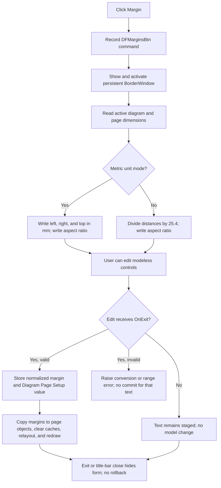

# Open and refresh the modeless page-margin editor

> Analysis status: Evidence-backed source review complete.

## Control

| Property | Recovered value |
| --- | --- |
| Form | DFWindow |
| Component path | DFWindow.DFToolPanel.ToolNoteBook.Print.DFMarginsBtn |
| Control class | TSpeedButton |
| Caption | Not present in the recovered resource. |
| Hint | Margin |
| Text | Not present in the recovered resource. |
| Handler name | DFMarginsBtnClick |
| Handler address | 01a80db0 |
| Graph node | `resource:dfm:DFWindow/DFWindow.DFToolPanel.ToolNoteBook.Print.DFMarginsBtn` |
| Handler node | `function:01a80db0` |
| Graph layer | UI |

## What happens when clicked

`DFMarginsBtn` opens the persistent global `BorderWindow` as a modeless page-margin editor. The handler does not create a new editor, use `ShowModal`, wait for an OK result, or copy an accepted value back to DFWindow.

`FUN_01a80db0` first records command name `DFMarginsBtn` in the recovered macro-command path. It then passes the global object at `PTR_DAT_02001450` to the common modeless Show wrapper. That wrapper sets the form visible and activates it. The handler finally calls `FUN_01a65f30` on the same object to replace the four numeric edit values with values derived from DFWindow's current active diagram.

When the form changes from hidden to visible, its `OnShow` handler also selects the recovered `mm` or `inch` notebook page and performs the same model-to-control refresh. The explicit refresh after Show still runs. If BorderWindow is already visible, the common Show path activates it and the explicit refresh makes its controls match the current active diagram again.

## Values loaded into BorderWindow

The refresh reads the active diagram through the global DFWindow instance. It obtains the current page width and height from the printer or page-device context and reads four normalized border coordinates from the active diagram:

| BorderWindow control | Displayed value |
| --- | --- |
| `LeftFE` | normalized left coordinate multiplied by page width |
| `RightFE` | `1 - normalized right coordinate`, multiplied by page width |
| `TopFE` | normalized top coordinate multiplied by page height |
| `WidthHeightFE` | usable border width divided by usable border height, after page dimensions are applied |

In the recovered metric-unit branch, the first three values remain in millimeters. In the other branch, each distance is divided by `25.4` for inches. The width-to-height value is a dimensionless ratio and is identical in both branches.

BorderWindow's `UnitCB` resource contains **millimeter** and **inch**. Its change handler selects the matching `mm` or `inch` label page from the control's item index and calls the same refresh. The conversion branch inside `FUN_01a65f30` reads the process-wide unit-mode byte, not the combo-box item index directly. The recovered UnitCB handler does not itself write that byte, so this article does not claim where the application-wide unit preference changes.

## Staged text and live margin state

Opening the editor does not change a margin. It only writes current model values into the controls. Text typed into one of the four `TFloatEdit` controls remains staged in that control until its `OnExit` handler runs.

A successful `OnExit` parses the text and updates live state immediately:

- `LeftFE` stores `displayed distance / page width` as the normalized left coordinate.
- `RightFE` stores `1 - displayed distance / page width` as the normalized right coordinate.
- `TopFE` stores `displayed distance / page height` as the normalized top coordinate.
- `WidthHeightFE` derives and stores the normalized bottom coordinate from left, right, top, page dimensions, and the entered width-to-height ratio.

The inch branches convert the distance through the same `25.4` relation before they store normalized state. Each successful handler also writes the corresponding `LeftMargin`, `RightMargin`, `TopMargin`, or `BottomMargin` value under `Diagram Page Setup`.

There is no separate OK-time commit. Clicking BorderWindow's **Exit** button only hides the form. A normal focus change to Exit can dispatch the current edit's `OnExit` first, but the recovered Exit handler does not call validation or commit itself. Conversely, calling the Margin command again refreshes all four edit controls from live state. This can overwrite text that is still only staged; it does not restore an earlier committed margin.

## Layout, preview, and printing effects

After a valid edit commits, the shared BorderWindow update routine copies all four normalized margins to every page object in DFWindow's current page-manager collection. It clears two cached dimension fields in each page object, recalculates the active diagram with the recovered layout-mode-specific path, and requests a full redraw. A committed change can therefore update the normal diagram or the current print-preview layout immediately.

`DFMarginsBtnClick` itself performs no layout or redraw because it only shows and refreshes the editor. The later Print command uses the current DFWindow page-manager objects when it renders pages. It does not wait for BorderWindow to close or read a modal result. Thus a successfully committed BorderWindow edit is already part of the live page layout used by a later print operation.

The neighboring DFWindow **Cancel** button only leaves or toggles the embedded print-preview view. It does not close BorderWindow, discard its staged text, restore margins, or undo a committed page-setup write.

## Close, repeated use, and persistence

BorderWindow is retained for reuse:

- Its **Exit** button calls the VCL Hide wrapper directly.
- Its title-bar close route selects the VCL hide close action.
- Neither route destroys the form, returns a modal result, or rolls margins back.
- Opening Margin again shows and activates the same global instance, then refreshes it from live state.

Successful edit handlers write page-setup values during `OnExit`. The Margin button does not perform an additional document save, file write, undo snapshot, or modified-state write. It also does not restore the values that were present when the form opened. The precise physical backing store used by the page-setup writer is not recovered here.

## No-op and error boundaries

- Reopening BorderWindow without changing an edit only shows, activates, and refreshes the form. It does not write margin state or redraw the diagram.
- The handler has no active-diagram guard. A direct call without the active diagram expected by `FUN_01a65f30` can fail after the Show call, leaving BorderWindow visible without completing the refresh. Normal command-state code can prevent an unavailable UI command, but that is outside this handler.
- Model-to-control refresh has no local check for zero page width, zero page height, or zero usable border height. It has no local exception handler or error message.
- A FloatEdit conversion or generic-range error occurs before that edit's model write. The edit handlers do not catch it. The BorderWindow review proves a shared accepted range of `-1e50` through `1e50`, but no form-specific positive, page-size, or `0..1` guard.
- The width-to-height commit divides by the entered ratio without an explicit zero check.
- Edit commits, page-setup writes, page-object updates, layout, and redraw are not transactional. A failure after an earlier operation can leave partially updated live or persisted settings. There is no Cancel rollback.

## Margin-editor flow

## Handler and model evidence

- Margin button handler and modeless opening order: [FUN_01a80db0](../../../DecompiledSources/Tina16/functions/0000000001A80DB0__FUN_01a80db0.c)
- Common Show and activate wrapper: [FUN_008059a0](../../../DecompiledSources/Tina16/functions/00000000008059A0__FUN_008059a0.c)
- Normalized-margin to metric/inch control refresh: [FUN_01a65f30](../../../DecompiledSources/Tina16/functions/0000000001A65F30__FUN_01a65f30.c)
- BorderWindow `OnShow` and unit-page selection: [FUN_01a66410](../../../DecompiledSources/Tina16/functions/0000000001A66410__FUN_01a66410.c) and [FUN_01a66380](../../../DecompiledSources/Tina16/functions/0000000001A66380__FUN_01a66380.c)
- Left, right, top, and aspect-ratio commits: [FUN_01a65790](../../../DecompiledSources/Tina16/functions/0000000001A65790__FUN_01a65790.c), [FUN_01a65910](../../../DecompiledSources/Tina16/functions/0000000001A65910__FUN_01a65910.c), [FUN_01a65ac0](../../../DecompiledSources/Tina16/functions/0000000001A65AC0__FUN_01a65ac0.c), and [FUN_01a65c40](../../../DecompiledSources/Tina16/functions/0000000001A65C40__FUN_01a65c40.c)
- Page-object propagation, layout, and redraw: [FUN_01a65d80](../../../DecompiledSources/Tina16/functions/0000000001A65D80__FUN_01a65d80.c)
- Page-setup writer: [FUN_01ae7390](../../../DecompiledSources/Tina16/functions/0000000001AE7390__FUN_01ae7390.c)
- BorderWindow close behavior: [Exit](../borderwindow/okbtn-981b09eeaa.md)
- Print-preview Cancel contrast: [DFCancelBtn](dfcancelbtn-16dd40e73c.md)
- Later print-page consumption: [FUN_01a7ab10](../../../DecompiledSources/Tina16/functions/0000000001A7AB10__FUN_01a7ab10.c)
- Recovered form and control resources: [ui-evidence.json](../../../DecompiledSources/Tina16/resources/dfm/ui-evidence.json)

## Resource and annotation limits

- `DFMarginsBtn` is a 25 by 25 `TSpeedButton` with hint **Margin** and two recovered glyph frames. It has no caption, action, checked state, or same-parent label candidate.
- [The extracted 18 by 9 pixel image](../../../glyph/0108_DFWindow_DFWindow_DFToolPanel_ToolNoteBook_Print_DFMarginsBtn_Glyph_Data.png) contains two page-outline frames with margin-like vertical guides. It supports the page-margin identity but does not prove modeless opening, units, or commit behavior.
- The source establishes normalized coordinate formulas and page dimensions. It does not publish the original Delphi names for the active-diagram border fields or the process-wide unit-mode byte.
- This Bead owns canonical annotations for `FUN_01a80db0` and `FUN_01a65f30`. Generic VCL Show, BorderWindow edit-commit, settings, page-layout, redraw, printer, preview, and hide helpers remain evidence only.
