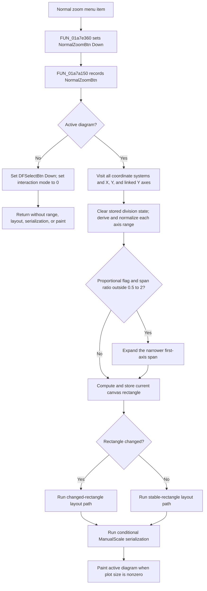

# Restore the active diagram to normal zoom

> Analysis status: Source reviewed through menu forwarding, automatic axis-range
> calculation, layout, conditional serialization, repaint, and failure boundaries.

## Control

| Property | Recovered value |
| --- | --- |
| Form | DFWindow |
| Component path | DFWindow.DFMainMenu.DFViewMnu.DFNormalzoomMnu |
| Control class | TMenuItem |
| Caption | Normal zoom |
| Hint | Not present in the recovered resource. |
| Text | Not present in the recovered resource. |
| Handler name | DFNormalzoomMnuClick |
| Handler address | 01a7e360 |
| Graph node | `resource:dfm:DFWindow/DFWindow.DFMainMenu.DFViewMnu.DFNormalzoomMnu` |
| Handler node | `function:01a7e360` |
| Graph layer | UI |

## What happens when clicked

The menu command is a wrapper for the **Normal zoom** toolbar button. It first
asks the speed-button state setter to put `NormalZoomBtn` in its Down state.
It then calls the toolbar handler `FUN_01a7a150`. The shared handler records
the command as `NormalZoomBtn` for TINA's macro/action recorder.

When DFWindow has an active diagram, the command does not enter a zoom tool or
wait for a drag rectangle. It immediately recalculates the normal range of
every X axis and every Y axis in every coordinate system of that active
diagram. A linked secondary axis at Y-axis offset `0x118` is included. There
is no selected-curve, selected-axis, or caption filter on this path.

The command affects the current active diagram only. It does not iterate all
diagram pages in the manager. It does not clear the current object selection,
change the diagram interaction-mode byte, or set the mouse cursor when an
active diagram exists.

If no active diagram exists, the range path is skipped. The shared handler
puts `DFSelectBtn` in its Down state and calls the Select handler, which sets
the interaction-mode byte at DFWindow offset `0x7a8` to 0. No range, layout,
serialization, or paint operation occurs in this branch.

The separate [View-menu state refresh](dfviewmnu-efccbe9f99.md) normally
disables **Normal zoom** when there is no active diagram. The click handler
still has the null-diagram branch described above. This is a local guard
against model access, not a selected-object or zoom-history requirement.

## Normal-range calculation

`FUN_01ad9580` walks the active diagram's coordinate systems. For each one, it
visits all X axes, all Y axes, and each linked secondary Y axis. Its call to
`FUN_01ad85f0` uses reset flag 1. Before an axis range is calculated, the lower
path removes three entries from that axis's `main` option store when present.
The recovered source names one of these entries `divs`; the other two key
strings are not recovered. This removes stored per-axis override state before
the automatic range is derived.

The axis range is derived from the data objects attached to that axis. The
exact source fields depend on the coordinate-system type and axis orientation:

- The common data branches take the minimum lower bound and maximum upper
  bound across the attached curves.
- One recovered coordinate-system type always uses `-1` through `1`.
- Another uses the largest absolute curve extent and creates a symmetric
  range around zero.
- The figure-coordinate branch collects the bounds of compatible diagram
  figures and adds ten percent padding before normalization.

The recovered numeric type values are 0 through 7, but their Delphi enum names
are not present. `FUN_01cd43b0` expands degenerate or extremely narrow ranges,
rounds the endpoints to usable interval boundaries, and calculates a bounded
major-division count. The result is copied to both recovered current-range
field pairs at offsets `0xb8`/`0xc0` and `0xc8`/`0xd0`.

After every coordinate system, `FUN_01ce27e0` checks the recovered
`Proportional` flag at offset `0x68`. If it is set and the first X- and Y-axis
spans differ by more than a factor of two, the helper expands the narrower
span around its midpoint to match the wider one and normalizes that axis
again. It does not shrink the wider span.

## Layout, redraw, and persistence

After all ranges are reset, the shared handler computes the available DFWindow
canvas rectangle. It stores the rectangle in the active diagram and chooses
one of two layout-recalculation paths according to whether that rectangle
changed. Both paths rebuild coordinate-system, axis, curve, figure, and other
diagram geometry. It then paints the active diagram. Painting is a no-op when
the recovered plot rectangle has zero width or height.

Before painting, `FUN_01add6f0` runs the existing **Diagram Page Setup /
ManualScale** persistence check. When `ManualScale` is false, this call writes
nothing. When it is true, it serializes the current diagram options, including
the new axis ranges, through `DiagOpt.tmp` and copies them to the associated
diagram-data object. This is conditional option serialization, not a document
Save command.

A repeated click performs the range walk, layout, conditional serialization,
and repaint again. There is no equality guard for already-normal ranges. An
active diagram with no coordinate systems performs no axis updates, but it
still reaches rectangle calculation, layout, the conditional serialization
check, and paint.

## Errors and partial state

The menu and toolbar handlers show no dialog and contain no local exception
handler or rollback. Axis ranges are changed before layout, serialization, and
painting. If a lower call raises an error, some ranges can therefore be
updated while the display or stored manual-scale options remain old. No
user-facing error message is recovered from this path.

The range code checks whether an axis can be resolved to its owning diagram
objects; an unresolved axis is left unchanged. Some type-specific branches
assume that required curve or first-axis collections are structurally valid.
The handler does not add a separate guard for malformed coordinate systems.

## Click flow

## Handler evidence

- Source: [FUN_01a7e360](../../../DecompiledSources/Tina16/functions/0000000001A7E360__FUN_01a7e360.c)
- Recovered role: Forwards the menu command to the Normal Zoom toolbar action
  after it sets the toolbar button state.
- Current graph summary: Handles
  `DFWindow.DFMainMenu.DFViewMnu.DFNormalzoomMnu.OnClick`.
- State evidence: The wrapper sets the speed-button object at DFWindow offset
  `0xaa0` Down. The resource and parallel toolbar binding identify this object
  as `NormalZoomBtn`.
- Output evidence: The forwarded handler either selects interaction mode 0
  when no active diagram exists, or resets, lays out, conditionally serializes,
  and repaints the active diagram.
- Complexity: moderate
- Distinct outgoing calls: 2

## Relevant calls

- [`FUN_0082a6c0`](../../../DecompiledSources/Tina16/functions/000000000082A6C0__FUN_0082a6c0.c)
  sets a recovered speed button's Down state and updates its visual/group state.
- [`FUN_01a7a150`](../../../DecompiledSources/Tina16/functions/0000000001A7A150__FUN_01a7a150.c)
  is the shared `NormalZoomBtnClick` handler and owns the active-diagram guard,
  layout, persistence, and paint sequence.
- [`FUN_01ad9580`](../../../DecompiledSources/Tina16/functions/0000000001AD9580__FUN_01ad9580.c)
  walks all coordinate systems and their X, Y, and linked secondary Y axes.
- [`FUN_01ad85f0`](../../../DecompiledSources/Tina16/functions/0000000001AD85F0__FUN_01ad85f0.c)
  derives one axis's normal range from its curves or compatible figures.
- [`FUN_01cd7300`](../../../DecompiledSources/Tina16/functions/0000000001CD7300__FUN_01cd7300.c)
  removes three stored axis options, including the recovered `divs` key.
- [`FUN_01cd43b0`](../../../DecompiledSources/Tina16/functions/0000000001CD43B0__FUN_01cd43b0.c)
  normalizes numeric bounds and calculates axis divisions.
- [`FUN_01ce27e0`](../../../DecompiledSources/Tina16/functions/0000000001CE27E0__FUN_01ce27e0.c)
  expands the narrower first-axis span for proportional coordinate systems.
- [`FUN_01a782f0`](../../../DecompiledSources/Tina16/functions/0000000001A782F0__FUN_01a782f0.c)
  computes the current DFWindow canvas rectangle.
- [`FUN_01acf9e0`](../../../DecompiledSources/Tina16/functions/0000000001ACF9E0__FUN_01acf9e0.c)
  compares and stores the diagram rectangle and reports whether it changed.
- [`FUN_01add6f0`](../../../DecompiledSources/Tina16/functions/0000000001ADD6F0__FUN_01add6f0.c)
  conditionally serializes diagram options when `ManualScale` is enabled.
- [`FUN_01aceb90`](../../../DecompiledSources/Tina16/functions/0000000001ACEB90__FUN_01aceb90.c)
  clears and paints the active diagram canvas.
- [`FUN_01a794b0`](../../../DecompiledSources/Tina16/functions/0000000001A794B0__FUN_01a794b0.c)
  sets Select interaction mode 0 on the no-active-diagram branch.

## Resource and glyph evidence

- The menu item has caption **Normal zoom**, shortcut value 49242, and no
  recovered hint, action, image reference, or embedded glyph.
- The forwarded toolbar control is a `TSpeedButton` with hint **Normal zoom**.
  Its [20 by 20 extracted glyph](../../../glyph/0096_DFWindow_DFWindow_DFToolPanel_ToolNoteBook_Diagram_NormalZoomBtn_Glyph_Data.png)
  is a magnifier marked `100`. This supports a return-to-normal-scale meaning;
  the handler's complete axis-range reset proves the behavior.

## Analysis limits

- The Delphi enum names for the recovered coordinate-system and axis-orientation
  values are not present, so this article uses their proven numeric branches.
- Two option-key strings removed before range calculation are not recovered.
  Only the third key, `divs`, is readable in the decompiled source.
- The exact difference between the two rectangle-dependent layout helpers is
  not named. Their common downstream geometry updates are proven.
- This handler does not call the View-menu state updater. Its enabled-state
  policy is outside this click path and is documented by the separate
  **View** menu analysis.
