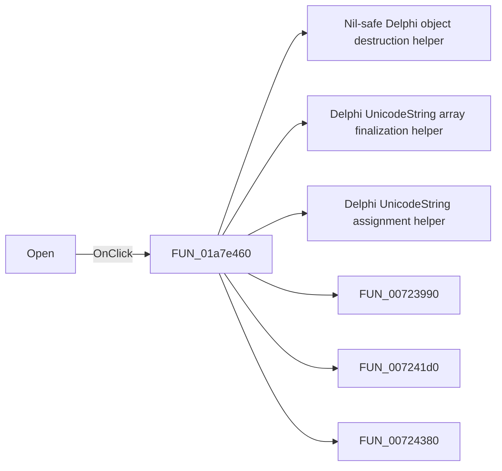

# Open

> Analysis status: Pending individual source review.

## Control

| Property | Recovered value |
| --- | --- |
| Form | DFWindow |
| Component path | DFWindow.DFToolPanel.DFOpenBtn |
| Control class | TSpeedButton |
| Caption | Not present in the recovered resource. |
| Hint | Open |
| Text | Not present in the recovered resource. |
| Handler name | DFOpenMnuClick |
| Handler address | 01a7e460 |
| Graph node | `resource:dfm:DFWindow/DFWindow.DFToolPanel.DFOpenBtn` |
| Handler node | `function:01a7e460` |
| Graph layer | UI |

## What happens when clicked

Pending individual analysis. An agent must read the recovered handler source and its relevant callees before it replaces this text.

## Click flow

## Handler evidence

- Source: [DecompiledSources/Tina16/functions/0000000001A7E460__FUN_01a7e460.c](../../../DecompiledSources/Tina16/functions/0000000001A7E460__FUN_01a7e460.c)
- Recovered role: Not present in the recovered resource.
- Current graph summary: Handles 2 Delphi UI events: DFWindow.DFToolPanel.DFOpenBtn.OnClick, DFWindow.DFMainMenu.DFFileMnu.DFOpenMnu.OnClick.
- Current graph behavior: Not present in the recovered resource.
- Current graph evidence: Not present in the recovered resource.
- Complexity: complex
- Distinct outgoing calls: 11

## Direct calls

- `function:00410f20` — Nil-safe Delphi object destruction helper
- `function:00414560` — Delphi UnicodeString array finalization helper
- `function:00414ad0` — Delphi UnicodeString assignment helper
- `function:00723990` — FUN_00723990
- `function:007241d0` — FUN_007241d0
- `function:00724380` — FUN_00724380
- `function:00b89270` — FUN_00b89270
- `function:00b8e520` — FUN_00b8e520
- `function:01156520` — FUN_01156520
- `function:01aed550` — FUN_01aed550
- `function:01aee720` — FUN_01aee720

## Resource evidence

- Kind: Not present in the recovered resource.
- Modal result: Not present in the recovered resource.
- Checked state: Not present in the recovered resource.
- List items: Not present in the recovered resource.
- Image reference: Not present in the recovered resource.
- Extracted glyph: [`0081_DFWindow_DFWindow_DFToolPanel_DFOpenBtn_Glyph_Data.png`](../../../glyph/0081_DFWindow_DFWindow_DFToolPanel_DFOpenBtn_Glyph_Data.png)

## Nearby label candidates

Nearby labels are layout candidates only. They are not proof of behavior.

- No same-parent label candidate is available.

## Analysis limits

- Do not infer behavior from the control class, caption, hint, glyph, or nearby label alone.
- Do not replace the pending status until the handler source and relevant call path provide enough evidence.
