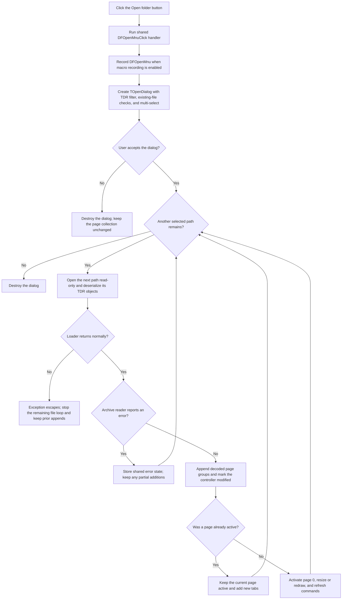

# Open TINA diagram archives from the toolbar

> Analysis status: Source reviewed and behavior traced.

## Control

| Property | Recovered value |
| --- | --- |
| Form | `DFWindow` (`TDFWindow`) |
| Component path | `DFWindow.DFToolPanel.DFOpenBtn` |
| Control class | `TSpeedButton` |
| Position and size | Left `4`, Top `6`, Width `25`, Height `25` |
| Caption | Not present in the recovered resource. |
| Hint | `Open` (`ShowHint=true`) |
| Glyph | Two-frame, 40×20 bitmap strip with closed-folder and open-folder images |
| Handler name | `DFOpenMnuClick` |
| Handler address | `01a7e460` |
| Graph node | `resource:dfm:DFWindow/DFWindow.DFToolPanel.DFOpenBtn` |
| Handler node | `function:01a7e460` |
| Graph layer | UI |

The extracted glyph contains two 20×20 yellow folder frames because the DFM
sets `NumGlyphs=2`. The first frame depicts a closed folder and the second an
open folder. Together with the `Open` hint, this identifies the toolbar
control's user-facing purpose. The `.tdr` file type, multi-file behavior, and
page effects come from the handler and its loaders, not from the glyph.

## Shared menu command

This speed button and **File > Open...** bind directly to the same handler,
`FUN_01a7e460`. The handler does not inspect the initiating control and has no
toolbar-only adapter. A toolbar click therefore performs the same operation as
the menu item.

The handler also formats the macro event with the literal name `DFOpenMnu`.
When macro recording is enabled, the toolbar activation is recorded as the
menu command name rather than a separate `DFOpenBtn` command.

## Open-dialog configuration

The handler creates a new `TOpenDialog` for every activation and applies these
settings:

| Setting | Recovered value and effect |
| --- | --- |
| Title | Localized resource ID `0x82A`; its text is not recovered. |
| Filter | `Tina diagram (*.tdr)|*.tdr` |
| Initial file name | `*.tdr` |
| Default extension | `tdr` |
| Options | Hide read-only, show Help, allow multiple selections, and require existing paths and files (`0x354`). |
| Help context | `503` (`0x1F7`) |

The handler does not set an initial directory. It does not add an **All files**
filter or perform a separate extension check. If the user accepts more than
one path, the handler reads the dialog's `Files` list and processes every path
in list order.

## Multi-file append behavior

For each accepted path, `FUN_01156520` opens the file through a Delphi stream
in read-only, deny-write mode. It creates an archive reader, reads the archive
header and version record, and dispatches deserialization to the global
`TCoorSysGrpCollection` stored at `DFWindow +0x7A0`.

The controller clears its temporary serialization lists and resets transient
serialization identifiers, but it does not clear the existing main page
collection. It reconstructs registered objects from the archive. Each decoded
coordinate-system group is appended to the main collection and the page-tab
list. The page-add path sets the controller's modified byte at `+0x40`.

This gives the toolbar command the following state effects:

- Existing pages remain in `DFWindow`.
- Pages from each accepted `.tdr` file are appended in dialog-list order.
- If a page is already active, it stays active. The new tabs appear, but this
  open path does not directly redraw or select them.
- If no page is active, the controller requests page 0 after loading. The
  shared page-switch path then assigns the active graph, applies its saved
  size, redraws or resizes it, and refreshes command state.

The recovered loaders do not write `TINA.INI`, save another `.tdr` file, or
replace the current document collection. The resulting pages and their loaded
diagram state exist in the in-memory page collection and can be saved later by
a separate command.

The detailed controller and object-deserialization trace is in the canonical
[File > Open analysis](dfopenmnu-fc379da579.md).

## Toolbar click flow

## Cancel, errors, and partial state

- Macro recording happens before the dialog opens. A Cancel action can
  therefore leave a recorded `DFOpenMnu` command even though no file is loaded.
- If the dialog returns Cancel, the handler does not read the selected file
  list and does not call the archive loader. The page collection and active
  page remain unchanged.
- A normal archive-reader error is copied to shared application error state.
  The click handler does not display a message, check a per-file result, or
  stop the loop. It continues with the next selected path.
- There is no transaction or rollback. Pages loaded from earlier files remain
  if a later file reports an archive error. Objects appended before an error
  within the same archive can also remain.
- File-open, allocation, and deserialization calls have no recovered local
  exception recovery in this handler. An escaping exception can stop the
  remaining file loop while all earlier additions stay in the collection. The
  recovered path does not identify which outer Delphi exception UI reports the
  failure.
- The `TOpenDialog` is destroyed after the normal Cancel or completed-load
  path. The handler does not retain its file list or last directory as
  DFWindow-owned state.

## Evidence

- [Shared Open handler `FUN_01a7e460`](../../../DecompiledSources/Tina16/functions/0000000001A7E460__FUN_01a7e460.c)
  records `DFOpenMnu`, creates and configures the dialog, branches on
  `Execute`, and passes every accepted path to the loader.
- [Single-file TDR loader `FUN_01156520`](../../../DecompiledSources/Tina16/functions/0000000001156520__FUN_01156520.c)
  opens one path, reads its archive header, dispatches controller
  deserialization, and forwards a reader error to shared state.
- [Controller archive reader `FUN_01ced260`](../../../DecompiledSources/Tina16/functions/0000000001CED260__FUN_01ced260.c)
  reconstructs registered objects and appends coordinate-system groups without
  clearing the main page collection.
- [Shared page-add helper `FUN_01cec150`](../../../DecompiledSources/Tina16/functions/0000000001CEC150__FUN_01cec150.c)
  adds one group and page tab and sets the controller modified byte.
- [Shared page-switch helper `FUN_01cec6e0`](../../../DecompiledSources/Tina16/functions/0000000001CEC6E0__FUN_01cec6e0.c)
  changes the active page and handles its size, redraw, and command refresh.
- [Extracted two-frame folder glyph](../../../glyph/0081_DFWindow_DFWindow_DFToolPanel_DFOpenBtn_Glyph_Data.png)
  provides the toolbar's folder imagery.
- [Glyph manifest](../../../glyph/manifest.json) records the source as a 40×20
  Delphi BMP with 522 source bytes and a converted PNG output.
- [Recovered UI evidence](../../../DecompiledSources/Tina16/resources/dfm/ui-evidence.json)
  identifies the speed button, `Open` hint, two glyph frames, and direct
  `DFOpenMnuClick` binding.

## Analysis limits

- The localized dialog-title text for resource ID `0x82A` is not recovered.
- The glyph supports an Open action but does not establish the file type,
  selection count, or append behavior without the source trace.
- The archive reader stores an error code in shared state, but this local call
  path does not identify the later user-facing error presenter.
- The decoded class registry can contain objects other than coordinate-system
  groups. Only the group-add branch is proven to create page tabs.

## Annotation scope

`TIARA-diz.6.7.284` is the canonical owner of shared handler `FUN_01a7e460`
and of loader annotations `FUN_01156520` and `FUN_01ced260`. This fragment
duplicates the complete `FUN_01a7e460` annotation exactly because empty
function lists are invalid. It omits the loader annotations and only cites
their source and canonical article.
