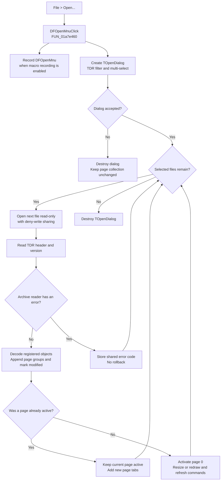

# Open TINA diagram archives

> Analysis status: Reviewed from the recovered handler, the `TOpenDialog` VMT, the archive reader, and the `TCoorSysGrpCollection` load path.

## Control

| Property | Recovered value |
| --- | --- |
| Form | `DFWindow` (`TDFWindow`) |
| Component path | `DFWindow.DFMainMenu.DFFileMnu.DFOpenMnu` |
| Menu path | **File > Open...** |
| Control class | `TMenuItem` |
| Caption | `&Open...` |
| Handler name | `DFOpenMnuClick` |
| Handler address | `01a7e460` |
| Graph node | `resource:dfm:DFWindow/DFWindow.DFMainMenu.DFFileMnu.DFOpenMnu` |
| Handler node | `function:01a7e460` |
| Graph layer | UI |

The menu item has no hint or image. The same handler also serves `DFWindow.DFToolPanel.DFOpenBtn`. That speed button has the hint `Open` and an extracted two-frame closed/open-folder glyph. This is supporting evidence only; the file type and load behavior come from the code.

## Open-dialog configuration

`FUN_01a7e460` creates a new `TOpenDialog` for each click and configures it as follows:

| Setting | Recovered value and effect |
| --- | --- |
| Title | Localized string ID `0x82A`. The exact English text is not present in the recovered resource export. |
| Filter | `Tina diagram (*.tdr)|*.tdr` — there is no All files entry. |
| Initial file name | `*.tdr` |
| Default extension | `tdr` |
| Options | `ofHideReadOnly`, `ofShowHelp`, `ofAllowMultiSelect`, `ofPathMustExist`, and `ofFileMustExist` (`0x354`) |
| Help context | `503` (`0x1F7`) |

The handler does not set `InitialDir` or seed the dialog from a previous selection. It does not perform its own extension check. The dialog requires an existing path and file, while the archive reader validates the selected file content later. If the user selects more than one file, the handler reads the dialog's `Files` list and processes every entry in list order.

## What happens after acceptance

Each selected path is passed to `FUN_01156520`. This loader:

1. Opens the file through a Delphi file stream in read-only, deny-write mode (`0x20`).
2. Creates the recovered archive reader in read mode.
3. Reads the archive identification/header fields and the next eight-byte version record.
4. Passes the reader to virtual slot `+0x30` of the global `DFWindow + 0x7A0` controller.
5. Copies any archive error code to the application's shared error state and releases the reader and file stream.

Recovered VMT metadata identifies the controller as `TCoorSysGrpCollection` and resolves its read slot to `FUN_01ced260`. The form creates this controller with `TDFWindow` as owner. Decoded non-special registered objects receive the controller pointer at object offset `+0x38`, and decoded coordinate-system groups are added to the controller's main collection and to the form's page-tab list.

## Existing state is appended, not replaced

Open does not clear the controller's main collection before it reads a `.tdr` file. `FUN_01ced260` clears temporary serialization lists and resets transient serialization identifiers on existing objects, but it keeps existing pages. It then constructs registered object types from the archive and appends each decoded coordinate-system group through the shared page-add helper `FUN_01cec150`.

This has three important effects:

- Existing diagram pages stay in the window.
- Pages from every accepted file are appended to the same `TDFWindow` controller.
- Adding a loaded page sets the controller's modified flag at `+0x40`. The archive writer later clears that flag after its serialization pass.

If the controller already has an active page, Open does not switch away from it and does not directly redraw it. New page tabs appear, but the user must select one to display it. If no page is active, the reader requests page index 0. The shared page-switch path then assigns the active graph, applies its saved size, redraws or resizes it, and refreshes command state. If no page was active and the file produces no page, the active graph stays unset.

The `.tdr` data includes analysis-result and diagram-viewer object state, so decoded page, axis, curve, and view settings become part of the in-memory page collection. This command does not write `TINA.INI`, another settings store, or a new `.tdr` file.

## Open is not Import

| Open | Import |
| --- | --- |
| Accepts one or more `.tdr` archives. | Uses a separate `.txt` selection and curve-import dialog. |
| Reconstructs registered diagram objects and complete page groups. | Parses text columns with selected type, row-skip, delimiter, and amplitude options. |
| Appends pages to the `TCoorSysGrpCollection`. | Adds parsed curve data to the active diagram. |
| Does not write `AutoImport` preferences. | Writes `AutoImport` file and parser settings after a successful import. |

The separate Import handler is `FUN_01a894f0`; the Open handler never calls its text parser or settings writer.

## Cancel and failure behavior

- The handler records the `DFOpenMnu` macro command before it opens the dialog. Cancel therefore can still add a macro record when macro recording is enabled.
- If the dialog returns Cancel, the handler does not read `FileName` or `Files`, does not call the archive loader, and does not change the page collection.
- An archive-format error is stored in shared error state. This handler does not show an error message, stop the selected-file loop, or restore the prior collection.
- Successfully appended pages from earlier files stay loaded if a later file fails. If an archive error occurs after some objects from the same file were added, those objects can also remain. There is no transaction or rollback.
- The file-stream constructor and the load calls have no local exception handler. An exception can leave the already-appended state in place and can stop the remaining file loop. The recovered path does not prove which outer Delphi exception UI reports that failure.

## Click flow

## Evidence

- [Open handler `FUN_01a7e460`](../../../DecompiledSources/Tina16/functions/0000000001A7E460__FUN_01a7e460.c) configures the dialog, branches on `Execute`, iterates `Files`, and calls the loader for every selected path.
- [Open-dialog constructor `FUN_00723990`](../../../DecompiledSources/Tina16/functions/0000000000723990__FUN_00723990.c) is identified as `TOpenDialog` by recovered VMT metadata.
- [Single-file TDR loader `FUN_01156520`](../../../DecompiledSources/Tina16/functions/0000000001156520__FUN_01156520.c) creates the read stream and archive reader, invokes the global page controller, and forwards its error code.
- [Controller archive reader `FUN_01ced260`](../../../DecompiledSources/Tina16/functions/0000000001CED260__FUN_01ced260.c) decodes registered object types and appends coordinate-system groups without clearing the main page collection.
- [Shared page-add helper `FUN_01cec150`](../../../DecompiledSources/Tina16/functions/0000000001CEC150__FUN_01cec150.c) adds a group and tab and sets the modified flag.
- [Shared page-switch helper `FUN_01cec6e0`](../../../DecompiledSources/Tina16/functions/0000000001CEC6E0__FUN_01cec6e0.c) assigns the active page, resizes or redraws it, and refreshes command state.
- [Controller constructor use `FUN_01a72620`](../../../DecompiledSources/Tina16/functions/0000000001A72620__FUN_01a72620.c) creates `TCoorSysGrpCollection` with `TDFWindow` as its owner and stores it at form offset `+0x7A0`.
- [Separate Import handler `FUN_01a894f0`](../../../DecompiledSources/Tina16/functions/0000000001A894F0__FUN_01a894f0.c) proves that text-curve parsing and `AutoImport` settings belong to Import, not Open.
- [Shared toolbar glyph](../../../glyph/0081_DFWindow_DFWindow_DFToolPanel_DFOpenBtn_Glyph_Data.png) shows closed and open folders for the sibling `Open` speed button.

## Analysis limits

- The localized dialog-title text for resource ID `0x82A` is unavailable; this article does not invent it.
- The reader records archive errors in shared application state, but this local call path does not identify the later user-facing error presenter.
- The decoded class registry can contain object types other than coordinate-system groups. Only the group-add branch is proven to create page tabs.
